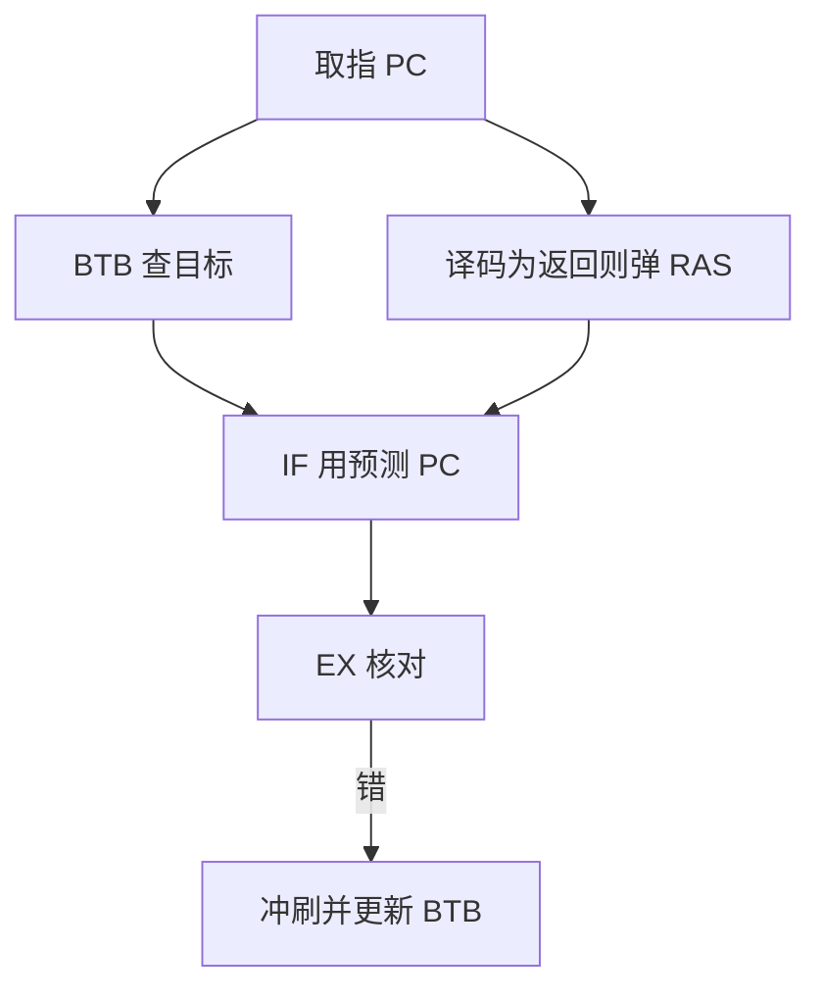

# BTB 与返回栈

方向猜对还不够：间接跳转的目标每次可能不同，返回地址却几乎总是配对的那一次调用。

<footer>—— 据 Hennessy and Patterson, Computer Architecture: A Quantitative Approach 整理</footer>

[上一课](/cs/control-hazard-predict)让 IF 按一位计数器或静态规则猜方向，核对失败则冲刷。条件分支的目标是 PC 加立即数，算出来即可。本课不重讲饱和计数器。缺口是：间接跳转与 `ret` 的**目标地址**在译码前未知，猜方向帮不上忙。本课只交出分支目标缓冲（BTB）与返回地址栈（RAS）。

## 问题

`jalr`、虚函数、`switch` 跳表：下一 PC 来自寄存器，五级里要到 ID 甚至 EX 才有值。若 IF 只准备「成功/失败」两位，仍不知道往哪取。返回指令的目标倒是历史：对应 `jal` 当时的 PC+4。缺口不是更宽的条件比较，而是**用 PC 索引一张目标表，并用栈专门记返回地址**。

上一课明确不把间接跳转预测表铺开。本课补上这一块，仍不引入两级模式历史。

BTB 命中且预测成功，IF 下一拍就能从目标取指，不必等 ALU 算地址。RAS 深度有限，递归过深会溢出，只能当提示。

## 方法

BTB：按取指 PC 索引（可组相联），条目存标签、预测目标、可选一位有效。命中则用存下的目标当下一 PC；EX 核对，错则冲刷并更新该条目。未命中则按顺序取指或按方向预测走立即数目标。

RAS：`jal`/`jalr` 用作调用时把返回地址压栈；译码到返回时弹栈当预测目标。与 BTB 可并行：返回优先信 RAS。

## 机制

控制冒险的损失拍数里，「目标未知」与「方向未知」是两项。BTB 把前者从「等 EX」降到「等 BTB SRAM」，命中时与条件预测叠用。RAS 利用调用/返回的 LIFO，准确率通常高于把返回当成普通间接跳转塞进 BTB——BTB 会被不同调用点别名污染。

BTB 本身是预测器状态，不是 ISA 寄存器。上下文切换不必保存；冷 BTB 只让误预测暂时升高。

## 边界

本课不引入竞赛预测、不引入间接跳转的完整历史（ITTAGE 一类）。特权态 `eret` 的目标来自 CSR，不走用户 RAS。异常冲刷时 RAS 可能失配，实现可选择恢复或清空；精确性仍由[流水线异常](/cs/pipeline-exception)的提交点保证，预测结构可以错。

后课默认：IF 的下一 PC 来自顺序、条件立即数、BTB 或 RAS。方向仍可用简单计数器；更准的相关预测是下一课。

## 小结

- BTB 缓存间接/分支目标，让 IF 不必等算出地址。
- RAS 按调用栈弹返回地址，比把 `ret` 塞进 BTB 更稳。
- 两级与锦标赛预测是后课的缺口。
- 出处：Hennessy and Patterson, *CA:AQA* 分支目标缓冲与返回栈。
