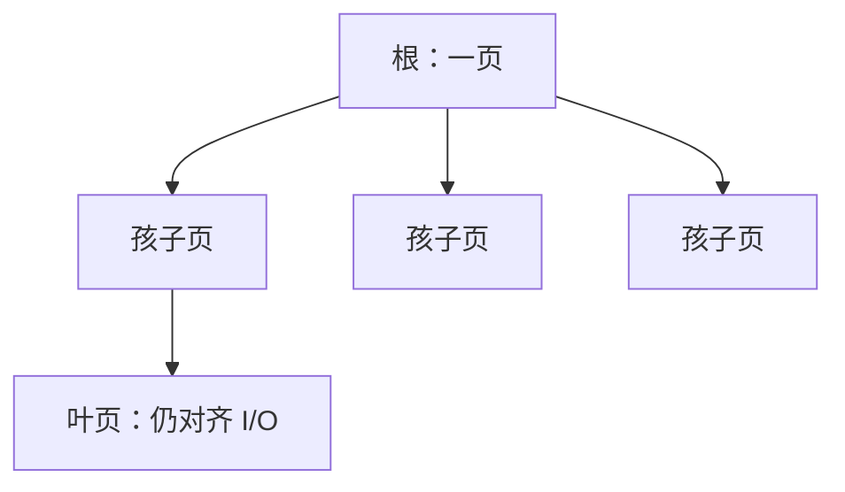

# B 树与外存

一次磁盘 I/O 能搬一整页键，节点就该有成百扇出；平衡多路树把高度收到三次左右。

<footer>—— 据 Bayer and McCreight, Organization and Maintenance of Large Ordered Indexes, Acta Informatica 1972 整理</footer>

[上一课](/cs/rbtree-intuition)把内存字典做到对数次指针追逐。每次追逐在[SRAM 与 DRAM 阵列](/cs/rbtree-intuition)上可能只是一次 cache 缺失；若节点在磁盘，一次追逐是毫秒级。[局部性原理](/cs/locality-principle)说应一次搬一块。[虚拟内存分页](/cs/paging-vm)的页正好是这块的单位。本课不重讲红黑着色。缺口是：节点大小对齐页，多键多孩子，仍保持有序与平衡。本课只钉 B 树直觉，不写 B+ 的叶子链表细节（数据库课再收）。

## 问题

二叉高度 $\log_2 n$ 对 $n=10^9$ 仍约 30 次 I/O，不可接受。缺口不是更快的磁盘调度，而是**阶 $t$：每个内部节点至少 $t-1$ 个键、至多 $2t-1$，孩子数多一个**，高度 $\Theta(\log_t n)$。页对齐让一次 I/O 读完一个节点。

分裂与合并代替旋转：满节点插入则分裂，根可长高，从而整棵树变高均匀。这是 Bayer–McCreight 的维护方式。

B 树的 B 不是 binary。扇出由页大小和键宽决定，常见上百。

## 方法

节点内键有序，孩子 $c_i$ 中的键介于 $k_{i-1}$ 与 $k_i$。查找：节点内二分或顺序扫（键少则扫），再沿一个孩子下降。插入：降到叶，叶满则分裂，中位键升到父；父满则继续。删除对称地合并或借键。

与 AVL 相同，平衡是全局高度一致（所有叶同深）。手段从旋转换成分裂合并，因为一次操作应对齐页，而不是改两三个指针。

## 机制

I/O 次数 $\Theta(\log_t n)$，通常 $\le 3$。这是外存字典的正确合同：代价单位是页，不是 CPU 比较。[cache 缺失分类](/cs/cache-miss-types)的强制/容量在页层变成缺页；B 树把工作集收成沿路径的几个节点。

内存里也可以用 B 树改善 cache 行利用率（B 树缓存友好），但动机最强的是外存。

## 边界

本课不引入哈希索引、不把 WAL 写进来。B+ 树把卫星数据只放叶、内部仅作路标，范围扫描更好——数据库课再分。并发锁住节点是又一层。

后课默认：外存有序索引是 B 树族。内存优先队列不需要全序遍历，可用堆。

## 小结

- 外存代价是页 I/O；高扇出把高度压到个位数。
- 满则分裂、根可长高，叶同深。
- 只要最小、不要中序遍历时，下一课用堆。
- 出处：Bayer and McCreight, *Acta Informatica*, 1972；Cormen et al. 第 18 章。
