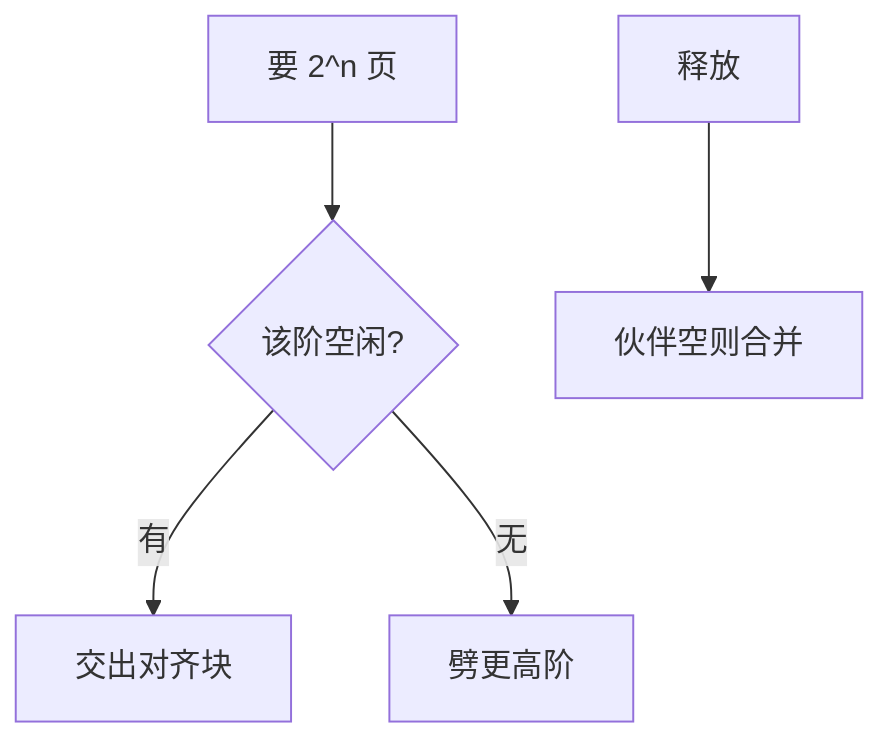

# buddy 分配器

物理内存按 2 的幂分块；分配时把大块劈成一对伙伴，释放时再与伙伴合并，减少外碎片。

<footer>—— 据 Knowlton, A fast storage allocator, CACM 1965；Knuth TAOCP 对 buddy 系统的整理</footer>

[上一课](/cs/mprotect)改的是用户虚权限。缺页、页表、[大页](/cs/huge-pages) 都要内核拿出**连续物理页**。[置换](/cs/page-replace)释放的也是帧。缺口是内核的页框分配器：不是 `malloc`，是按阶（order）管理空闲块。buddy 是经典实现。

## 问题

若用一张位图每次找 N 个连续帧，扫描太慢。若只用单页空闲表，2MB 大页经常拼不出。buddy：每阶一条空闲链表，块大小 2^k 页，地址对齐。分配 order=n：若该阶没有，从更高阶劈成两个伙伴。释放：看伙伴是否空闲，合并升阶。缺口不是虚地址布局，而是物理连续与对齐。

本课不把每节点 NUMA 的 zonelist 调参写完，只承认 DMA/普通区等 zone。

伙伴关系由地址决定：块基址 xor 块大小即伙伴。合并是 O(阶数)，不是扫全部内存。内碎片：只要了 3 页也得给 4 页。

## 方法

`alloc_pages(order)` 从对应 zone 取块；失败则唤醒回收（后课 shrinker）或对调用者失败。大页需要高阶成功。单页（order 0）是缺页的常见路径。释放必须用原来的 order，否则破坏伙伴不变量。与用户堆对照：用户 brk 切的是虚区间；这里切的是 DRAM 帧。

## 机制

buddy 让物理连续成为一等公民：DMA、大页、某些内核栈都要它。外碎片表现为高阶链表空、低阶很碎——回收与压缩（后课）试图拼回高阶。不要把 buddy 写成文件系统的块分配；inode 的块位图是另一层。

[分页](/cs/paging-vm) 把这些帧填进 PTE；分配器不关心 VPN。

## 边界

本课不引入 CMA、内存热插拔的全部状态机。不保证碎片在长时间运行后仍能给出 1GB 页。内核小对象若直接用 order 0 再自己切，浪费页表级对齐——下一课 slab 在页内切对象。

后课默认：内核能按 2^n 页拿到帧。频繁的几十字节对象不应各占一页，下一课 slab。

## 小结

- buddy 用伙伴合并管理 2^n 物理块，服务大页与 DMA。
- 内碎片换来分配与合并的速度。
- 页内小对象缓存是 slab 的缺口。
- 出处：Knowlton, *CACM* 1965；Knuth, *TAOCP*；Bovet and Cesati, *ULK*。
