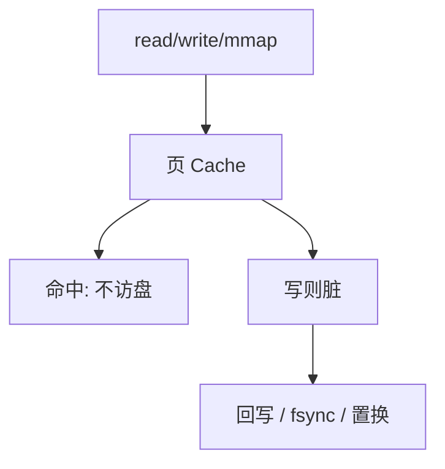

# 缓冲与脏页

磁盘块在内存里有一份缓存；写先标脏，稍后才回写。崩溃时内存与介质可以不一致。

<footer>—— 据 Silberschatz et al., Operating System Concepts；McKusick 等对 Unix 缓冲缓存的整理</footer>

[上一课](/cs/mount-super)让读写落到块号。[mmap](/cs/mmap) 与 [按需调页](/cs/demand-paging)已经把文件页放进帧。缺口是统一承认：**页 Cache / 缓冲缓存**是磁盘的 Cache，脏位表示比介质新。数据库栏的 [WAL](/cs/wal) 正是在这个前提下谈日志先行。本课只钉缓冲与脏，不选磁盘臂算法。

## 问题

每次 `write` 若都同步落盘，管道式小写会把吞吐打穿。若只改内存，断电丢数据。缺口不是新的 inode 字段，而是策略：写进帧并标脏；读命中则不访盘；回写可由定时器、内存压力（[置换](/cs/page-replace)）或 `fsync` 触发。同一物理块不应在缓冲里有两份互相不知道的副本。

本课不把 write-back 与 write-through 的微架构 Cache 课再推一遍；对象换成磁盘块。

脏页是还没到稳定介质的字节。`fsync` 要求该文件相关脏页与必要元数据到达持久存储。组提交与延迟分配是优化。

## 方法

读：查页 Cache，无则分配帧、读盘、插入。写：在 Cache 中修改，标脏。置换选到脏页必须先写盘。元数据（inode、目录）同样走缓冲，崩溃可留下「目录项在、inode 未分」或相反，这是 fsck 与日志要补的，本课只暴露不一致可能。

## 机制

缓冲把磁盘的高延迟从大多数 `read` 里拿掉，让[调度指标](/cs/scheduling-metrics)里的 I/O 等待下降。它也让 mmap 与 `read` 看见同一帧成为可能：统一 Cache。脏页是正确性与性能的交界：OS 允许短暂不一致；数据库用 WAL 在更高层再加一条顺序。本栏不把关系库的 REDO 写进文件系统课。

与关中断锁的关系：Cache 索引是共享结构，下半部完成 DMA 后要把页标有效，锁规则沿用同步课。

## 边界

本课不引入 O_DIRECT 绕过 Cache 的全部语义，不把电池后备写缓存当默认硬件。也不保证 `write` 返回即持久——那正是脏页的含义。下一课才问：许多脏页要写时，请求以什么顺序送向设备。

写回顺序若先数据后 inode 大小，崩溃可能泄露旧数据；日志文件系统用事务把元数据捆在一起，本课只承认问题存在。

后课默认：内存可以比磁盘新。回写与读请求如何排队到磁头或闪存，下一课磁盘调度。

## 小结

- 文件页经统一 Cache；写标脏，稍后回写。
- 崩溃时允许不一致；fsync 是显式持久。
- WAL 假定本课这个缺口已经在。
- 出处：Silberschatz et al., *OSC*；McKusick, Bostic, Karels, Quarterman, *The Design and Implementation of the 4.4BSD Operating System*。
