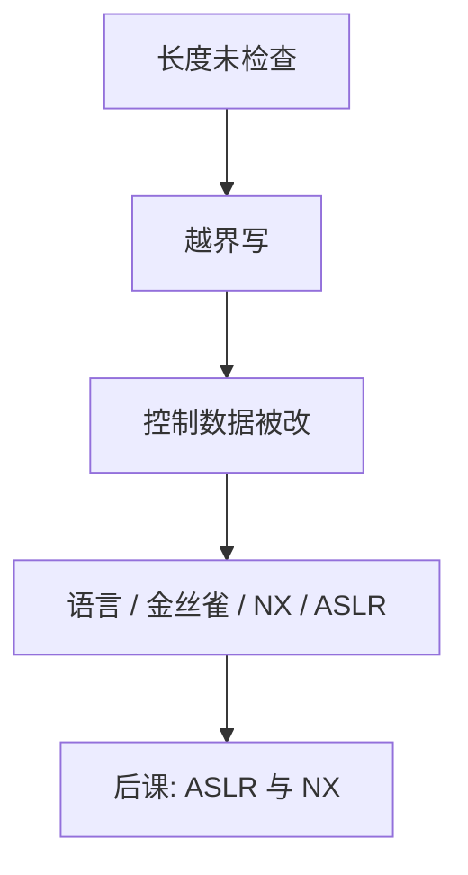

# 缓冲区溢出直觉

定长缓冲与可变长输入一旦相遇，多出来的字节会改写相邻的控制数据；防御从语言与布局入手，而不是从「怎么写进那些字节」入手。

<footer>—— 据 Anderson 对内存破坏；对照[调用约定与栈](/cs/calling-convention-stack)、[地址空间布局](/cs/addrspace-layout)</footer>

[上一课](/cs/toctou)把授权收到矩阵与票。本课不重做 Lampson。缺口是：用户态进程里，C 一类语言把相邻对象放在同一地址空间，长度检查一旦缺失，写入可以越过对象边界，改掉返回地址、函数指针或堆元数据。[调用约定](/cs/calling-convention-stack)已经说明栈上有保存的返回地址；本课只讲**越界为何打破隔离**，以及防御落在哪一层。

## 问题

[进程映像](/cs/process-image)把代码、堆、栈放在同一可写可读（历史上还可执行）的空间里。访问控制在系统调用边界检查；进程内部的数组写入内核看不见。缺口不是提供构造恶意输入的步骤，而是承认：完整性可以在指令级被破坏，CIA 的 I 在「程序仍在跑、系统调用仍合法」时已经失败。

本课不给出 payload、shellcode、ROP 序列或利用步骤。课程只需要：越界写控制数据 ⇒ 控制流不再等于源代码；后课 ASLR/NX 降低可利用性，不从根上消灭越界。

## 方法

根因：语言不检查边界、或把不可信长度拷进定长缓冲。防御分层：用带边界的语言或检查过的库；编译器插入金丝雀；栈不可执行；地址随机化；隔离把高价值密钥放到别的进程。本课把这些列为机制名字，实现细节在下一课收 NX 与 ASLR。

## 机制

控制流完整性一旦失守，引用监视器看到的仍是「该进程的系统调用」——最小特权只能限制损坏半径，不能把错误流纠正回源码。这与[竞争与临界区](/cs/race-critical)不同：那是交错，这是空间上的相邻破坏。堆与栈都有元数据，越界读则服务机密性失败（泄漏密钥），不必改控制流。

越界读可以只伤保密（把密钥打到输出），不必改控制流。完整与保密在此分叉。

## 边界

严禁把本课读成利用手册。也不要把「只有网络服务会溢出」当定理：本地 setuid、解析文件格式同样。内存安全语言把这类错误从完整性轴上挪走，但运行时与 FFI 仍可能再引入。

整数溢出导致分配长度变短、随后拷贝仍按原长度走，是同一类空间错误的变体，机制仍是「长度与对象不一致」。后课默认：越界是完整性事故；NX 与 ASLR 是降低可利用性的布局与权限位，不是正确性证明。

空间安全与类型安全是语言层的完整。本课只要求系统课读者：控制数据与用户数据若相邻且未检查，规格上的隔离已经不够。

## 小结
- 本课不提供构造越界写入的步骤，只说明控制数据与缓冲相邻时完整轴如何失败。
- 后课 NX/ASLR 改页权限与可预测性，不证明没有越界。

- 授权矩阵管系统调用；进程内越界写可以改控制数据。
- 防御：安全语言、检查、金丝雀、不可执行栈、随机化、隔离。
- ASLR 与 NX 如何改布局与页权限，下一课只讲机制。
- 出处：Anderson, *Security Engineering*；对照教材中的栈帧布局，不引用利用配方。
