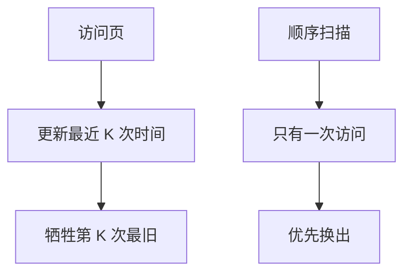

# 缓冲池 LRU-K / 2Q

一次扫描污染 LRU：顺序页只有一次命中却把热点挤出。LRU-K 看第 K 次最近访问时间，2Q 把第一次与多次访问分队列。

<footer>—— 据 O'Neil, O'Neil and Weikum, LRU-K, SIGMOD 1993；Johnson and Shasha, 2Q；Gray and Reuter</footer>

执行引擎在[延迟物化](/cs/late-materialization)封口，gather 会打页。本课打开存储进阶：主干缓冲与脏页在 WAL 前已承认池的存在，替换策略往往一笔带过。缺口是扫描污染与「相关引用」：经典 LRU 把刚扫过的一次性页当成热点。

## 问题

OLTP 热点页应常驻；OLAP 大扫描应走过去几乎不留。LRU 把最近触摸的页放头，扫描让池充满一次性页，随后点查全 miss。缺口是**用访问历史区分扫描与循环热点**，不是再定义页。

LRU-K：记录每页最近 K 次访问时间，替换「第 K 次访问最久远」的页（K=2 常用）。一次扫描只有一次访问，第 2 次时间是 $-\infty$，优先被换。2Q：A1 队列收第一次入池页，很快淘汰；第二次命中晋升到 Am（常 LRU）。时钟算法是近似，本课点名。

O'Neil, O'Neil, Weikum，SIGMOD 1993。Johnson and Shasha 2Q。与操作系统页替换同构，但数据库知道扫描、预取、脏页刷盘约束，不能直接套 OS LRU。

## 方法

池：固定帧，每帧一页（或更大块）。命中：更新该页历史。未命中：按策略选牺牲者；若脏则先写（与 steal 策略、WAL 的 pageLSN 一致）。pin 下一课：正在用的页不能换。

预取：顺序扫描可提前读，策略应避免预取页立刻升成热点。中间结果临时页可标快速逐出。

## 机制

代价模型假设的缓存命中率来自这套策略。校准若假定命中、策略却被扫描污染，DP 会错。并行工人争同一池，latch 保护替换结构——再下一课 latch。

脏页写回：替换要写，延长 miss 路径；后台刷脏与检查点互动，恢复课再接。

## 边界

本课不讲 pin 计数与 latch 区别。也不把 OS page cache 与库缓冲池双缓存当推荐——库常用 `O_DIRECT`。LRU-K 的历史表本身占内存，K 与精度是调参。

后课默认：替换要抗扫描污染；热点靠第二次及以后访问识别。pin 与 latch：页被固定时不能成牺牲者，并发要用短锁。

策略服务的是命中率，不服务可串行。

## 小结

- LRU-K / 2Q 区分一次性扫描与多次热点。
- 脏牺牲者先写；正在使用的页必须 pin。
- pin 与 latch 下一课：固定与互斥不是同一把锁。
- 出处：O'Neil et al. LRU-K；Johnson and Shasha 2Q；Gray and Reuter。
