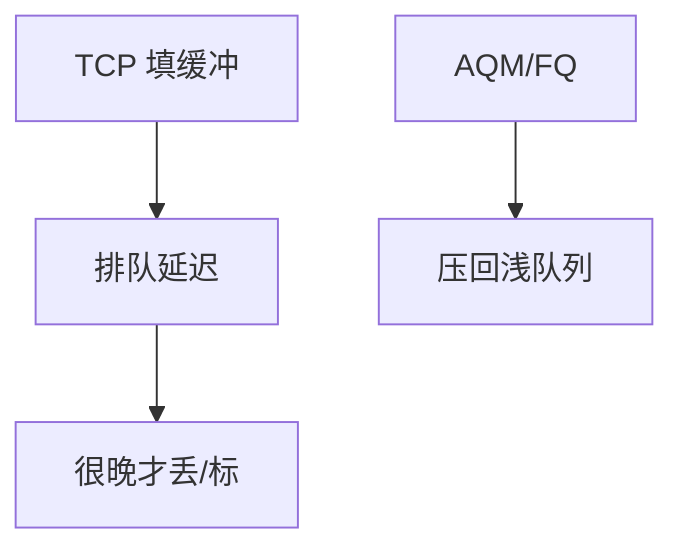

# 缓冲膨胀

过大的瓶颈缓冲让 AIMD 在已满 $C$ 之后仍堆延迟；吞吐看起来很好，交互 RTT 变成秒级。

<footer>—— 据 Gettys and Nichols, Bufferbloat, ACM Queue 2011；RFC 7567 整理</footer>

[BDP](/cs/bandwidth-delay-product) 说缓冲约一 BDP。[AQM](/cs/aqm-red-codel) 是药。[上一课](/cs/ecn) 给标记。缺口是**命名膨胀**：家用路由、LTE 基站、Cable 调制解调器里的巨缓冲。本课不把 WFQ 写完。

## 问题

网卡和驱动按「丢包坏」堆兆字节。TCP 填满缓冲才丢，稳态延迟 = 缓冲/$C$，可远超传播。测速工具显示线速，ssh 却卡——因为共享同一队列。卫星固有延迟不是膨胀；膨胀是可消灭的排队。FQ-CoDel 把大象流隔开，老鼠流不排队。

不要把所有高 RTT 都叫膨胀：先减传播与无线调度。

Gettys 普及该词。本课不点名某调制解调器固件。

### 吞吐满而交互死

排队延迟 = 缓冲/$C$。灌流前后 ping 对照。卫星固有传播不是膨胀。过浅则 incast。

## 方法

对照：浅缓冲丢包 vs 深缓冲延迟。画：cwnd 超过 BDP 的部分 = 队列。测：空闲 ping vs 灌流 ping。incast 是过浅；膨胀是过深；数据中心与接入网方向相反。

方法止于选定对象与对照；机制才说它如何嵌入已有分层与主干课。

## 机制

窗口缩放「成功」后更容易堆满巨型缓冲。PFC 无损也会堆延迟，只是不丢。5G 切片可给 URLLC 独立浅队列，避免被 eMBB 膨胀。测量后课 iperf 要同时看 RTT。

与 HOL：膨胀是单队列深度；HOL 是结构。

## 边界

本课不引入 BQL 网卡字节队列的全部。WFQ 是下一课。后课默认：过大缓冲把延迟藏进吞吐数字；AQM 或每流排队是解。

给接入网「更大缓冲抗抖动」要有上界，否则交互死。

上一课留下的缺口在本课收口；「缓冲膨胀」进入后课词汇表后只引用。文献用来钉对象与边界，不把本课写成该主题的独立综述。下一课[WFQ](/cs/wfq-fair-queue)。

## 小结

- 膨胀：队列延迟主导 RTT，吞吐仍满。
- 测灌流前后的 ping。
- AQM/FQ 针对它；incast 是反面。
- 后课只引用本课钉死的对象，不从该领域总问题重开。
- 出处：Gettys–Nichols, 2011；RFC 7567。
