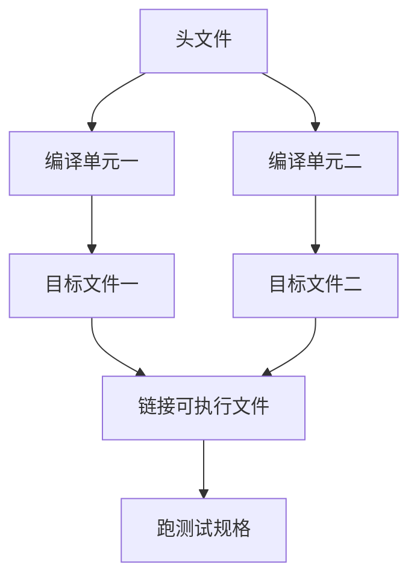

# 构建系统

构建系统记录谁依赖谁：源变了哪些目标文件过期，测试应在链接之后再跑，避免调试一份与源码脱节的镜像。

<footer>—— 据 Kernighan & Ritchie, The C Programming Language, 2nd ed.；Bryant and O'Hallaron, Computer Systems: A Programmer's Perspective 整理</footer>

上一课[调试器与断点](/cs/debugger-breakpoint)需要符号与当前源对应。本课不重讲 DWARF，也不从某一种 Makefile 方言另起。缺口是：第一课的编译命令在多文件时会爆炸，头文件一改，**哪些 `.o` 必须重做、哪份可执行文件是旧的**。构建系统把翻译与链接收成一张依赖图。

## 问题

分别编译的正确性依赖「声明改变则所有包含者重编译」。人手敲 `cc` 会漏掉边：改了 `foo.h`，只重编了 `foo.c`，`bar.c` 仍链着旧布局。缺口因此不是「一键编译」的方便，而是**过期判定**：边是源与头文件到目标文件、目标文件到可执行文件、可执行文件到测试。版本控制课要求旧快照可回放，构建说明必须进同一仓库。

增量构建用时间戳或内容哈希。漏边导致静默 ABI 破裂，症状像未定义行为，根子是镜像混了两代布局。多声明一次边，比事后猜「我该 clean」更接近规格。测试作为规格应成为图上的节点，而不是开发者记忆。

### 构建不是「再写一层宏」

预处理器在一个翻译单元内插入文本；构建系统跨文件调度进程。用递归的巨型脚本 `gcc *.c` 每次全量编译，能正确但丢掉增量，也难以表达生成代码、跨语言步骤。把构建理解成「高级 `#include`」，会把依赖方向搞反：是图调度编译器，不是文本插入整个项目。

K&R 的 `cc` 命令行是单单元模型的起点。CSAPP 链接章默认你已能从多个 `.o` 做出可执行文件。Make 一类工具把「目标、依赖、配方」写成显式图；本课钉图，不背某一种语法。

## 方法

节点：源、头、目标文件、库、可执行文件、测试。边：包含关系与链接关系。改叶子则沿边向上标记过期。配方必须是可重复的：同样源得到同样镜像（在工具链版本固定时）。生成文件由配方写出并被后续节点依赖，不要把生成物与手写源混成同一手改文件。

编译选项（含调试符号、优化等级）是图的一部分：选项变了，节点也过期。否则会出现「调试器里的行号对不上我以为的 `-O0`」。

清洁构建（删掉所有中间文件再做）用来验证图是否自足：若只有增量能过、清洁失败，说明有人手改了生成文件或漏了边。配方应当是声明式的输入到输出，不要在配方里偷偷改源。交叉编译把「主机上跑的测试」和「目标上跑的镜像」分成图上不同的节点，不能用同一条 `cc` 边糊弄。后课动态链接把运行时库加进这张图的「部署边」，构建成功不再等于目标机能加载。

## 机制

依赖图把模块课的「谁包含谁」从程序员脑子里搬到可执行的检查。漏边与版本历史里「只改了实现没改调用方」叠加时，最难查。构建系统不理解 C 类型，只理解文件；头文件纪律仍然必要。后课动态链接会在图上多一类节点：运行时才出现的共享库，其兼容性不能单靠这次链接时的符号解析来保证。

漏边的典型症状是：改完结构体，一部分目标文件用新偏移、一部分用旧偏移，链接成功，运行时错在「不可能」的字段值上——像 UB，其实是两代 ABI 被链进同一镜像。依赖扫描可以从 `#include` 生成边，但生成代码、汇编插入、链接脚本也是边。测试节点失败应当使整个配方失败，否则「构建成功」会掩盖规格已红。动态库作为链接输入时，构建时解析的是当时那一份 soname；运行时搜索路径可以找到另一份，这是下一课要单独画出来的边。

## 边界

本课不比较各种生成器，不讲分布式缓存。下一课[动态链接直觉](/cs/dynamic-link-preview)把「链接」从构建时延到加载时。后课默认：构建是依赖图；头文件是边；测试挂在可执行文件之后；调试的镜像必须是图的产物。

配方应可在干净环境复现：依赖未声明的本机头文件，会在别人机器上静默编出另一份 ABI。把工具链版本钉在构建说明里，与源的变更集同一纪律。测试红则整图失败，不能只生成镜像。

## 小结

- 构建系统用依赖图决定谁过期、以何种配方重做。
- 头文件改变必须重编所有包含者，否则布局会静默混代。
- 测试与编译选项都是图上的节点。
- 下一课把链接从构建时推迟到程序启动。
- 出处：K&R 的编译驱动；CSAPP 多文件链接；Make 一类工具的图模型。
