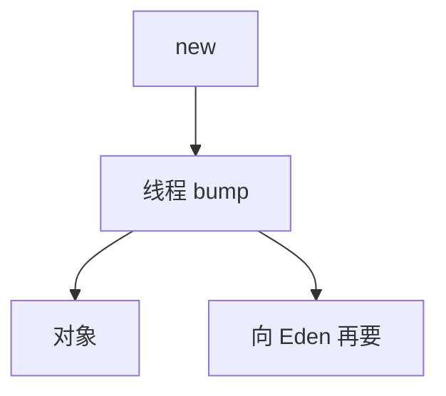

# bump 分配与 TLAB

在连续空闲区上移动指针即可分配：bump pointer。多线程各持 TLAB（线程本地分配缓冲），避免在 Eden 上全局加锁。

<footer>—— 据 Appel 分代分配；HotSpot TLAB；Jones 手册整理</footer>

上一课[分代晋升](/cs/generational-promotion) 的 Eden 需要极快分配。缺口是**实现**：bump 与 TLAB。弱引用下一课。与[线性扫描](/cs/linear-scan-regalloc) 无关——那是寄存器。

## 问题

空闲链表 `malloc` 太慢。复制式/分代 Eden 是空的连续区：`top+=size`。多线程争 `top` 则原子瓶颈。TLAB：每线程一块，本地 bump，耗尽再向堆要。缺口是**无锁快路径**，不是年龄表。

对象头、对齐、数组长度写在 bump 之后。

### TLAB 不是寄存器 TLAB 的笔误

Thread-Local Allocation Buffer。不要和 table 混。

Appel。HotSpot TLAB 自适应大小。本课与逃逸：栈分配更省，TLAB 是堆快路径。

## 方法

慢路径：锁或 CAS 切一块 Eden 给 TLAB。快路径：内联 `if (top+size<=end)`。GC 时废弃或回收 TLAB 剩余。

与 JIT：分配序列是热内联点。与写屏障：新对象在 Eden，store 到老对象才脏卡。

## 机制

浪费：TLAB 末尾空洞。自适应：按线程分配速率调大小。不要在 TLAB 里放必须零填的巨大数组而不考虑预零页。

并发 GC：分配与标记交错，对象须正确着色（黑分配等）。

## 边界

本课不写弱引用。后课默认：Eden 用 bump+TLAB。下一课弱引用与终结器。

也不把 bump 当磁盘分配。

## 小结

- bump：连续区指针移动分配。
- TLAB：每线程一块，快路径无锁。
- GC 与并发着色要与分配协议对齐。
- 出处：Appel；HotSpot TLAB；Jones 手册。
