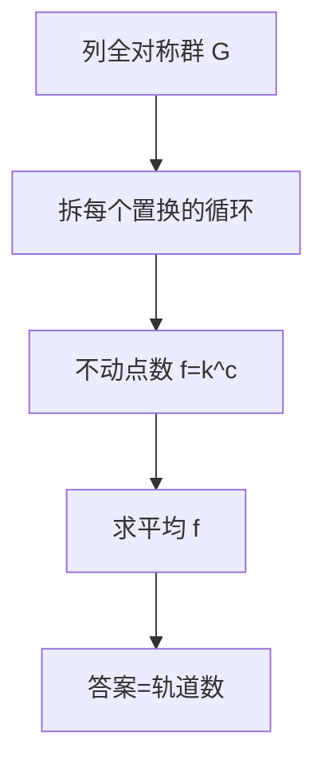
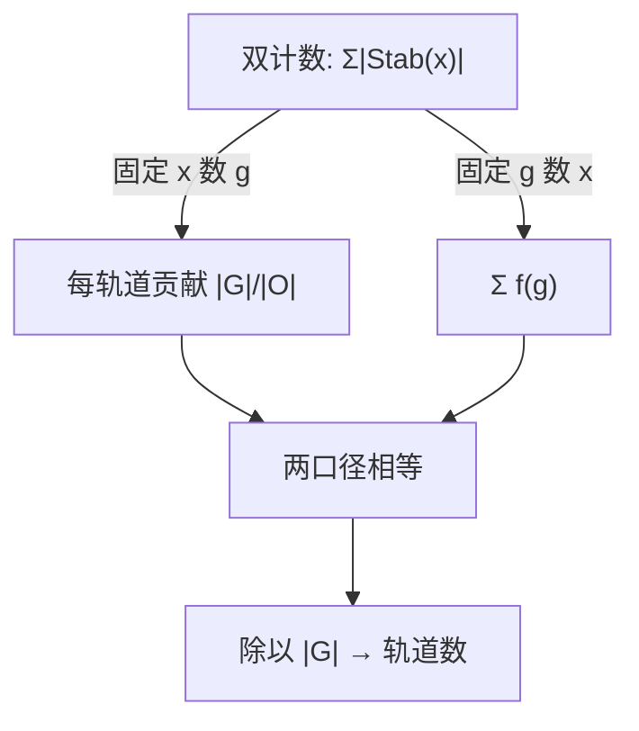

# Burnside 与 Polya 计数

数「本质不同」不要挨个代表挑：把每个置换的不动点数平均一下，等价类个数自己浮出来。

<footer>—— 据 Burnside《Theory of Groups of Finite Order》(1911)；Pólya (1937) 循环指标</footer>

[Lagrange 插值](/cs/lagrange-interpolation)解决「多项式长什么样」，本课解决另一类计数：对象经旋转、翻转、重标号后算同一个，问本质不同的有几个。缺口是 **Burnside 引理**：等价类数 = 各群元素不动点数的平均。Pólya 再把不动点数压缩成循环指标的系数。本课不进群论一般理论，只取计数这两板斧。

## 问题

6 颗珠子串成环，黑白两色，旋转算同一条：$2^6=64$ 种染色里本质不同的多少？挨个去重既慢又容易漏。缺口：**对称性下的去重计数**要一个系统算法。本课不处理「着色带权且要求恰用 k 次」这类带约束变体——那是生成函数的事。

术语翻译：轨道（orbit）=「算同一种」的所有染色凑成的一堆；不动点（fixed point）= 某置换转完以后纹丝不动的染色。Burnside 数的就是后者的平均。

数字实例：6 珠双色手链（可翻面，二面体群 12 阶）。恒等置换不动点 $2^6=64$；旋转 60° 与 300° 各 2（全黑全白）；120° 与 240° 各 4；180° 一个 8；翻转 3 条过对珠的轴各 $2^4=16$（2 个单珠 + 2 对互换）、3 条过对边的轴各 $2^3=8$（3 对互换）。平均 $(64+2+2+4+4+8+16\cdot3+8\cdot3)/12=13$——本质不同 13 条。

## 方法

算法三步：列出对称群 $G$ 的全部置换；对每个置换数不动点；求平均。数不动点有套路——置换拆成循环，一个染色不动当且仅当每个循环内颜色一致，于是 $f(g)=k^{c(g)}$，$c(g)$ 是循环个数，$k$ 是颜色数。项链题里 $c$ 直接由循环长度看出。

直觉类比：清点全班有几个「小组」，不逐组登记，而是问每个同学「你们组几个人」，再取平均？——Burnside 换了个更聪明的口径：每个置换像一位裁判，报出它「点名时不动」的方案数，所有裁判报数取平均就是小组数。

## 机制

为什么平均恰好是轨道数？对一条轨道 $O$，数二元组 $\{(x,g): g\cdot x=x\}$。固定 $x$ 数 $g$，得 $|G|/|O|$（稳定子群拉格朗日）；固定 $g$ 数 $x$，得 $\sum_g f(g)$。两个口径相等，除以 $|G|$ 即 $|O|$ 求和——每一轨道恰贡献 1。这就是「平均不动点数 = 轨道数」的全部机关。

Pólya 一步：把 $c(g)$ 换成循环指标 $a_1^{c_1}a_2^{c_2}\cdots$（$a_i$ 记长度 $i$ 的循环个数），代入 $a_i\leftarrow \sum t^i$ 后展开取系数——一次性得到「恰用 $t$ 种颜色」各档的答案，不用对每种 $t$ 重跑 Burnside。

常见误区：只除以旋转忘了翻转——项链（有向）与手链（可翻面）答案不同：6 珠双色项链 14 条、手链 13 条。另一误区是把「群的阶」数错：正六边形旋转群 6 阶、二面体群 12 阶，漏掉恒等置换会全盘算错。

## 边界

Burnside 要求 $G$ 确实是群（封闭、有逆），把「旋转」和「翻转」混着单列不构成群就会算错。Pólya 展开在颜色多、循环长时指数爆炸，工程上靠多项式乘法截断。带约束计数（比如每种颜色至少一次）要配容斥或生成函数，引理本身只管「等价类个数」。

直觉类比：循环指标像「收据」——每行写着「长度 2 的圈有 1 个、长度 3 的圈有 1 个」；Pólya 就是把每行的圈按颜色「批发」出 $t^i$，最后收据一汇总，全部答案一次结清。

## 小结

- 本质不同计数 = 对称群各元素不动点数的平均：$\frac1{|G|}\sum_g k^{c(g)}$。
- 循环指标把逐色重算升级成一次展开各档全出。
- 对称群必须完整：旋转加翻转（二面体群）与只有旋转答案不同。
- 出处：Burnside《Theory of Groups of Finite Order》1911；Pólya「Kombinatorische Anzahlbestimmungen」1937。
