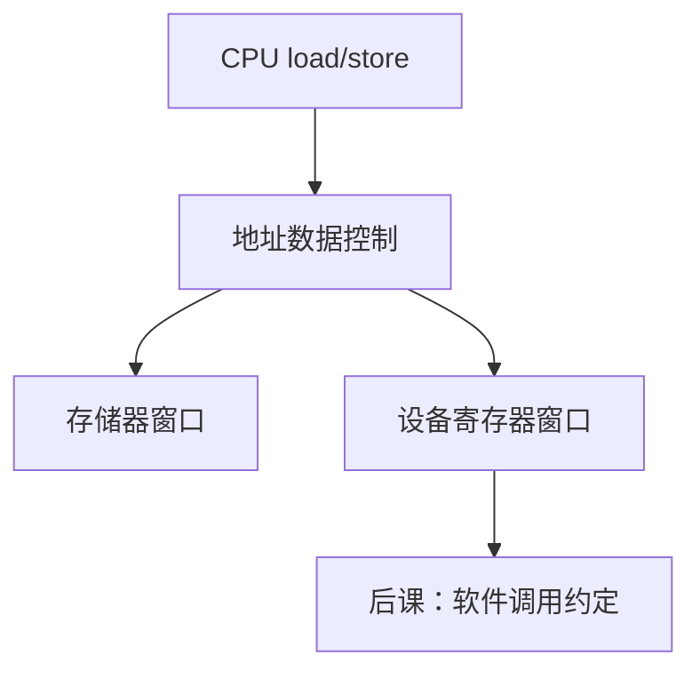

# 总线与 MMIO

CPU 的访存口接到一组共享地址/数据/控制线上；一段物理地址不对应 DRAM 单元，而对应外设寄存器，这就是内存映射 I/O。

<footer>—— 据 Patterson and Hennessy, Computer Organization and Design (RISC-V)；Harris and Harris, Digital Design and Computer Architecture 整理</footer>

上一课[多周期与微程序直觉](/cs/multicycle-microcode)让硬件能把指令拆拍执行。本课不重画 FSM 状态，也不从操作系统驱动模型另起。缺口是：到现在「数据存储器」还是一块匿名阵列。真实系统里，同一套 `lw`/`sw` 还要打到**外设**。

## 问题

总线：地址、数据、读/写、就绪。主设备（CPU）发起，从设备（存储控制器、UART）译码地址片选。MMIO：物理地址区间译到设备寄存器，软件仍用 load/store，没有单独 `in`/`out`（x86 端口 I/O 是另一风格，本栏不用）。缺口不是新的 ISA 运算，而是地址译码把空间切开。

就绪信号让慢设备插入等待拍，与多周期「等存储器」同一机制。教学单周期常假装一拍完成。

### MMIO 不是「另一套指令集」

外设寄存器的比特语义是设备规定的，但访问就是普通 `lw`/`sw`。把 MMIO 当成需要新 opcode 的 I/O 指令，RISC-V 的 load/store 原则会破。缓存：MMIO 区通常不可缓存，否则写缓冲会打乱设备顺序——体系结构课再钉，本课承认「有的地址不是 RAM」。

Patterson/Hennessy 用内存映射设备。Harris 有简单总线时序。三态/互斥驱动已在[传输门与三态](/cs/transmission-tristate)。本课不把 PCIe 层次写完。

## 方法

CPU 发出地址。译码：落在 RAM 则进 DRAM/SRAM 控制器；落在 `0x10000000` 一类窗口则进 UART 等。设备把寄存器接到总线数据。轮询：软件读状态位。中断通知留到后课入口与 PLIC。

## 机制

至此，组成上的处理器能执行任意已定义指令序列，并能用地址访问存储与设备。下一课不再加数据通路方框，而是软件如何用 `jal` 与栈传参——硬件已经够用。DMA 是设备当主设备抢总线，本课点名，机制同仲裁。

## 边界

本课不讲 VirtIO、不把网络协议栈请进来。不讨论一致性下 MMIO 的强序。中断号如何汇聚是 PLIC 课。

后课默认：I/O 是 load/store 到特殊物理地址；总线有等待。下一课 ABI 与栈。

## 小结

- 总线连接 CPU 与从设备；MMIO 用访存指令打设备。
- 地址译码区分 RAM 与寄存器。
- 硬件已能跑任意指令序列；下一课是软件约定。
- 出处：Patterson and Hennessy, COD (RISC-V)；Harris and Harris。
