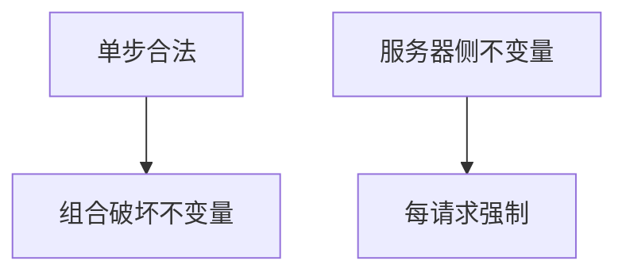

# 业务逻辑漏洞

每一步都合法，合起来却破坏不变量：负数量、跳过支付、改价接口未授权。工具难自动找，因为错误在规格里，不在越界里。

<footer>—— 据 OWASP 业务逻辑；Anderson 对激励与规则；对照[最小特权](/cs/acl-least-priv)</footer>

## 定位

上一课[竞态](/cs/web-race-condition)是并发不变量。缺口是**规格本身**：工作流。本课讲如何把不变量写成测试，不给欺诈剧本。

后课默认已经读完本课钉下的合同，只补差，不从该领域第一性原理重开。

## 问题

优惠码可叠加到负价；状态机允许未付发货。缺口是：显式状态机、服务器侧计价、授权每一步。

### 客体级授权

能调 API 不等于能碰该订单。BOLA 后课专收。

OWASP。禁止欺诈操作指导。撞库下一课是认证面。

## 方法

列出不变量：价格非负、状态单调、资源属主。用属性测试。下一课撞库与速率。

图中节点是本课的机制骨架；课程不把图展开成可运行的攻击步骤。

## 机制

授权矩阵要覆盖工作流，不只登录。撞库是另一条：凭证已经泄漏，在你这重放。

前提写进合同之后，游戏外的误用只当失败模式点名，不在本课写成操作程序。

## 边界

不写欺诈步骤。状态机不变量必须在服务器，不能只在前端。撞库与速率限制下一课。

## 小结

- 竞态是时间；业务逻辑是规格。
- 不变量必须服务器强制。
- 工具对这类洞盲。
- 下一课撞库。
- 出处：OWASP Business Logic；Anderson；[acl-least-priv](/cs/acl-least-priv)。

