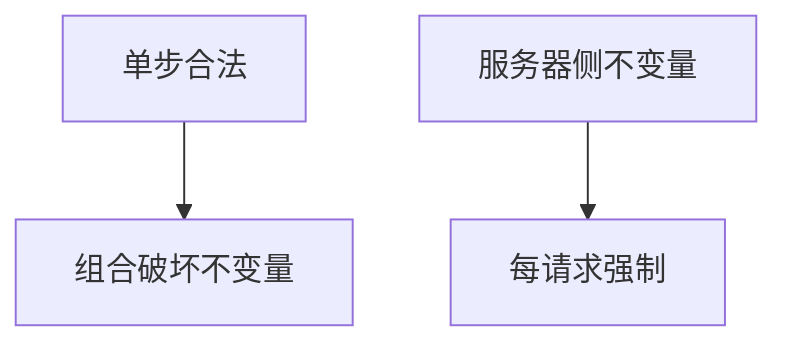
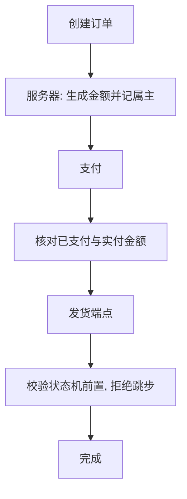

# 业务逻辑漏洞

每一步都合法，合起来却破坏不变量：负数量、跳过支付、改价接口未授权。工具难自动找，因为错误在规格里，不在越界里。

<footer>—— 据 OWASP 业务逻辑；Anderson 对激励与规则；对照[最小特权](/cs/acl-least-priv)</footer>

上一课[竞态](/cs/web-race-condition)的洞出在时间上：并发打乱了不变量。本课的洞出在**规格本身**：每步都合法，走完工作流，不变量却碎了。方法是把不变量显式写成测试；不给欺诈剧本。

后课默认已经读完本课钉下的合同，只补差，不从该领域第一性原理重开。

## 问题

三个典型。价格：优惠接口各自打折、无总额下限，叠加出负价，退款再按负数继续走。状态机：未支付订单也能调「发货」端点，端点只查登录、没查前置条件。对象：改价接口信任客户端提交的金额，谁拿到请求模板谁就能改价。共同缺口：状态机只活在实现者脑子里、计价能被客户端影响、授权只在登录做了一次而不是每步都做。

数字实例：两张 9 折券叠一张满 100 减 20——100 元订单变成 100×0.9×0.9−20=61 元；若系统再不设总额下限，再叠一张「减 80」就得出负价，退款按负数走，反而给用户账户打钱。

### 客体级授权

能调用 API 不等于能碰这一笔订单：授权要落到对象实例——是不是当前用户的订单——而非接口存在。BOLA 后课专收。

OWASP。禁止欺诈操作指导。撞库下一课是认证面。

## 方法

把不变量显式列出：价格非负、金额只在服务器算、状态沿状态机单向走、每个对象有属主且每请求核对。再把它们写成属性测试：随机生成操作序列，断言不变量在任意序列后仍成立——单步用例对组合漏洞无效，洞只在组合里。下一课撞库与速率。

直觉类比：不变量像游戏物理引擎——玩家每个按键都合法（每个 API 调用都过校验），但两键同按、按错顺序就能穿墙；漏洞藏在引擎允许的组合里，单看任一按键都看不出问题。

```mermaid
flowchart TD
  STEP["单步合法"] --> COMP["组合破坏不变量"]
  INV["服务器侧不变量"] --> ENF["每请求强制"]
```

## 机制

为什么工具盲：扫描器与模糊测试盯的是「越界」——非法输入、注入、溢出；业务逻辑漏洞的每个输入都合法、都能过校验，坏在合起来的顺序与组合，规格之外的机器看不见规格里的洞。防线因此是让规格显式化：状态机由服务器强制，前端校验只做体验、不能当守门员；计价只认服务器数据；授权矩阵覆盖工作流每一步而不只在登录。撞库是另一条线：凭证已在别处泄漏，攻击者到你这里重放——那是认证面，下一课讲。

```mermaid
flowchart TD
  CREATE["创建订单"] --> C1["服务器: 生成金额并记属主"]
  C1 --> PAY["支付"]
  PAY --> C2["核对已支付与实付金额"]
  C2 --> SHIP["发货端点"]
  SHIP --> C3["校验状态机前置, 拒绝跳步"]
  C3 --> DONE["完成"]
```

常见误区：初学者容易以为前端校验过了就安全——前端只做体验提示，攻击者拿请求工具直接重发即可绕过；金额、状态、属主三个判断必须在服务器每个请求重做。

## 边界

本课不写欺诈操作的具体步骤。一条要钉死：状态机不变量必须在服务器强制，不能只在前端。撞库与速率限制下一课。

## 小结

- 竞态是时间；业务逻辑是规格。
- 不变量必须服务器强制。
- 工具对这类洞盲。
- 下一课撞库。
- 出处：OWASP Business Logic；Anderson；[acl-least-priv](/cs/acl-least-priv)。

