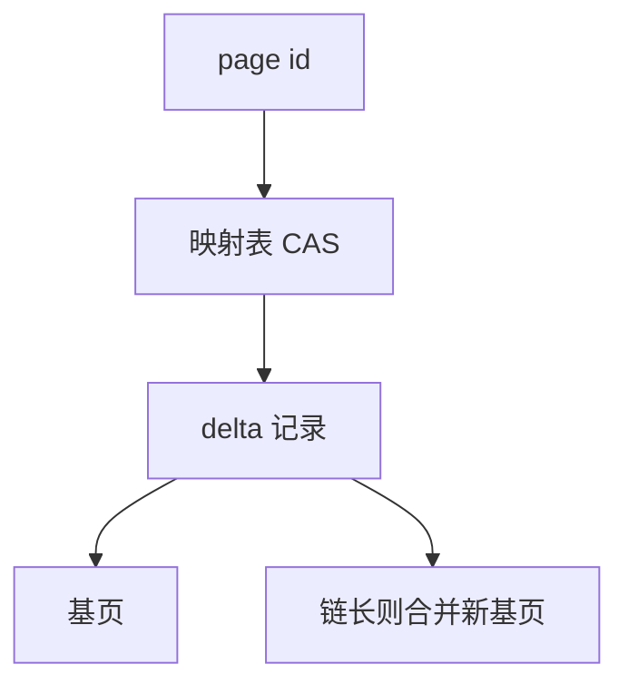

# Bw-tree

逻辑页是映射表里的指针：原地改换成 delta 记录链，CAS 安装新地址；结构修改也走无闩路径。

<footer>—— 据 Levandoski, Lomet and Sengupta, The Bw-Tree, ICDE 2013；B-link 对照</footer>

[上一课](/cs/latch-crabbing)在页闩上蟹行。本课不持写闩走满节点。缺口是主存优化索引：多核上 latch 仍是缓存行争用。Bw-tree 把「页」变成映射表（page id → 地址），更新用单字 CAS 挂 delta，读方沿着 delta 链看到最新逻辑页。

## 问题

传统 B+：改槽要写闩，叶热点（递增键）把核排队。Bw-tree：插入是分配 delta 记录（键+载荷），CAS 把映射表从旧页地址改到「delta→旧页」。失败则重试。缺口是**无闩并不无同步**，同步在 CAS 与 epoch 回收。

链太长则 consolidate：把 delta 与基页合成新基页，再 CAS 安装。分裂/合并是安装新页 id 并改父，用 SMO 协议保证读者看到一致。闪存/持久化变体另说；原论文面向主存+日志。

Levandoski, Lomet, Sengupta, ICDE 2013，微软 Hekaton 相关。ART 下一课是另一主存索引族（基数树）。本课不把 Bw 当磁盘 B+ 的替代教条。

## 方法

查找：映射表取地址，沿 delta 链+基页二分或扫描。范围：逻辑叶有序，链上有插入删除。GC：epoch 或类似，确保无读者还在旧地址上才回收。崩溃：映射表与页要进 WAL 或检查点，比纯内存结构重。

与缓冲池：逻辑页可能不在固定帧模型里；主存库常自己分配。磁盘库用 Bw 要重新设计落盘，本课点名边界。

## 机制

正确性：读者看到的链是某次 CAS 前缀，不会撕裂槽。隔离仍要事务层（锁或 MVCC 版本在载荷里）。Bw 只替换页闩这一层。

与 LRU-K 无关若页不进经典池。混合引擎可能叶在 Bw、溢出在磁盘 B+——实现复杂性高。

## 边界

本课不讲 ART 的 Node4/16/48/256。也不把无锁跳表当 Bw。学习索引更后。

后课默认：高并发主存点查可用映射+delta 减少写闩。ART 在数据库：字节序范围扫描的自适应基数树，常作主存主索引。

无闩索引把争用从锁管理器挪到 CAS 与回收，不取消事务语义。

## 小结

- Bw-tree 用映射表与 delta CAS 更新逻辑页。
- 链合并与 SMO 仍要协议；GC 用 epoch。
- ART 在数据库下一课：有序主存索引的另一形状。
- 出处：Levandoski, Lomet, Sengupta, ICDE 2013；B-link 对照。
