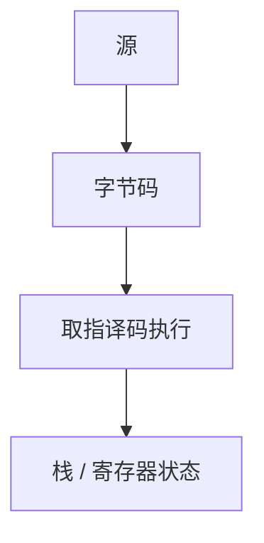

# 字节码解释器

编译到紧凑的字节码，再由循环取指、译码、执行。比树遍历快，比 native 慢；换来可移植与短生成时间。

<footer>—— 据 Deutsch and Schiffman, Efficient Implementation of the Smalltalk-80 System；Appel；主干运行时直觉整理</footer>

上一课[交叉编译](/cs/cross-compile-triple) 把 native ELF 交到目标机。缺口是另一条交付：**字节码 + 解释器**。JVM、CPython、早期 Pascal P-code。本课钉分派循环，栈 vs 寄存器 VM 下一课。不重写 ELF 加载。

## 问题

AST 解释：每结点虚调用，慢。字节码：线性指令、小操作码。循环：`op = *pc++; switch(op)`。缺口是**这层 IR 的执行**，不是 lex。

与[操作语义](/cs/operational-semantics)：解释器是 SOS 的可执行版。正确性：每条字节码对应小步。

### 字节码不是「源码压缩」

它是编译器后端的另一种目标。类型检查仍在生成前。不要把 `.pyc` 当加密。

Deutsch–Schiffman 1984。Pascal P-machine。Java 虚拟机规范是工程百科，本课只取解释循环。不写 JIT，后课。

## 方法

定义操作码：load/store、算术、跳转、调用。生成器从 AST/IR 吐字节。解释器维护 PC、栈或寄存器文件、常量池。

与 GC：解释器必须能枚举根（栈槽类型图）。主干[运行时 GC](/cs/runtime-gc) 已给根。

## 机制

switch 分派：分支预测差。线程化分派后课。安全：校验器（JVM）在加载时查栈高度，否则解释器可被坏码打崩。

不要在解释器里做全局优化；那是编译到字节码的中端。

## 边界

本课不写 JVM 指令全集。后课默认：字节码循环是 VM 基线。下一课栈式对寄存器式编码。

也不把解释器当 bash。

## 小结

- 字节码解释器：可移植目标 + 分派循环。
- 对应操作语义的可执行形式。
- 分派开销是主要税，后课减。
- 出处：Deutsch and Schiffman, 1984；Appel；对照 Plotkin SOS。
