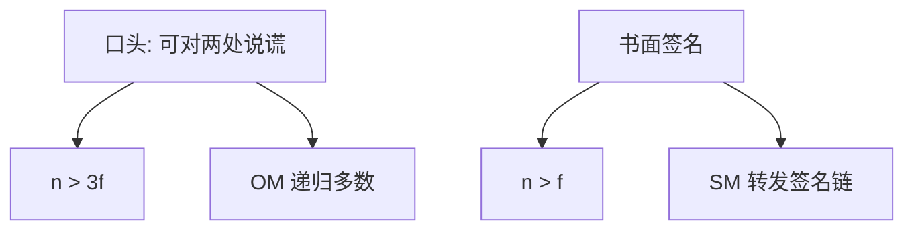

# 拜占庭将军

口头消息下 $n>3f$ 才能让忠诚将军达成同一命令；书面（不可伪造签名）可降到 $n>f$。撒谎比崩溃贵三倍。

<footer>—— 据 Lamport, Shostak and Pease, The Byzantine Generals Problem, TOPLAS 1982；Pease, Shostak and Lamport, JACM 1980 整理</footer>

上一课[FLP](/cs/flp-impossibility)在崩溃下封死了异步确定共识。缺口是**故障类升级**：进程不但停，还会发矛盾消息。本课时间模型先按同步口头/书面协议讲经典下界，不把 PBFT 的视图更换提前写完。后课一致性模型假定复制机能偏离到哪一档。

## 问题

若干将军要进攻或撤退，忠诚者必须同命令，且该命令若指挥官忠诚则等于其提议。$f$ 个叛徒任意说话。口头消息：可撒谎、可对两人说不同话，但不可伪造第三者身份（或模型里不假设签名）。Lamport–Shostak–Pease：口头需要 $n>3f$，且给出递归 OM 算法。书面消息：签名不可伪造、不可抵赖，则 $n>f$ 足够（SM 算法）。

缺口不是故事，而是把[故障模型](/cs/failure-models)里「拜占庭」变成可证的 $n$ 与 $f$ 关系。同步轮是本课假设：口头递归按轮展开。异步拜占庭还要另付 FLP 与认证信道的账，后课 PBFT。

1980 的 PSM 论文先给交互一致性；1982 的 BGP 把故事与 OM/SM 写清楚。口头 $3f$ 下界用分区+撒谎构造。

## 方法

OM($f$)：指挥官广播；每人把收到的值再当指挥官跑 OM($f-1$)；取多数。$f=0$ 即直接投递。指数消息是经典代价；后续多项式协议（Dolev 等）本课点名。签名把「第三人说了什么」钉死，叛徒不能再分裂忠诚者的证据。

崩溃是拜占庭真子集：能抗 $f$ 拜占庭则能抗 $f$ 崩溃，但 $n$ 预算按拜占庭花。认证信道（点对点不可伪造）介于口头与完全书面之间，后课 PBFT 用 MAC/法定人数。

## 机制

下界直觉：三个进程一个叛徒，口头时忠诚二人无法判断谁在撒谎，各自坚持己见。四人一叛徒可以多数。签名后叛徒不能冒充别人的命令，忠诚者能收集一致的证据链。

本课不把工作量证明当拜占庭将军的解：PoW 换了参与集合与同步假设，后课单独钉直觉。也不把「多数派投票选主」直接叫拜占庭容错：无认证的多数在撒谎下会被分裂投票骗。

与租约、检测器：拜占庭心跳无意义。怀疑名单不能当 OM 的输入；要用消息交叉验证。

## 边界

本课不写 PBFT 三阶段，不引入权益证明。不把口头协议当数据中心默认——实践用签名或 TLS 会话。后课默认：崩溃预算 $n>2f$，口头拜占庭 $n>3f$，签名可降。一致性课先按崩溃复制讲，拜占庭状态机放到 PBFT。

时间与失败这一课序在此封口：故障类、时间档、钟、检测、租约、不可能、撒谎下界。下一单元从「读看起来像什么」开始，不再从零定义崩溃。

## 小结

- 口头拜占庭：$n>3f$，OM 递归；书面：$n>f$。
- 崩溃预算不能直接拿到撒谎场景复用。
- 同步经典结果；异步拜占庭后课。
- 出处：Lamport, Shostak and Pease, TOPLAS 1982；Pease et al., JACM 1980。
