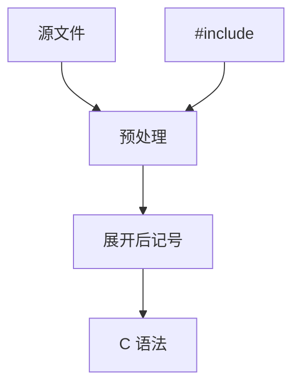

# C 预处理器

在真正的 C 语法之前，cpp 按记号列表做替换、条件编译与文件包含。它不是卫生宏，也不是函数。

<footer>—— 据 ISO C 标准预处理翻译阶段；Kernighan and Ritchie；龙书对独立预处理遍的说明整理</footer>

上一课[宏与卫生](/cs/macros-hygiene)给出着色宏的不变量。C 的 `#define` 工作在**词法记号**上，故意不卫生，且发生在[lex](/cs/lex-flex) 与语法之间的标准「翻译阶段」。缺口是这份**阶段与陷阱**：包含、条件、粘贴、字符串化，不是再讲 Scheme。本课钉顺序，不写全部 `#pragma`。

## 问题

ISO C 把翻译分成阶段：物理源 → 逻辑行（续行符）→ 记号 → 预处理 → 再记号化 → 语法。`#include` 把另一文件的记号插进来，符号表与 AST 尚未存在。缺口是**预处理遍的输入输出类型**：仍是记号流，不是树。

函数式宏 `#define F(a) ...` 只认括号调用，有独立的展开规则（参数预扩展、`#` `##`）。与卫生宏对照：`tmp` 必捕获。

### `#define` 不是类型系统

宏不尊重作用域、不尊重 `typedef`。`max(x++, y)` 双求值是展开副本，不是调用约定。本课用这个例子钉「改写 ≠ 函数」，不重讲求值策略。

K&amp;R 与 ISO C 的翻译阶段。cpp 可独立运行（`cc -E`）。本课不把模块（C++20 modules / C23 的部分方向）当已替代 cpp 的事实。

## 方法

实现：维护宏表与条件编译栈（`#if`/`#ifdef`）。展开时防递归（已展开的宏名涂黑）。`##` 粘贴后须再扫描。包含路径与守卫（`#ifndef`）是工程，不是文法。

与 lex：有的实现把 cpp 与扫描器交织（上下文敏感的 `typedef` 还在后面）。标准仍要求阶段语义。错误：`#error`、未定义行为式的粘贴结果，诊断要指向宏调用栈。

## 机制

条件编译改变「哪些记号存在」，分析器看见的语言是配置后的。增量解析若忽略 cpp，高亮与真编译会分叉——接[tree-sitter](/cs/incremental-parsing) 的边界。

卫生课的着色在 cpp 里不存在：要卫生只能不用 cpp 做绑定。头文件是文本接口，不是模块类型检查。

## 边界

本课不写链接，不讲导出宏的 ABI。后课默认：C 前端先预处理再分析；捕获与双求值是特性。下一课：源编码与 Unicode 词法——在 cpp 之前的字符阶段。

不要把 `X` 宏表技巧当类型安全的泛型；泛型在类型单元。

## 小结

- cpp 在语法前改记号；不卫生、无作用域。
- 翻译阶段规定包含与宏的顺序。
- `#`/`##` 与参数预扩展是独立规则。
- 出处：ISO C；Kernighan and Ritchie；对照 Kohlbecker 卫生宏。
