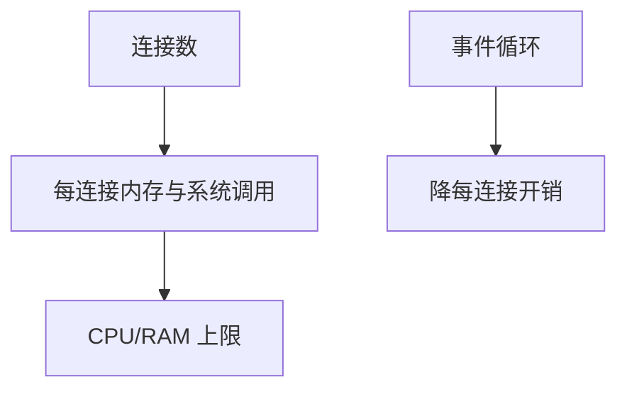
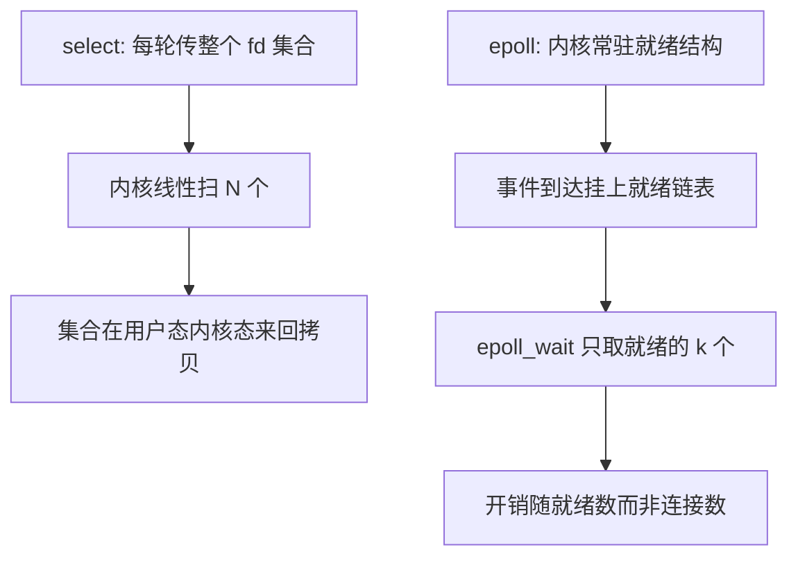

# C10K 与并发模型

一万并发连接的瓶颈在每连接的内核与用户态开销；事件驱动、高效多路复用与少拷贝把 C10K 变成 C10M 量级的工程，而不是新协议。

<footer>—— 据 Kegel, The C10K Problem；libevent/nginx 实践整理</footer>

[Reactor](/cs/reactor-proactor) 给模式。[套接字](/cs/socket-api) 给 API。[上一课](/cs/reactor-proactor) 留下规模。缺口是 **C10K 问题**：fd 上限、epoll vs select、内存。本课不把粘包写完。

## 问题

2000 年代：select 线性扫描、每连接一进程、内核套接字缓冲默认大，一万连接吃光 RAM。对策：epoll/kqueue、降低缓冲、事件循环、零拷贝 sendfile。今日 C10M 还要网卡多队列、RPS、用户态栈。这与 $C$ 公式无关，是主机实现税。Maglev 把连接摊到多机，是水平解。

数字实例：1 万条连接只有 100 条活跃——select 每轮仍要遍历约 10000 个 fd；epoll_wait 只返回那 100 个就绪事件，工作量差两个数量级，这正是 C10K 的分水岭。

不要把 C10K 写成必须用某种语言。

Kegel C10K。本课不点名基准广告。

### 每连接开销 × N

事件化与少拷贝，不是新协议。H2 多流也减连接数。fd 耗尽是可用性攻击面。业务同步塞进循环会更早失败。

## 方法

对照：进程 / 线程 / 事件 / 协程。画：连接数 × 每连接开销。与 incast：那是网络队列；这里是主机 fd。

术语翻译：fd 是「连接的编号句柄」——每条 TCP 连接在进程里占一个整数加一份内核对象；ulimit 与 fd 上限卡的正是编号总数，耗尽时新连接连 accept 都进不来。

```mermaid
flowchart TD
  N["连接数"] --> COST["每连接内存与系统调用"]
  COST --> LIM["CPU/RAM 上限"]
  EV["事件循环"] --> LOW["降每连接开销"]
```

## 机制

HTTP 持久减少握手但仍占 fd。H2 多流在一条连接上减轻 C10K。QUIC 用户态更灵活也更吃 CPU。SYN cookies 保护握手，不降低已建立连接数。测量：ss -s，不是 ping。

```mermaid
flowchart TD
  SEL["select: 每轮传整个 fd 集合"] --> SCAN["内核线性扫 N 个"]
  SCAN --> COPY["集合在用户态内核态来回拷贝"]
  EP["epoll: 内核常驻就绪结构"] --> CB["事件到达挂上就绪链表"]
  CB --> WAIT["epoll_wait 只取就绪的 k 个"]
  WAIT --> SC["开销随就绪数而非连接数"]
```

常见误区：初学者容易以为换一门语言就能过 C10K——瓶颈在每连接的内核对象、缓冲和系统调用次数，语言只动常数；事件化、少拷贝、减每连接状态才动结构。

安全：fd 耗尽是拒绝服务，要 ulimit 与限连。

## 边界

本课不引入 DPDK 的全部。粘包与帧定界是下一课。后课默认：万级并发靠事件化与减每连接状态。

把业务逻辑同步塞进事件循环会在远低于 C10K 时失败。

下一课[粘包与帧定界](/cs/message-framing)。

## 小结

- 瓶颈是每连接开销 × N。
- 高效多路复用 + 少线程。
- 协议多路（H2）也减连接数。
- 后课只引用本课钉死的对象，不从该领域总问题重开。
- 出处：Kegel C10K；服务器实践。
