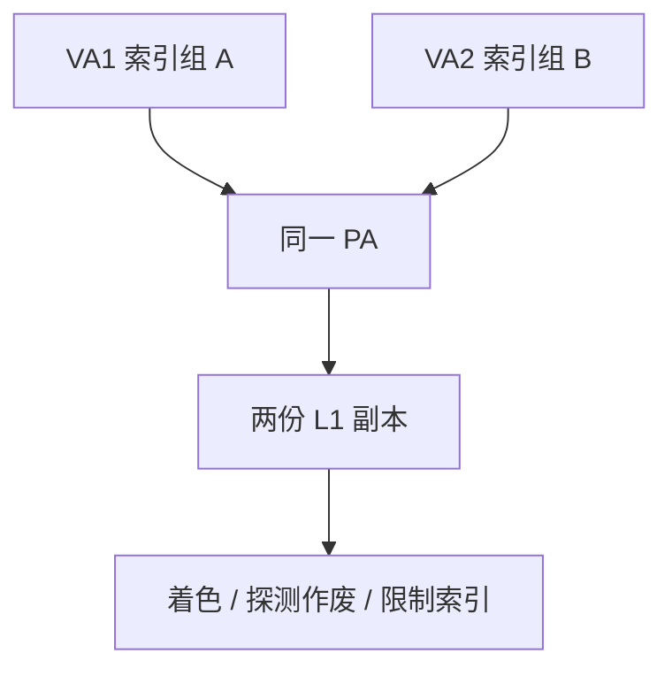

# 缓存别名

同一物理行若能被两个虚拟地址索引到不同的组，L1 里就会出现两份副本；写其中一份，另一份变成静默的陈旧数据。

<footer>—— 据 Hennessy and Patterson, CA:AQA 整理</footer>

[上一课](/cs/vipt-cache) 要求 VIPT 的索引落在页内，正是为了堵住同义（synonym）。实践中人们仍想做更大的 L1，索引会借到 VPN 位。本课不重讲 TLB 并行。缺口是**别名：同义与同名（homonym），以及硬件或软件如何保证最多一份有效副本。**

## 问题

同义：两个 VA 映射到同一 PA（共享页、`mmap` 两次）。若索引用了 VPN 位，两份 VA 进不同组，L1 变成「两个 cache 行对应一块内存」。单核写回已经乱；再叠加 [MESI](/cs/mesi-protocol) 更无法定义哪份是 M。同名：同一 VA 在不同 ASID 下指不同 PA，VIVT 会把旧进程的行当成新进程的命中。缺口不是替换策略，而是**检测或避免第二份副本。**

页着色：OS 分配物理页时让 PA 的某些位与 VA 一致，从而「越页」的索引位实际上在同义之间相同。这是软件契约，硬件仍可加探测器。

## 方法

避免：限制 L1 使索引 ⊆ 页内（上一课）。页着色：OS 保证同义的 VA 在索引位上一致。硬件：填入时按 PA 查「是否已在另一组」，有则先无效或搬移。VIVT 用 ASID 标签，切换不必全冲，但同义仍要处理。

## 机制

别名是正确性问题，不是性能调优。调试器里「变量改了但读到旧值」可以来自这里。I-cache 与 D-cache 对同一物理页的别名（SMC）是另一条：指令行必须在 store 后无效，与 uop cache 的 SMC 纪律相同。

大页让页内位移变长，VIPT 可索引更大 L1，同义窗口变小——后课大页会再提，本课只记「页大小是别名几何的一部分」。

## 边界

本课不把 GPU 的纹理 cache 别名当主干。也不把写合并缓冲的部分行写成别名解决方案。路预测下一课：那是在「已经只有一份、多路比较贵」时猜哪一路，不是修副本。

后课默认：L1 要么几何上杜绝同义，要么 OS/硬件显式消第二份。多路并行比较的功耗，用路预测来砍。

## 小结

- 同义别名产生多份物理行副本，必须着色、探测或限制索引。
- 同名靠物理标签或 ASID，不能只信 VA。
- 多路都读但只启用一路，是下一课路预测。
- 出处：Hennessy and Patterson, *CA:AQA*。
