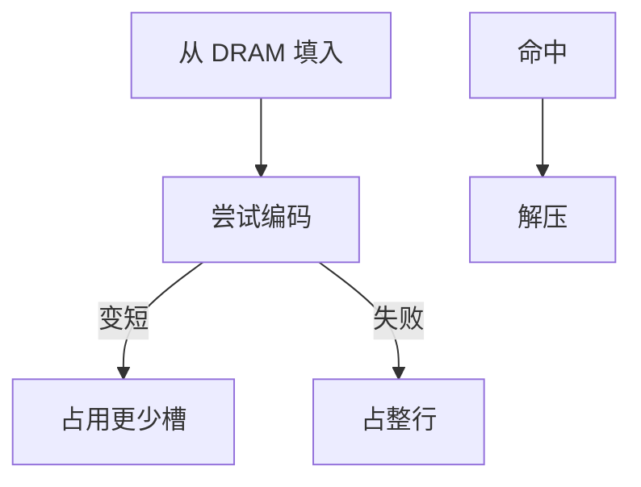

# 缓存压缩

许多行的数据是稀疏、重复或窄整数；压缩后同一 SRAM 可以多住几块，代价是命中路径上的编解码与可变行大小。

<footer>—— 据 Alameldeen and Wood；Pekhimenko et al., Base-Delta-Immediate Compression, PACT 2012 整理</footer>

[上一课](/cs/cache-partition-qos) 按核切容量。配额仍以物理行为单位，一行 64B 里若只有少量有效信息，配额浪费。本课不重切 way。缺口是**压缩：在填入时把行变短，让一组里塞进多于相联度的「逻辑块」，缺失率下降。**

## 问题

指针、小整数数组、全零行在 LLC 里极常见。不压缩则每块固定 64B。[MLP](/cs/mlp-memory-parallelism) 再高也救不了「工作集以块计刚好溢出」。缺口不是再分区，而是**用简单、定界延迟的编码提高有效容量**，且解压必须适合 L2/L3 命中路径。

BDI：一行用一个基址加窄的 delta。零块、重复值是更简单的特例。压缩率随数据变，标签阵列要能指向「半行」「四分之一行」的槽。

## 方法

填入：试几种编码，选能装进更少子块的方案；失败则不压缩。标签：每块仍有完整 PA 标签 + 压缩模式 + 起始槽。命中：按模式解压再返回。替换：按压缩后占用的槽数计，可能一次踢出「逻辑一块」。

## 机制

有效容量上升，冲突/容量缺失下降，与 [RRIP](/cs/rrip-dead-block) 叠加。副作用：同一组里块数可变，替换与分区的「路」不再整齐；QoS 记账要从路数改成槽数。命中延迟增加一级组合逻辑，因此 L1 很少压，LLC 更常见。

一致性仍按物理行：压缩是私有表示，总线/目录上看完整 64B 或按扇区，下一课扇区会碰到部分行。

## 边界

本课不把通用压缩算法（LZ）放进命中路径。也不把 GPU 的帧缓冲压缩当 CPU LLC 的同一实现。近存计算会把「不搬数据」当作另一种减带宽，那是很后面的课。行大小本身（32/64/128B）与扇区是下一课的几何。

后课默认：LLC 可以用简单编码提高有效块数。未压缩时，行大小与是否按扇区填，仍决定假共享与带宽。

## 小结

- 简单数据编码提高 LLC 有效容量，解压加在命中路径。
- 可变槽让分区与替换的记账变复杂。
- 行大小与扇区缓存是下一课几何问题。
- 出处：Alameldeen and Wood；Pekhimenko et al., *PACT*, 2012。
