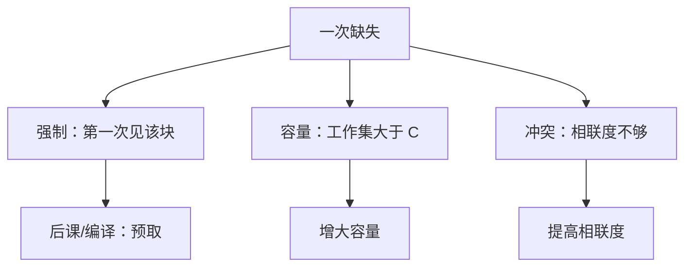

# 缺失分类

一次缺失要么是第一次见到这块，要么是容量不够，要么是相联度把还能留下的块挤掉了。

<footer>—— 据 Hill and Smith, Evaluating Associativity in CPU Caches, IEEE TC 1989；Hennessy and Patterson, CA:AQA 整理</footer>

[上一课](/cs/write-through)把写回与写分配钉成默认。标签、组、替换都已有。[局部性原理](/cs/locality-principle)解释了为什么会命中，还没解释缺失从哪三类来。本课不重讲 LRU。缺口是：同样一次缺失，加大容量、提高相联度、加预取，药不同。本课只交出强制、容量、冲突三类，并把它们接回 CPI 的停顿项。

## 问题

只报一个缺失率，无法决定下一步改硬件还是改程序。直接映射下「互踢」与「cache 太小」看起来一样。缺口不是新的映射函数，而是**把缺失相对于一个理想全相联、无限大、再相对于同容量全相联来分类**。

强制（冷）缺失：这块从未进过 cache，再大也逃不掉第一次。容量缺失：工作集比 cache 大，全相联同容量仍会缺。冲突缺失：同容量全相联不会缺，但有限相联度互踢。Hill 与 Smith 的这套三分是分析工具，不是运行时硬件打的标签。

有时加第四类一致性缺失：多核把块作废。本课仍在单核；那一类放到一致性课。

## 方法

对给定轨迹：无限 cache 仍发生的缺失是强制。再对有限容量 $C$ 的全相联 LRU 计数，多出来的是容量。实际 $n$ 路相对该全相联多出来的是冲突。预取可以减少强制（提前把块请来），增大 $C$ 减少容量，提高 $n$ 减少冲突。

三类之和等于实测缺失次数（单核、无一致性失效时）。写缺失按是否分配计入同一轨迹。

## 机制

分类把[CPI 与阿姆达尔](/cs/cpi-amdahl)里的存储器停顿拆开：强制缺失率随问题规模降得慢；容量缺失率随 $C$ 降；冲突在 2–8 路后通常饱和。设计者不该用加路去治容量病。

程序改布局（数组按行扫、减少冲突索引）主要打冲突与空间局部性，不增加 SRAM 面积。这是软件与硬件分担的同一项 CPI。

## 边界

本课不测量具体基准，不引入 victim cache 作为第四种结构——它是减轻冲突的附录手段。也不把页缺失的「缺页」混进三类：页是下一课的粒度，尽管分析语言相似。

后课默认：谈到缺失，能说它更像强制、容量还是冲突。虚拟内存的缺页另计数，不并进 cache 的 CPI 项而不声明。

## 小结

- 强制 / 容量 / 冲突三分，相对于无限与同容量全相联定义。
- 加容量、加路、预取分别对三类。
- 分页把「块」换成「页」，是下一课的缺口。
- 出处：Hill and Smith, *IEEE Trans. Computers*, 1989；Hennessy and Patterson, *CA:AQA*。
