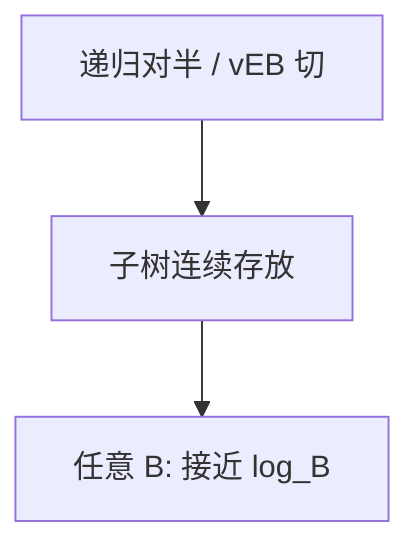

# 缓存无关结构

算法不读缓存行长度 $B$ 与容量 $M$；用递归对半，使任意 $B$ 下 I/O 仍接近已知 $B$ 的最优。

<footer>—— 据 Frigo, Leiserson, Prokop and Ramachandran, Cache-Oblivious Algorithms, FOCS 1999；Prokop, Cache-Oblivious Algorithms, 硕士论文 1999 整理</footer>

[上一课](/cs/functional-queue) 谈持久，不谈层次存储。[局部性](/cs/locality-principle) 与 [B+](/cs/btree-external) 显式按页 $B$ 调扇出。本课不 CAS。缺口是缓存无关：van Emde Boas 布局的树、递归矩阵乘与排序，分析用理想缓存模型。

## 问题

外存/缓存最优常依赖 $B$（块大小）。部署时 $B$ 多层不同（L1/L2/页）。缓存无关：代码无 $B,M$，但 I/O 次数与「知道 $B$ 的最优」同阶（常差对数因子内）。静态搜索树：按 van Emde Boas 递归把子树连续存放，查找 I/O $O(\log_B n)$。缺口是**用递归空间布局代替调参 $B$**。

Frigo et al., *FOCS*, 1999。理想缓存：全相联、最优替换；与真实 LRU 差一个常数因子定理（在一定条件下）。

## 方法

分治规模降到适合未知 $M$ 的切点自然出现。funnel sort、缓存无关 B 树（缓冲树的亲戚）点名。实现：建静态树时中序不连续而 vEB 序连续。

与 LSM：LSM 显式多层 $T$、容量，缓存有关且面向写。下一课把 LSM 当结构本体，不是数据库课重写 WAL。

## 机制

模型不计计算只计块传输。对扫描已最优的数组，缓存无关帮不上更多。并发与持久可叠，但分析分开。不要把「无关」理解成「不吃缓存」——恰恰是为了吃未知的那一层。

## 边界

本课不证全部替换定理。GPU 共享内存是另一层次参数。写优化的日志结构合并是 LSM，显式分层。

后课默认：只读递归布局可缓存无关。写多读少的外存字典用 LSM 树形态。

## 小结

- 缓存无关：代码不参数化 $B$，递归布局接近最优 I/O。
- vEB 布局是搜索树实例。
- 下一课 LSM：面向写的多层有序串。
- 出处：Frigo, Leiserson, Prokop, Ramachandran, *FOCS*, 1999。
