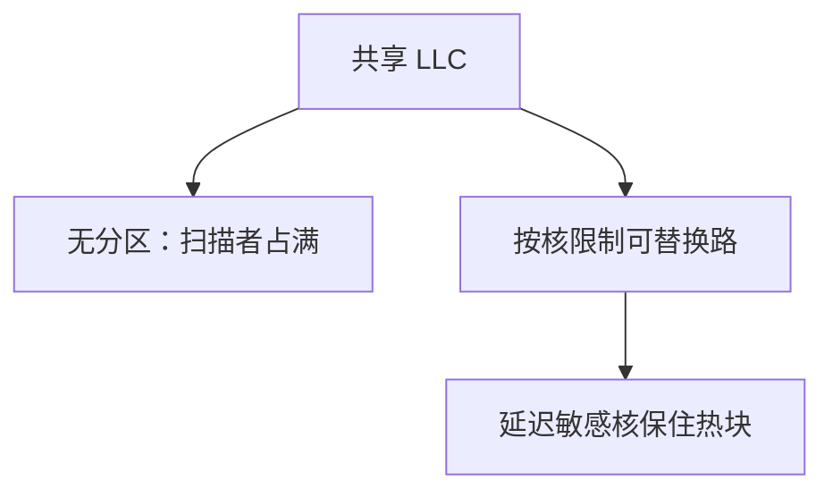

# 缓存分区与 QoS

共享 LLC 上，贪心的扫描核会用 LRU 占满所有路；按核切路或按效用切容量，才能让延迟敏感的核保住命中。

<footer>—— 据 Qureshi and Patt, Utility-Based Cache Partitioning, MICRO 2006 整理</footer>

[上一课](/cs/prefetch-timing-pollution) 的错预取会污染共享层。即使预取关掉，一个核的工作集也能通过 [LRU](/cs/lru-plru) 把另一个核的热块挤走——这是多核 QoS，不是单核替换能单独解决的。本课不重调 $k$。缺口是**分区：把 LLC 的路或组按核（或 VM）切开，按效用而不是按瞬时 LRU 竞争。**

## 问题

两核共享 16 路 LLC。核 A 扫描大数组，核 B 跑延迟敏感的工作集刚好 4 路。LRU 下 A 的一次性块不断当 MRU，B 的命中率崩。缺口不是 MESI（副本仍然正确），而是**分配：给 B 保留若干路，A 只能在自己的份额里替换。**

UCP：用每路命中曲线估计「再给这个核一路能减少多少缺失」，按边际效用切。CAT 一类的架构接口把某些路绑到某类 QoS 域。

## 方法

路分区：每组内若干 way 属于某核，替换只在自己的 way 子集里踢。组分区/页着色：不同核用不同组，类似把 LLC 切成 bank。监控：每核 miss 计数、占用计数。效用：试探性占用增加，看 miss 下降是否足够。

## 机制

分区降低总吞吐也可能：把路给「效用低」的核会浪费。UCP 的目标通常是总缺失最少或加权 CPI。与 [RRIP](/cs/rrip-dead-block) 可叠：分区内仍用 RRIP。预取填入算在该核配额里，否则预取变成占路攻击。

虚拟机与容器把「核」换成 class of service，硬件计数器给 hypervisor 看。这是微结构对系统软件的接口，不是新的一致性状态。

## 边界

本课不写 Linux 的 resctrl 用法教程。也不把网络带宽的 QoS 混进来。压缩可以在同一分区里装更多有效块，下一课。安全上，分区也减少某些跨核缓存侧信道，后课 Prime+Probe 会引用，本课只从性能动机讲。

后课默认：共享 LLC 可以按核切路。切完之后，行里是否还能用压缩多装点数据，是下一课。

## 小结

- 共享 LLC 的 LRU 会被扫描者占满；路分区按效用分配容量。
- 预取与替换都在配额内记账。
- 行内压缩提高有效容量，是下一课。
- 出处：Qureshi and Patt, *MICRO*, 2006。
