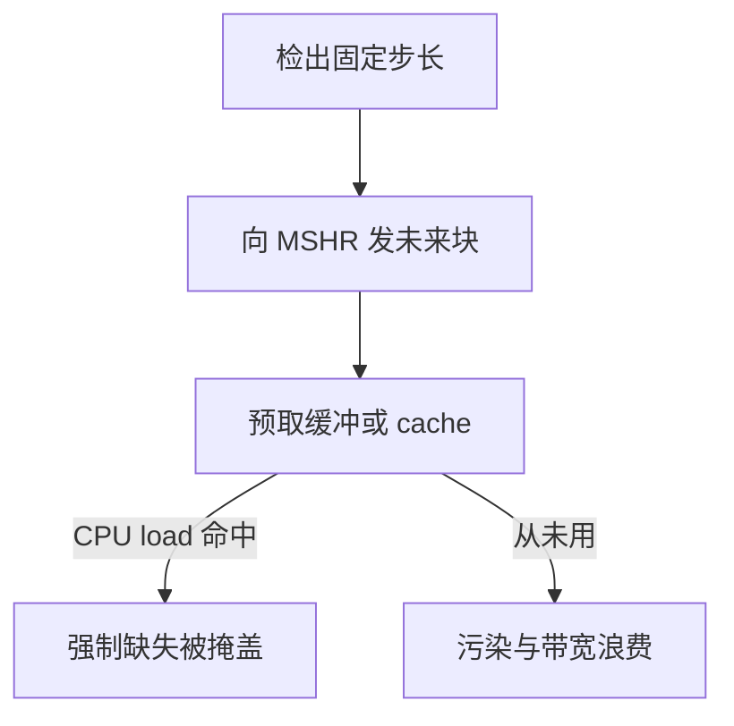

# 预取

强制缺失逃不掉「第一次见这块」，但可以把第一次安排在 CPU 真正 load 之前；猜错则占带宽和 MSHR。

<footer>—— 据 Jouppi, Improving Direct-Mapped Cache Performance by the Addition of a Small Fully-Associative Cache and Prefetch Buffers, ISCA 1990；Hennessy and Patterson, CA:AQA 整理</footer>

[上一课](/cs/mshr)让未完成的块请求有地方挂。缺失分类里，预取被点名为对付强制缺失的手段。本课不重画 MSHR。缺口是：硬件或软件如何**在需求 load 之前发出块请求**，以及预取与容量/污染的交易。本课只钉流预取与预取缓冲的直觉，不把编译器软件预取指令写完。

## 问题

冷缺失在无限 cache 上仍在。若轨迹是数组顺序扫，下一块地址可预测。[局部性原理](/cs/locality-principle)的空间局部性已经说「附近会用」；cache 行只覆盖当前块，下一块仍可能冷。缺口不是提高相联度，而是**按步长发出未来块的读，填入 cache 或一小块预取缓冲**。

猜错：把不会用的块请来，挤掉有用行（污染），并占用上一课的 MSHR 与 DRAM 带宽。预取及时性：太早被踢，太晚等于普通缺失。

Jouppi 1990 的 stream buffer 把预取与 L1 分开，减少直接映射的冲突污染。教学上可把它看成「预取不要直接写进唯一那一路」。

## 方法

硬件流预取：连续缺失若地址相差固定块距，为该流分配一个流缓冲，按该步长向前发。命中缓冲则提升为 cache 填入或直接转发。软件：在循环里插入预取提示，地址由编译器算；提示失败不得产生异常。

预取缺失通常不阻塞流水线：它本来就是提前的 MSHR 事务。需求缺失仍按上一课唤醒。

## 机制

预取改的是强制项的**有效延迟**，不是数学上消灭第一次引用。容量缺失靠预取很难：工作集已经装不下，再请来只是换哪些块在 SRAM 里。冲突可以用预取缓冲绕开直接映射的互踢，这与加路是另一笔交易。

[CPI 与阿姆达尔](/cs/cpi-amdahl)：预取把一部分缺失延迟与计算重叠。重叠不满时，$f$ 仍在。过度预取让 DRAM 调度更乱，后课时序课会碰到。

## 边界

本课不引入指针追逐的依赖预取（那几乎就是提前 load），不把 GPU 的软件预取当主干。多层 cache 之间谁包含谁，会影响「预取填在哪一层」——下一课包含/互斥。也不把预取写成 MESI 事务的替代。

后课默认：顺序与固定步长轨迹允许硬件预取；预取走 MSHR。层次之间的包含关系是下一课。

## 小结

- 预取把强制缺失提前到需求之前，靠空间局部性与步长。
- 错预取污染 cache 并占用 MSHR 与带宽。
- 多层谁必须包含谁，是下一课的缺口。
- 出处：Jouppi, *ISCA*, 1990；Hennessy and Patterson, *CA:AQA*。
