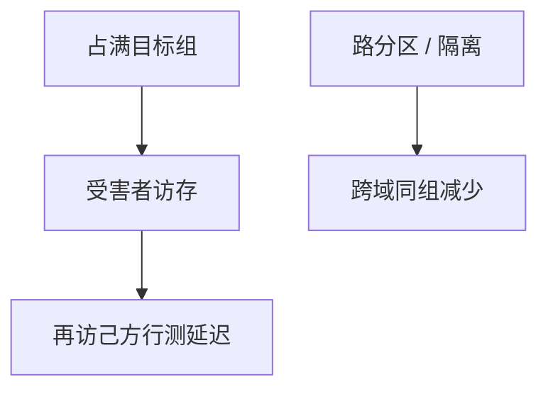

# 缓存侧信道 Prime+Probe

共享 cache 的组是可观测的：先填满一组，等受害者执行，再测自己的行还在不在。命中延迟编码的是「谁碰过这一组」，不是 ISA 寄存器。

<footer>—— 据 Osvik, Shamir, and Tromer, Cache Attacks and Countermeasures, CT-RSA 2006 整理</footer>

[上一课](/cs/rowhammer) 改 DRAM 电荷。[Spectre](/cs/spectre-variants) 把瞬态 load 编进占用。即使没有瞬态，两个进程共享 LLC 时，[分区](/cs/cache-partition-qos) 若未切开，组相联本身就是信道。本课收束微结构进阶：只讲 **Prime+Probe 的机制与防御方向**，不给探测实现，不接量化 LOB，不重写 Transformer。

## 问题

[局部性](/cs/locality-principle) 让硬件共享 SRAM。[路预测](/cs/way-prediction) 与 LRU 状态也因访问而变。测量者若能让自己的行与受害者映射到同一组，就可以用命中/缺失延迟读出「组是否被动过」。缺口不是再训 TAGE，而是**把 cache 替换状态标成非架构输出**，与 [瞬态执行对照](/cs/transient-exec) 同一威胁模型。

Osvik–Shamir–Tromer 系统化 Prime+Probe（以及 Evict+Time 等）。Flush+Reload 依赖共享页，机制不同、同属缓存信道。防御：分区、隔离、常量时间、限制高分辨率计时。

## 方法

机制上分三步直觉：准备（使一组处于已知占用）、等待（受害者运行）、探测（再访问自己的行，看延迟）。防御：LLC 按核/QoS 切 way，减少跨域同组；常数时间密码实现不按秘密索引 cache；关闭或噪声化对侧的计时。本课不写如何选冲突集。

## 机制

与 [伪共享](/cs/false-sharing)：都是行/组粒度的意外共享；一个打性能，一个当信道。与 PMU：计数器与 `rdtsc` 都是时钟。[fence](/cs/fence-cost) 不能单独关掉占用。本课程到此：前端预测、乱序窗口、cache 协议、SIMT、互连、测量与故障，全部会在安全边界上重现为副作用。

 inclusive LLC 让私有 L1 的占用更容易反映到共享层，exclusive 则相反。这不是选 inclusive 的理由，只是信道带宽的几何。后课（数据结构进阶）不再续这条微结构链；本课是单元收口。

## 边界

本课不提供可运行的探测、不讨论绕过具体云隔离的步骤。密码实现的常数时间是软件课/安全课的接口。微结构进阶结束：下一课程从[前缀和与差分](/cs/prefix-sum-difference)起，默认已经读过推测、一致性与这些副作用。

## 小结

- Prime+Probe 用组相联占用与命中延迟做信道。
- 分区与隔离减少跨域同组；不能单靠 ISA 正确性。
- 微结构进阶在此收口：性能机制即安全边界。
- 出处：Osvik, Shamir, Tromer, *CT-RSA*, 2006；Kocher 等时序一线。
