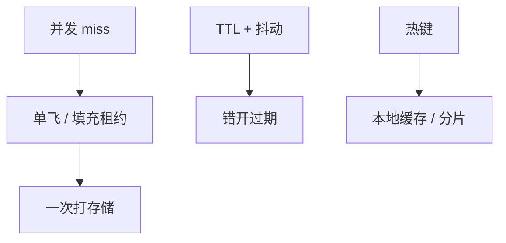

# 缓存雪崩与热键

大批键同时过期，或单键被打到一台存储，miss 路径把后端打穿。要错开 TTL、单飞填充、并对热键分片或本地层。

<footer>—— 据 Nishtala et al., Scaling Memcache at Facebook, NSDI 2013；业界 stampede / dogpile 实践整理</footer>

上一课[缓存失效](/cs/distributed-cache-invalidation)的 miss 会打存储。缺口是**miss 同步到来**：雪崩是时间对齐，热键是空间对齐。本课钉缓解，不重写版本 cas。后课限流是更外层的保护，缓存打穿时限流是后备。

## 问题

雪崩：同一时刻大量 TTL 到期或重启空缓存，所有读变 miss。热键：流行键的 QPS 超过单存储分片。单飞（singleflight）：同一键并发 miss 只允许一个填充，其余等——租约在 Facebook memcache 里就是这种锁。没有单飞，N 个应用进程 × M 个 worker 对同一 miss 放大成 N×M 次查询。

缺口：只加机器不加错开与单飞，重启仍是雪崩。只加缓存不加热键分片，单键仍打穿。

dogpile/stampede 是同一现象的两个名字。逻辑时钟课的租约在这里变成填充租约，期限很短。

## 方法

TTL 加抖动，避免对齐。预热关键键。分层：进程内缓存挡热键，再分布式缓存，再库。热键拆成多个子键随机读（若语义允许）或复制到多缓存节点。降级：打穿时返回旧值（若还留着 stale-if-error）。

不要用全局锁「填充全世界」。锁本身会雪崩。

## 机制

与[故障检测](/cs/failure-detectors)：存储变慢使填充超时，重试放大，形成活锁。熔断下一课。缓存空窗与发布同时发生（滚动升级后课）是雪崩常见组合。

本课不把 CDN 流量工程写全。也不写 GPU 热键。

过期对齐常来自「午夜批任务写同一 TTL」。抖动必须在写填充时做，不是只在配置里写一个常数。

## 边界

本课不给容量规划公式。后课默认：缓存层必须有单飞与 TTL 抖动；热键有本地层或拆分。限流熔断接在打穿之后当保险丝，不是第一道。超时退避再下一课把重试放大钉死。

同步 miss 是负载峰值的制造器。缓存的命中率曲线在过期点不连续。

## 小结

- 雪崩：过期/变空对齐；用抖动与预热。
- 热键：单飞 + 本地层或拆分。
- 填充租约防止 miss 放大。
- 出处：Nishtala et al., NSDI 2013；stampede 实践。
