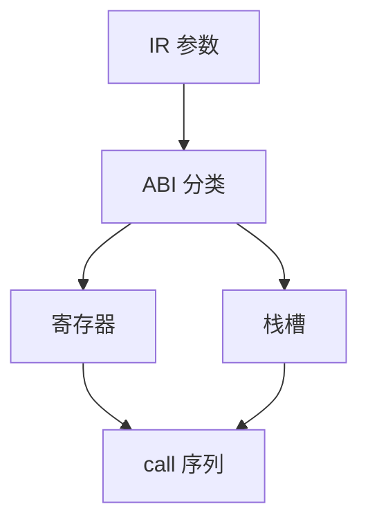

# 调用约定的实现

约定规定参数在哪些寄存器或栈槽、谁保存、返回值怎么走。后端 lowering 必须与 ABI 文档一致，否则不能与已编译的库链接。

<footer>—— 据 System V ABI；ARM AAPCS；主干[调用约定与栈](/cs/calling-convention-stack)；Appel 整理</footer>

上一课[目标描述](/cs/target-description)有寄存器类。组成课已讲约定直觉。缺口是**实现**：ISel 把 `call` 降成拷贝到参数寄存器、栈对齐、red zone、可变参。本课钉 lowering，不重画栈帧全图——下一课布局。

## 问题

IR 的 `call @f(i32, double)` 要按 ABI 分类（整数/浮点/聚合）。聚合：寄存器对或内存。缺口是**分类算法 + 插入拷贝**，不是 lex。

可变参：固定参数后的区域；调用方与 `va_list` 一致。调用者保存：跨 call 的活寄存器要存——分配器已见预着色。

### ABI 不是「编译器随便选」

与操作系统、语言运行时绑定。自创约定只能闭世界 LTO 静态全程序。不要改 `printf` 的约定。

SysV AMD64 ABI。AAPCS64。Itanium C++ ABI 的 this 指针。本课 C 为主，C++ 额外 this、返回槽。

## 方法

实现 `LowerCall`/`LowerFormalArguments`：把参数映射到物理寄存器或 `FrameIndex`。返回：寄存器或 sret 隐藏指针。对齐：栈 16 字节等。

与内联：内联后约定消失。与尾调用：须约定兼容才能 jmp。

## 机制

浮点与 SIMD 寄存器类独立。整数 8 个参数寄存器满则上栈。不要把 `float` 误分类到 GPR 除非 ABI 如此（某些软浮点）。

异常：调用是 invoke 时还要 landing pad，展开表后课。

## 边界

本课不写完整 DWARF。后课默认：call lowering 实现 ABI。下一课栈帧布局与帧指针。

也不把 ABI 当 REST API。

## 小结

- 调用约定 lowering：分类 → 寄存器/栈 → 拷贝。
- 必须与平台 ABI 一致才能链接 libc。
- 可变参、聚合、sret 是细节坑。
- 出处：System V ABI；AAPCS；对照龙书/Appel 调用序列。
