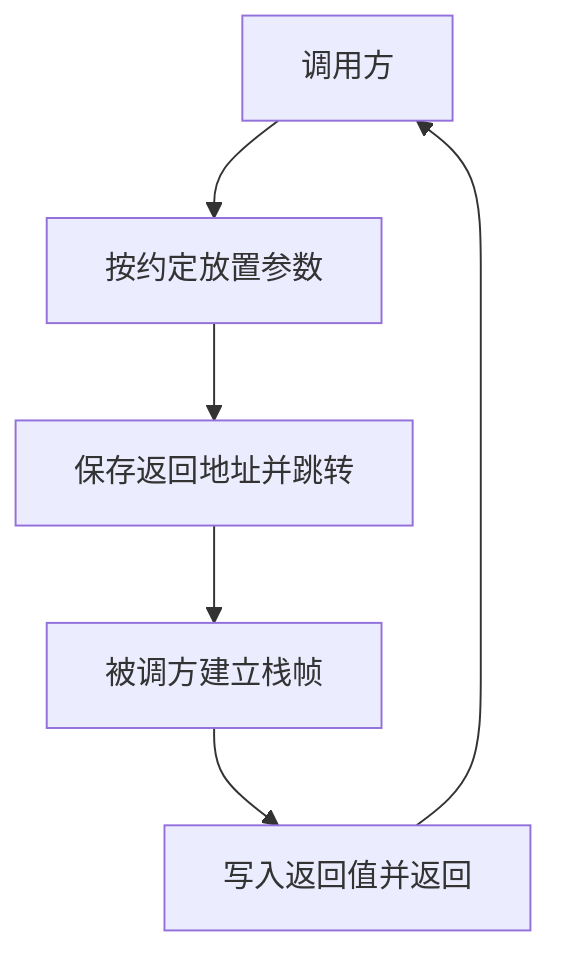

# 调用约定直觉

函数调用能成立，是因为双方事先约定：参数放哪、返回值从哪取、谁来清理栈上的槽。

<footer>—— 据 Bryant and O'Hallaron, Computer Systems: A Programmer's Perspective；ISO/IEC 9899 整理</footer>

上一课[对齐与填充](/cs/alignment-padding)把对象放进合法地址。本课不重讲填充，也不从某一种 ISA 的寄存器表另起。缺口是：结构体和整数已经能在一个函数内部寻址，**跨函数时它们怎么交接**？没有约定，caller 把参数放在栈上，callee 却去寄存器里找，程序只是碰巧能跑。

## 问题

一次调用要传递控制与数据。控制：保存返回地址，跳到 callee，返回时跳回。数据：参数与返回值放在寄存器或栈槽， excess 参数溢出到栈；大结构体可能改传隐藏指针，由 caller 提供返回槽。缺口因此不是「函数怎么写」，而是**边界上的 ABI**：同一平台、同一语言的所有翻译单元必须遵守同一套，链接才有意义。上一课的对齐在这里变成栈槽与参数区域的对齐。

本课只建立直觉。具体哪几个寄存器传整数、浮点是否走另一组、红区有多大，随 System V AMD64、AAPCS 而变，后课机器级编程再钉死一张表。这里要带走的是：调用不是源码里的括号，是一份双方都执行的协议。

### 调用约定不是「C 语法」

`f(a,b)` 的求值顺序在 C 里未指定；那是表达式规则。调用约定是链接后的机器协议，与源码里从左到右的错觉无关。C 与汇编、C 与操作系统系统调用包装，都可以共享或故意不共享同一套。把两者混成「语言规定怎么传参」，后课动态链接与系统调用会对不齐。

CSAPP 用机器级程序展示：调用前 caller 把参数放入约定位置，callee 在栈上建帧。ISO C 只要求抽象机器上参数已初始化；放进哪些物理槽是实现的 ABI，不在标准正文里逐条列出。

## 方法

最小图景：caller 求值参数，按约定写入寄存器/栈，执行 call（把返回地址压栈或写入链路寄存器），callee 建立栈帧保存它要弄脏的寄存器，用完后恢复，把返回值写入约定位置，再 ret。整数与指针通常走通用寄存器；浮点常走另一组；过大的聚合走内存。谁弹出参数槽（caller clean / callee clean）也必须一致。

可变参数函数还约定：固定参数之后的实参如何在栈上排列，以便 `va_list` 能走访。这是约定的延伸，不是另一套语言。

可变参数与固定参数混用时，未提升的类型会按默认提升规则变宽，调用方与声明必须一致，否则是 UB 而不是「约定宽松」。这把 ABI 与语言规则焊在一起。结构体按值传递是否拆进寄存器，由 ABI 按大小与类别决定，程序员看见的仍是拷贝整块语义。后课递归假设每一次进入都完整执行这份协议，所以深度与帧大小成正比，而不是与源码里函数名字的个数成正比。

## 机制

有了约定，分别编译的 `.o` 才能互调：每个函数只看见自己的帧与约定位置，不必知道对方用了哪些局部名。这也解释了为何改一个结构体的字段布局会同时破坏调用双方——传值时拷贝的是带填充的整块。递归能工作，是因为每次调用另建一帧、返回地址叠在栈上；下一课专讲帧如何随深度增长。

调用约定还划分 callee-saved 与 caller-saved：哪些寄存器跨调用必须保持，哪些可以随便用。这不是性能花絮，是「谁负责保存」的所有权。搞错会表现为间歇性寄存器被踩，而源码看起来没有别名。

系统调用用另一套放置规则：调用号与参数常在固定寄存器里，返回错误也用寄存器约定，不必与用户函数的 caller-clean 相同。动态链接的 PLT 仍走用户调用约定，只是目标地址来自表。可见「约定」是按边界分类的：函数对函数一份，用户对内核一份。后课递归只使用函数这份——每一层帧都按同一 ABI 建，所以同一函数可以叠许多层而不混用寄存器所有权。

## 边界

本课不列 x86-64 寄存器名表，不讲内联与尾调用消除如何省略帧。下一课[递归与栈帧](/cs/recursion-stack-frame)把「每次调用一帧」写成深度与溢出。后课默认：跨函数的数据走 ABI 约定位置；结构体按值传递拷贝布局；返回地址在栈或链路寄存器上。

## 小结

- 调用是 ABI 协议：参数、返回值、栈清理、寄存器保存都事先约定。
- 对齐好的对象按约定进寄存器或栈槽；过大聚合走内存。
- 分别编译能链接，依赖所有单元遵守同一套约定。
- 下一课看递归如何把这些帧叠起来。
- 出处：CSAPP 机器级调用；ISO C 抽象机器上的函数调用。
