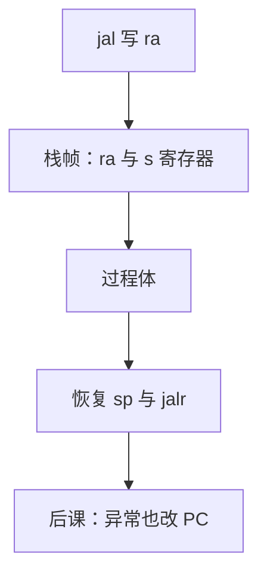

# 调用约定与栈

ISA 只保证 `jal` 把返回地址放进 `rd`；谁保存哪些寄存器、参数放哪、栈向哪长，是软件与硬件共同遵守的 ABI。

<footer>—— 据 Patterson and Hennessy, Computer Organization and Design (RISC-V)；RISC-V Calling Convention 整理</footer>

上一课[总线与 MMIO](/cs/bus-mmio)让硬件能执行任意指令序列。本课不重画 FSM 状态，也不从操作系统进程映像另起。缺口是：过程调用在 ISA 里只有 `jal`/`jalr` 与一堆通用寄存器。没有约定，调用者与被调用者会互相覆盖 `x` 寄存器，返回地址也会丢。

## 问题

RV32I 能跳、能存。缺口是 **ABI**：参数进 `a0`–`a7`（`x10`–`x17`），返回值 `a0`/`a1`；`ra` 存返回地址；栈由 `sp` 指向，向低地址增长；调用者保存与被调用者保存寄存器划分（caller/callee saved）。栈帧：保存 `ra`、`s` 寄存器、局部变量、溢出的参数。

硬件不强制这些，编译器与手写汇编必须一致。叶子函数可以不建帧，但不得破坏 callee-saved。

### 栈不是「栈 ADT 课」

这里的栈是内存中由 `sp` 界定的连续区，用 `sw`/`lw` 访问。数据结构课的栈抽象会后出现；本课是组成层的调用栈。不要把 Java 操作数栈或 x87 浮点栈混进来。

Patterson/Hennessy 用 RISC-V 调用例子画栈帧。官方 psABI 规定寄存器角色。本课不把完整 ELF 重定位提前。

## 方法

`jal rd, offset` 写 `rd=PC+4` 并跳；惯例 `rd=ra`。被调用者：`addi sp,sp,-N`，存 `ra` 与需保存的 `s` 寄存器，用完 `lw` 恢复，`addi sp,sp,N`，`jalr x0,0(ra)`。递归每次新帧，否则 `ra` 被覆盖。

## 机制

叶子过程可把 `ra` 留在寄存器。非叶子必须把 `ra` 入栈再 `jal` 出去。变长参数与栈上传参是 ABI 细节，本课点到：寄存器不够则放在 `sp` 之上的约定槽。栈溢出是软件错误，硬件只在访问未映射页时异常——页表很后。

## 边界

本课不讲异常帧、不讲信号处理器。不把线程的多栈、协程提前。尾调用优化可省略帧，但是约定下的优化，不是硬件指令。

后课默认：过程调用遵守 RISC-V 整数 ABI；栈向低地址长。异常与中断也会改 PC，但不是 `jal`，下一课。

## 小结

- `jal` 只提供返回地址机制；ABI 规定寄存器与栈帧。
- caller/callee saved 防止互相覆盖。
- 递归必须入栈 `ra`。异常入口是另一条改 PC 的路。
- 出处：Patterson and Hennessy, COD (RISC-V)；RISC-V psABI。
