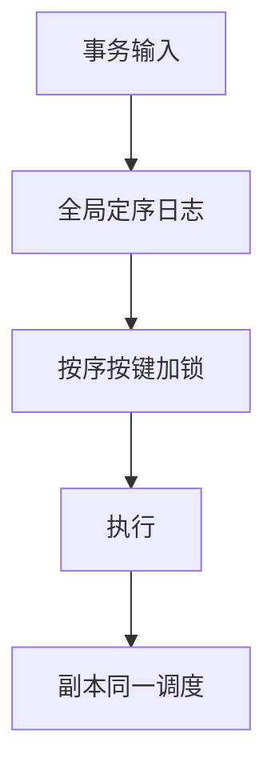

# Calvin 确定性

先对事务输入全局排序再执行：同一日志在每个副本上重放同一调度，锁可在定序后无死锁获取，提交无需 2PC 对话。

<footer>—— 据 Thomson et al., Calvin, SIGMOD 2012；确定性数据库谱系</footer>

[上一课](/cs/read-only-snapshot)把只读从写路径拆开。本课不钉 xmin。缺口是分布式写：2PC 阻塞、死锁跨节点。Calvin 一类确定性数据库：先把事务（或锁请求集）写入全局有序日志（Paxos），再按序执行。并发控制续封口；恢复复制续从 ARIES 三阶段开。

## 问题

非确定性：各节点本地 2PL 调度不同，副本不能只重放 SQL 文本。确定性：输入序列唯一决定调度与结果。缺口是**读集必须先声明或先侦察**：否则定序时不知道锁哪些键。只读可走本地快照，但要与定序水位一致。

与 OCC：Calvin 减少 abort，把冲突变成队列里的顺序。热点键仍串行，只是顺序明确。

Thomson, Diamond, Weng, Ren, Shao, Abadi, SIGMOD 2012。后续 Fauna 等。本课机制，不把产品当标准。Spanner 用真时间戳，路线不同，后课。

## 方法

客户端提交事务批次 → 定序器编号 → 工作机按号获取锁（无等待环：按键排序加锁）→ 执行 → 提交。失败：确定性重放或标记 abort 占住序号。

与 WAL：全局日志即事务输入日志，重做是再执行而非生理 redo——粒度不同，恢复课对照影子与生理。

## 机制

依赖分析：无锁冲突的事务可并行执行仍等价于序。侦察事务先跑一遍读集再定序，增加延迟。与 MVCC：可在定序戳上读版本。

性能：定序器吞吐是上限；可分区定序但跨分区事务又要合成序。

## 边界

本课不讲 ARIES CLR。也不把确定性当「无日志」。网络分区时定序器可用性是共识问题，后课分布式。

后课默认：可先定序再执行以避免 2PC 与死锁。ARIES 三阶段与 CLR：单机生理恢复的完整播放。

确定性调度把隔离做成「日志里的全序」，应用仍要可重放（无非确定性 UDF）。

## 小结

- Calvin 全局定序事务输入，副本同调度，免 2PC 对话。
- 需要读集或侦察；热点仍串行。
- 下一序列 ARIES 三阶段与 CLR：崩溃恢复播放。
- 出处：Thomson et al. SIGMOD 2012；2PC 对照。
