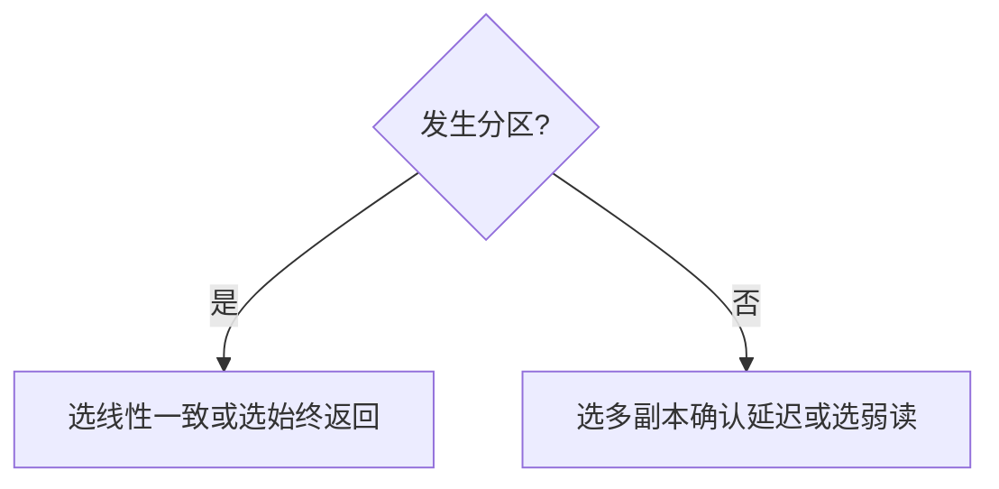

# CAP 与 PACELC

分区发生时，线性一致与可用性不可兼得。没有分区时，延迟与一致仍要交换——PACELC 把这后半句写进缩写。

<footer>—— 据 Gilbert and Lynch, Brewer's Conjecture and the Feasibility of Consistent, Available, Partition-Tolerant Web Services, SIGACT News 2002；Abadi, Consistency Tradeoffs in Modern Distributed Database Design, IEEE Computer 2012；Brewer, 2012 回顾 整理</footer>

上一课[最终一致](/cs/eventual-consistency)是许多人在分区下的选择。缺口是**为什么必须选**：不是性格，是定理。本课不重写线性化点，不把 Dynamo 当 CAP 的唯一例。后课主备、法定人数都是在这张表里占格。

## 问题

Brewer 的猜想：一致、可用、分区容忍三选二。Gilbert–Lynch 把它证成：在异步网络分区下，**线性一致**与**每个请求都终止**不能同时。可用这里指正确节点在有限步返回（不无限等另一分区）。分区指信道把节点切成互不通信的组。

缺口：三选二被误读成「永远只能挑两字」。没有分区时三者可以同时（单主、多数派在连通时）。真正日常交换是**延迟 vs 一致**。Abadi 的 PACELC：If Partition, then A or C Else Latency or C。

Gilbert–Lynch 的 C 是线性一致，不是「数据没丢」。A 不是 HTTP 200。弱一致模型可以在分区下既「可用」又「某种 C」。

## 方法

设计时先问：分区期间读是否必须线性化？若是，少数派必须拒绝（CP）。若否，就近返回（AP），愈合时合并。再问：无分区时是否同步复制到多数派（偏 C、加延迟）还是异步（偏 L）。

不要用 CAP 解释 FLP：一个是分区+线性一致读写，一个是异步崩溃+共识终止。不要用 CAP 解释磁盘满。

## 机制

多数派读写：$R+W>n$ 在**未分区**时给线性一致寄存器（后课 quorum）。分区导致多数派只在一侧，另一侧的 W 或 R 不能完成——这是 CP。Dynamo 式 $R+W\le n$ 或斜向就近：分区两侧都能写，AP，冲突后课解决。

PACELC 的 EL：同步流水线 vs 读本地。Spanner 选 C 与较高延迟；许多缓存选 L。缩写是备忘录，不是新定理；定理仍是 Gilbert–Lynch 加上延迟模型。

本课不把「CA」系统写成第三类宗教：拒绝承认分区等于假设网络永不切，Lynch 模型里这不成立。工程上「单机房、分区当全死」是把 P 的范围缩小。

## 边界

本课不写 PACELC 的所有数据库厂商对照表。不引入拜占庭分区。后课默认：协议声明分区时拒绝还是就近；连通时等多数派还是异步。主备切换是 CP 的一种实现形状。

口号去掉之后，留下的是线性一致与终止在分区下的合取不可能。选弱尺子才能两边返回。

## 小结

- Gilbert–Lynch：分区下线性一致与普遍终止不可兼得。
- 无分区时仍有延迟–一致交换：PACELC。
- C 指线性一致；弱模型不在该不可能式里。
- 出处：Gilbert and Lynch, 2002；Abadi, 2012；Brewer 回顾。
