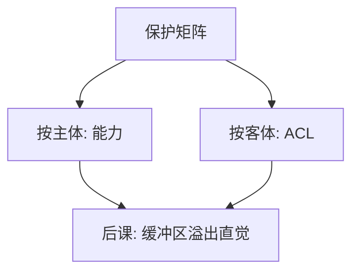

# 能力对 ACL

ACL 问「这个对象允许谁」；能力是主体持有的不可伪造票，「持票即允许」。混淆代理人在票与名字分离时更容易出现。

<footer>—— 据 Lampson；Dennis and Van Horn, Programming Semantics for Multiprogrammed Computations, 1966</footer>

[上一课](/cs/dac-mac-rbac)给出保护矩阵与最小特权。本课不重列 DAC/MAC。缺口是：矩阵有两种常用表示。按列存是 ACL（客体上的名单）；按行发不可伪造引用是能力。Unix fd、某些微内核的 cap 是能力直觉；文件 mode 与许多 Web ACL 是另一极。两者都能实现同一矩阵，失败模式不同。

## 问题

ACL 检查「名字 → 主体是否在名单」。若服务用自己的高权限去碰用户指定的名字，就变成混淆代理人：用户骗服务去打开它本不该碰的客体。能力把「打开」的结果变成持有的票，之后只认票，不认用户又递来的路径字符串。缺口不是新的 CIA 轴，而是表示如何改变委托与代理解引用。

Unix：路径查找走 ACL 式的目录权限；得到的 fd 更像能力。两种同时存在，所以「Linux 是 ACL 系统」这句话过粗。

## 方法

能力：不可伪造、可传递（或显式收窄后传递）、与操作绑定。实现靠内核表或带 MAC 的令牌。ACL：改策略集中，列出「谁被撤销」容易；能力撤销要回收票或换纪元。本课不设计新操作系统，只对照：委托、撤销、命名。

## 机制

最小特权在能力系统里常表现为「只把需要的票传入进程」。ACL 系统靠每次查找重新求值名单，适合集中改策略。分布式下能力像带签名的票（下一课证书已会签）；ACL 则要在每次访问问权威。混淆代理人的修复可以是：不接受名字、只接受已持有的能力，或绑定「用哪一张票去访问」。

撤销能力常用纪元或短寿命票；ACL 删一行即可，这是表示税。

## 边界

不要把能力写成「更安全所以取代 ACL」。Web 资源、数据库 GRANT 仍大量是 ACL。也不要把区块链 token 插入本课。后课内存破坏会让两种表示都失效：若能改内核表或伪造票字节，表示层的论证作废。

能力传递要能衰减（只读、不可再传），否则最小特权在委托链上失控。后课默认：授权有 ACL 与能力两套语言；内存安全被破坏时，保护矩阵不再是有效边界。

两种表示可以在同一系统共存：查找用名字与 ACL，持有用 fd 与能力。设计要写清每一跳认的是哪一种。

## 小结
- 混淆代理人在「用高权限去解析用户给的名字」时出现；能力让后续只认票。
- 后课内存越界可以伪造票或改返回地址，表示层论证作废。

- 矩阵可按列（ACL）或按票（能力）实现。
- 能力利于委托与防混淆代理人；ACL 利于集中撤销。
- 内存越界一旦改控制流，两种票都可以作废——下一课只讲机制与防御直觉。
- 出处：Dennis and Van Horn, 1966；Lampson；Saltzer and Schroeder。
