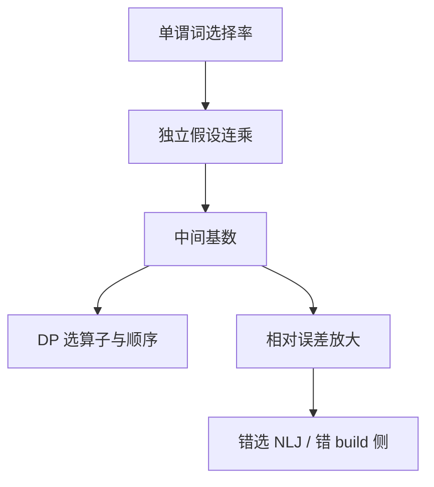

# 基数估计误差传播

选择率相乘把相对误差指数放大；中间结果估错一个数量级，动态规划就在错误的地图上找最短路。

<footer>—— 据 Ioannidis and Christodoulakis；Lohman；Selinger 代价模型对照；Ramakrishnan and Gehrke</footer>

[上一课](/cs/join-order-space)画出连接树空间。本课不枚举 Catalan 数。缺口是树上的数字：主干直方图给出单谓词选择率；多谓词、多连接之后，独立假设把误差连乘。优化器单元必须承认：**DP 精确不等于计划好**。

## 问题

单列等值：选择率 $1/\mathrm{NDV}$ 或高频值。两列相关（城市与邮编）独立假设会把联合选择率估得过小或过大。连接：$|R \bowtie S| \approx |R||S|/\max(\mathrm{NDV}(R.k),\mathrm{NDV}(S.k))$ 一类公式，再错一层。沿左深树 $n{-}1$ 次相乘，相对误差可指数增长（Ioannidis 等指出优化对误差极敏感）。

缺口不是再画等宽桶，而是传播：哪个节点的误差最伤（靠近根的大中间结果），以及「低估」通常比「高估」更伤——低估会选 NLJ 打大表，内存爆；高估常选更保守的哈希/排序，慢但不至于灾难。

Ioannidis and Christodoulakis 讨论优化对估计误差的敏感性。Lohman 总结代价优化的工程。本课不发明新公式冒充已发表结果。

## 方法

诊断：计划中的估计行数 vs 实际行数（explain analyze）。误差比沿路径看是放大还是抵消。缓解：多列统计、函数依赖（邮编→城市）、采样、直方图桶加密。本课点名方向，采样草图下一课。

逻辑改写先减树高（下推），减少相乘次数，是误差控制的一部分，不只是「更快」。

## 机制

有趣序不救错误基数：归并看起来便宜是因为估小了无序输入。计划缓存会把第一次的错误数字锁死。自适应查询处理（后课）在执行中发现误差再换计划，是承认静态估计不够。

NULL 与包：选择率要计入 NULL 比例，否则等值谓词估错。三值课已有，估计模块必须读目录里的 NULL 统计。

## 边界

本课不把学习基数估计当默认——更后课学习型优化器。也不校准 I/O 常数。采样与草图下一课给执行期或 ANALYZE 期的另一种输入。

后课默认：看计划先看估计/实际比，再谈有没有索引。连乘独立假设是默认谎言，相关列要显式统计。

DP 的最优性相对模型；模型的输入是带噪声的基数。

## 小结

- 选择率相乘放大误差；低估常导致灾难性算子选择。
- 多列统计与下推减少相乘层数。
- 采样与草图下一课：用数据样本修正目录谎言。
- 出处：Ioannidis and Christodoulakis；Lohman；Selinger；Ramakrishnan and Gehrke。
