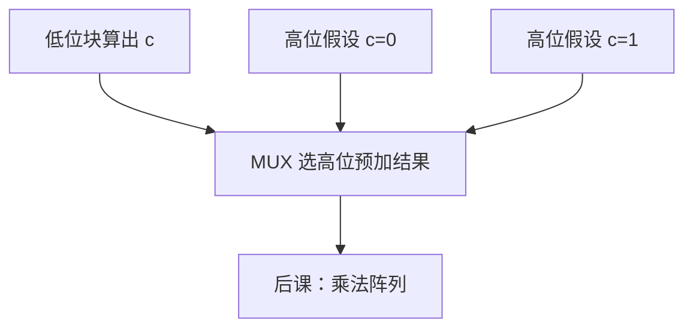

# 进位选择

低位块还在算进位时，高位块先按进位入是 0 和 1 各加一遍，真正的进位到达只选一路。

<footer>—— 据 Harris and Harris, Digital Design and Computer Architecture 整理</footer>

上一课[行波进位对照](/cs/ripple-adder)钉死了 RCA 的线性链。[CLA](/cs/adder-cla)用 $g,p$ 换深度。本课不重写组生成公式，也不从华莱士树另起。缺口是中间方案：**进位选择**——用面积买掉「等低位进位」的那段空闲。

## 问题

把 $n$ 位切成若干块。每块内部仍可用 RCA 或小 CLA。缺口是：块 $k$ 的进位入要等块 $k-1$ 算完。预先做两份：假设进位入为 0 的和与进位出，假设为 1 的另一份；低位进位到达后用 MUX 选。MUX 延迟换成两套加法器。

块等长时，总延迟大约是一块 RCA 加若干级 MUX，优于纯行波，通常仍不如宽 CLA 树。本课只钉这一种折中。

### 选择不是超前

CLA 在进位到达前就用 $g,p$ 组合出正确进位。进位选择是**猜两种、再选**，进位值本身仍来自低位块，只是高位数据和已算好。把 carry-select 叫成 lookahead 的别名，后课分组 CLA 的 $G,P$ 会混。

Harris 用不等长块减小 MUX 链上的空等。本课用等长块讲清结构即可。Patterson/Hennessy 不强制 CPU 用哪一种加法器。

## 方法

例如 16 位：低 8 位 RCA，高 8 位两套 RCA + 8 位 MUX。进位出同样二选一，接到下一块。关键路径：第一块行波 + 后续 MUX。面积近乎 $1.5\times$–$2\times$ 单套加法器（视块数）。

## 机制

后课 ALU 仍是一个加减框；框内换 CSA 只改关键路径与面积，控制位不变。与 CLA 可混合：块内 CLA、块间选择。本课不把混合画完。

## 边界

本课不讲进位跳跃（bypass）、不把平方根块长优化写成作业。乘法的部分积压缩是下一课，不是进位选择的推广。

后课默认：加法器有 RCA / 选择 / CLA 三档延迟–面积；功能都是同一套全加。

## 小结

- 进位选择：高位两套预加，低位进位只做 MUX。
- 用面积换掉等待，不是 $g,p$ 超前。
- 控制与溢出接线与上一课相同。
- 出处：Harris and Harris。
