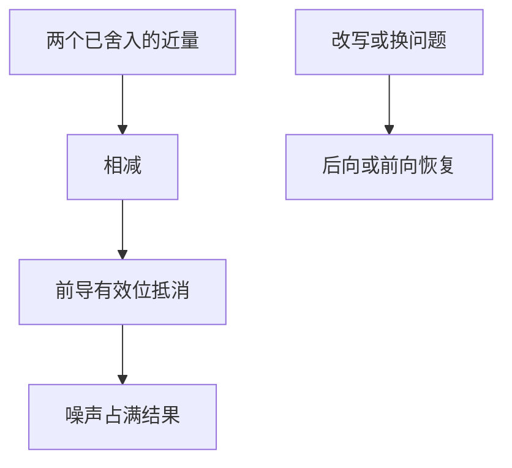

# 消去与灾难抵消

两个相近的量相减，前导的正确数字抵消，后面本是舍入噪声的比特涌到前面——公式可以代数正确而数值破产。

<footer>—— 据 Higham, Accuracy and Stability of Numerical Algorithms；Golub and Van Loan, Matrix Computations 整理</footer>

上一课[前向稳定与后向稳定](/cs/forward-backward-stability)区分了问题与算法。本课不重定义 $\kappa$，也不从 754 的 sticky bit 另起。缺口是：加减在 $\mathrm{fl}$ 模型里各带一个 $\delta$，**当精确差远小于两个操作数时，相对前向误差为何可以到 $O(1)$**。这是最常见的、代数上看不见的不稳定。

## 问题

设 $a\approx b$，二者已含舍入。$\mathrm{fl}(a)-\mathrm{fl}(b)$ 的差若只有末几位有效，则结果的相对误差相对真值 $a-b$ 可以任意大。缺口因此不是「减法不精确」——相近相减在实数里完全良态若 $a,b$ 精确——而是**操作数先被舍入，再减**。条件数课已提示 $f(a,b)=a-b$ 在 $a\approx b$ 时病态；本课把这条落到运算级，并指出：改写公式往往是在换一个更好条件的 $f$，而不只是换算法。

二次公式、$\sqrt{1+x}-1$、正交化里的消去，都是同一模式。本课给判别与改写，不把每种初等函数的稳定公式列成手册。

### 灾难抵消不是「下溢」

下溢是结果的量级掉出规格化范围。抵消发生在普通规格化数上：结果量级正常，只是有效位没了。把二者都叫做「太小」，会去放大 $u$ 或改异常掩码，而不是去改公式。溢出与无穷是另一条 754 路径，本课也不走。

Higham 用「cancellation」专指有效位损失。Golub and Van Loan 在正交化与消元里反复提醒：大数相减是要改算法的信号。信息课的尾数宽度决定你还能剩几位；本课不重讲隐藏位。

## 方法

判别：若 $|a-b|\ll |a|$，则减法可能毁掉相对精度。改写：有理化（$\sqrt{1+x}-1=x/(\sqrt{1+x}+1)$）、换未知量、用 FMA 或更高精度算差值，或干脆避免形成 $a$ 与 $b$。二次公式在 $b^2\approx 4ac$ 时对其中一个根改用 $c/a$ 除另一个根，避免同一抵消。

有时抵消是良性的：两项的误差相关，差反而精确（Sterbenz 引理：若 $a/2\le b\le 2a$，浮点减法可以精确）。不要把所有相减都改掉；要看误差是否相关、结果是否还要再除以一个同样小的量。

求均值、方差的朴素公式 $\sum x_i^2 - n\bar x^2$ 在数据接近常数时就是灾难抵消；Welford 一类在线算法换了 $f$，不是多加了几位精度。同样，差分 $f(x+h)-f(x)$ 在 $h\to 0$ 时相对误差爆掉，这限制牛顿课用差分近似导数。本课给出的判别「差的量级相对操作数掉了多少位」可以直接用在这些公式上。稳定改写优先于盲目改用 `long double`。

## 机制

相对表示把精度铺在有效位上。抵消把真信号推到 $u$ 的量级以下，剩下的比特不再描述 $f$，只描述先前 $\delta$ 的差。后向图像：你精确地减了两个已经错了的数，后向误差相对原问题并不小。这就是不稳定：不是 $\gamma_n$ 线性变宽，而是一步丢掉所有位数。下一课求和顺序处理许多项相加时的同类、但通常更温和的效应。

正交化里从向量里减去它在另一方向上的投影，若两向量几乎平行，减去的是近量，再归一化会放大噪声，失去正交——这是线性代数里的龙格式灾难，要用修正 Gram–Schmidt 或 Householder 换一个数值上不同的 $f$。二次方程、复根与初等函数的稳定公式，本质上都是躲开「先做出大数再减」。FMA 把乘加熔成一次舍入，能减少但不消灭抵消。下一课多项求和里，抵消可以分散在许多步里，顺序与补偿是在管理累积而不是单步爆炸。

## 边界

本课不讲复平面上的相消、不把自动微分请来。下一课[求和顺序](/cs/summation-order)处理结合律在浮点里失败时该怎么排。后课默认：近量相减要检查相对尺度；改写公式是在换条件更好的表达式；良性抵消存在，不能见减就改。

## 小结

- 灾难抵消：先舍入再减近量，有效位被噪声取代。
- 它不是下溢；条件数在 $a\approx b$ 的减法上已经预警。
- 有理化、换根、FMA 是改 $f$ 或减少舍入次数。
- 下一课把多项求和的次序当作稳定性问题。
- 出处：Higham；Golub and Van Loan。
