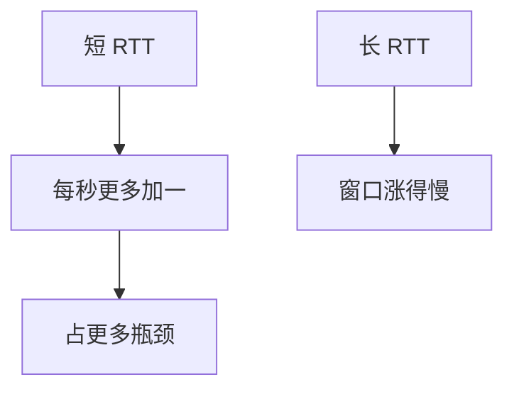

# RTT 不公平

AIMD 每 RTT 加一 MSS，RTT 短的流窗口涨得快，占满同一瓶颈；公平几何假定的同步同 RTT 在真实互联网不成立。

<footer>—— 据 Floyd and Jacobson 对 RTT 的讨论；Chiu–Jain 模型对照；Kurose and Ross 整理</footer>

[AIMD](/cs/aimd-dynamics) 在同 RTT 下收敛。[上一课](/cs/keepalive-half-open) 不改窗口动力学。缺口是**异质 RTT**：局域网流 vs 卫星流共享核心。本课不把 RED 参数写完。

## 问题

cwnd ← cwnd+1 每 RTT，则速率 ≈ cwnd/RTT，增长 $1/\mathrm{RTT}^2$ 量级。短 RTT 流抢占。卫星用户即使用对窗口缩放，仍被数据中心旁路流压。CUBIC 用墙钟时间减弱依赖，但不消灭。BBR 后课用带宽估计，仍有 RTT 噪声问题。这不是政策不公，是控制律。

不要把「不公平」写成必须用 WFQ 才能上网；WFQ 后课是调度器解。

经典 TCP 文献讨论 RTT bias。本课不给数值仿真作业。

### 每 RTT 加一偏袒短路径

这是控制律，不是商业不公。CUBIC/BBR 缓解不取消。数据中心 RTT 同质，公网否。CDN 减 RTT 也改份额。

## 方法

对照：同 RTT 相位图 vs 两 RTT。画：快流占更大份额。AQM 若按队列延迟标，可给长 RTT 一点呼吸，不能完全抹平。ECN 同样按事件，事件频率仍随 RTT。

方法止于选定对象与对照；机制才说它如何嵌入已有分层与主干课。

## 机制

Clos 内 RTT 同质，RTT 不公平不明显，incast 主导。公网 IXP 出口混流则明显。MSS 钳制让长 RTT 流每加一步字节更少，雪上加霜。多路径 MPTCP 后课可把子流 RTT 再搅一次。

应用层：把仓搬近（CDN）减 RTT，既降延迟也改善 TCP 份额——经济与控制耦合。

## 边界

本课不引入 FAST TCP 的全部。AQM：RED 与 CoDel 是下一课。后课默认：AIMD 偏袒短 RTT；要公平需调度或改控制律。

指责用户「窗口太大」之前先看 RTT 差。

上一课留下的缺口在本课收口；「RTT 不公平」进入后课词汇表后只引用。文献用来钉对象与边界，不把本课写成该主题的独立综述。下一课[AQM：RED 与 CoDel](/cs/aqm-red-codel)。

## 小结

- 每 RTT 加一 ⇒ 短 RTT 更狠。
- CUBIC/BBR 缓解不取消。
- 数据中心同质 RTT，公网否。
- 后课只引用本课钉死的对象，不从该领域总问题重开。
- 出处：Floyd–Jacobson；Chiu–Jain 对照。
