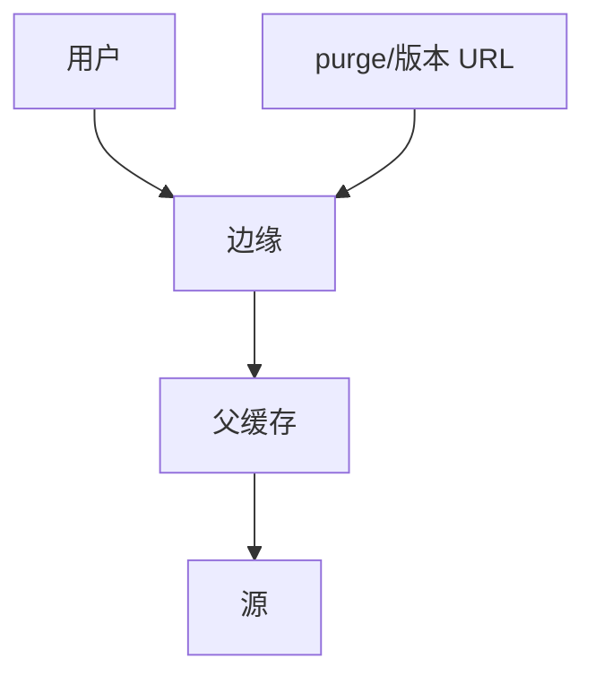

# CDN 缓存层次与失效

边缘未命中问父层，父层问源；失效用 TTL、显式 purge 或版本化 URL，否则用户看见旧表示。

<footer>—— 据 RFC 9111 HTTP 缓存；主干 CDN 直觉课；层次缓存实践整理</footer>

主干[CDN 直觉](/cs/cdn-intuition) 已给为何近。[HTTP 缓存头](/cs/http-semantics) 给合同。[上一课](/cs/abr-streaming) 的分片要能命中。缺口是**层次与失效**：边缘–父–源、stampede、purge。本课不把边缘计算写完。

## 问题

每个边缘都回源会打满源 $C$。层次：L1 边缘、L2 区域、源。命中率靠 TTL 与键（含 `Vary`）。失效：短 TTL、purge API、内容哈希进 URL。惊群：TTL 同时到期，要锁定或 stale-while-revalidate。Cookie 个性化几乎不可缓存。GeoDNS 把用户钉到某边缘。

不要把 CDN 写成任意计算，那是下一课。

RFC 9111。本课不点名厂商产品名当标准。

### 失效是一等公民

层次减源命中。Vary 与 Cookie 决定能否存。不可变 URL 最干净。惊群要用 stale-while-revalidate。

## 方法

画：用户 → 边缘 → 父 → 源。对照 DNS 缓存层次。与 EVPN 无关。

方法止于选定对象与对照；机制才说它如何嵌入已有分层与主干课。

## 机制

H3 连接在边缘终止。Origin shield 减源负载。失败：某层错误缓存 200 要 purge。RPKI 管源地址，不管缓存一致性。ABR 分片不可变则永不失效，最香。

安全：缓存投毒若键过粗。点名。

## 边界

本课不引入 ESI 的全部。边缘计算是下一课。后课默认：CDN 是分层 HTTP 缓存；失效是显式问题。

只靠很长 TTL 无版本化，事故时无法切。

上一课留下的缺口在本课收口；「CDN 缓存层次与失效」进入后课词汇表后只引用。文献用来钉对象与边界，不把本课写成该主题的独立综述。下一课[边缘计算](/cs/edge-compute)。

## 小结

- 层次减少源命中。
- 键与 Vary 决定正确性。
- 失效靠 TTL、purge 或不可变 URL。
- 后课只引用本课钉死的对象，不从该领域总问题重开。
- 出处：RFC 9111；CDN 实践。
