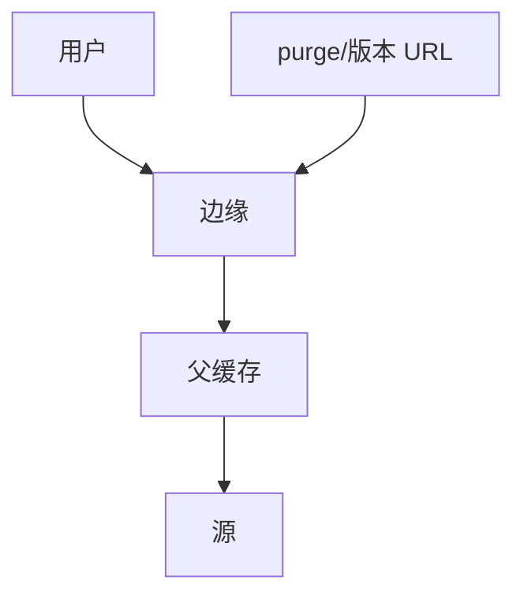
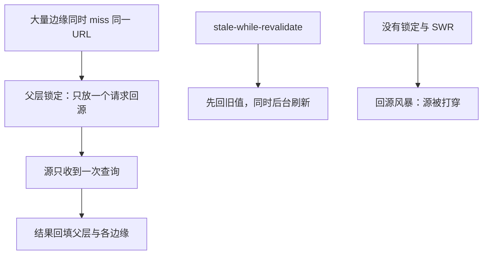

# CDN 缓存层次与失效

边缘未命中问父层，父层问源；失效用 TTL、显式 purge 或版本化 URL，否则用户看见旧表示。

<footer>—— 据 RFC 9111 HTTP 缓存；主干 CDN 直觉课；层次缓存实践整理</footer>

主干[CDN 直觉](/cs/cdn-intuition) 已给为何近。[HTTP 缓存头](/cs/http-semantics) 给合同。[上一课](/cs/abr-streaming) 的分片要能命中。缺口是**层次与失效**：边缘–父–源、stampede、purge。本课不把边缘计算写完。

## 问题

每个边缘都回源会打满源 $C$。层次：L1 边缘、L2 区域、源。命中率靠 TTL 与键（含 `Vary`）。失效：短 TTL、purge API、内容哈希进 URL。惊群：TTL 同时到期，要锁定或 stale-while-revalidate。Cookie 个性化几乎不可缓存。GeoDNS 把用户钉到某边缘。

不要把 CDN 写成任意计算，那是下一课。

RFC 9111。本课不点名厂商产品名当标准。

直觉类比：层次缓存像公司订水——工位（边缘）没水先问楼层茶水间（父层），茶水间没有才去仓库（源）整箱进货；大多数需求在楼层之间就消化了，仓库只被低频地、大批量地打扰。

### 失效是一等公民

层次减源命中。Vary 与 Cookie 决定能否存。不可变 URL 最干净。惊群要用 stale-while-revalidate。

## 方法

画：用户 → 边缘 → 父 → 源。对照 DNS 缓存层次。与 EVPN 无关。

数字实例：边缘命中率 90%，父层再接住剩余 miss 的 90%，回源率就是 0.1×0.1=1%——两层「九成」的命中率叠起来，源只承受百分之一的流量，这就是层次的复利。

```mermaid
flowchart TD
  U["用户"] --> E["边缘"]
  E --> P["父缓存"]
  P --> O["源"]
  INV["purge/版本 URL"] --> E
```

## 机制

H3 连接在边缘终止。Origin shield 减源负载。失败：某层错误缓存 200 要 purge。RPKI 管源地址，不管缓存一致性。ABR 分片不可变则永不失效，最香。

安全：缓存投毒若键过粗。点名。

```mermaid
flowchart TD
  MISS["大量边缘同时 miss 同一 URL"] --> LOCK["父层锁定：只放一个请求回源"]
  LOCK --> ORIGIN["源只收到一次查询"]
  ORIGIN --> FILL["结果回填父层与各边缘"]
  SWR["stale-while-revalidate"] --> OLD["先回旧值，同时后台刷新"]
  NOLOCK["没有锁定与 SWR"] --> STAMPEDE["回源风暴：源被打穿"]
```

常见误区：初学者容易以为 purge 要一台一台边缘去清，实际上版本化 URL（把内容哈希写进路径）让「失效」变成「换新地址」——旧 URL 自然过期，无需任何清查动作，这也是事故时最可靠的切换方式。

## 边界

本课不引入 ESI 的全部。边缘计算是下一课。后课默认：CDN 是分层 HTTP 缓存；失效是显式问题。

只靠很长 TTL 无版本化，事故时无法切。

下一课[边缘计算](/cs/edge-compute)。

## 小结

- 层次减少源命中。
- 键与 Vary 决定正确性。
- 失效靠 TTL、purge 或不可变 URL。
- 后课只引用本课钉死的对象，不从该领域总问题重开。
- 出处：RFC 9111；CDN 实践。
