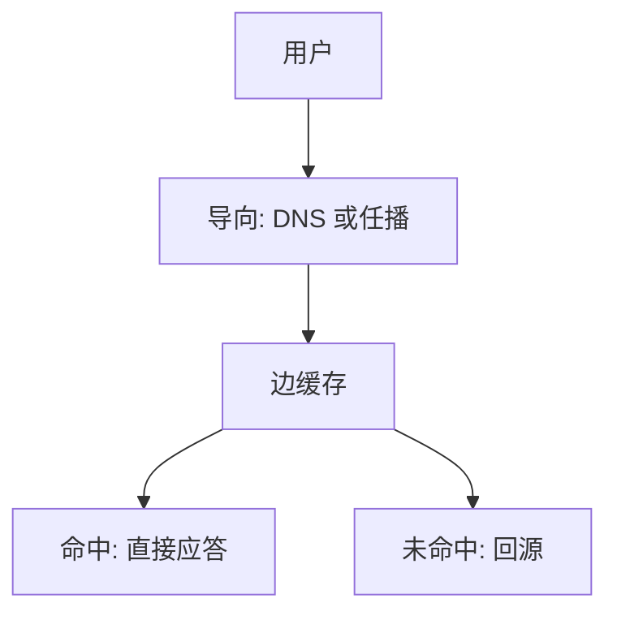

# CDN 直觉

把可缓存的对象复制到离用户近的节点，用 DNS 或任播把请求导到边；源站仍是权威。

<footer>—— 据 Nygren, Sitaraman and Sun, The Akamai Network, CACM 2010；Kurose and Ross 对 CDN 的整理</footer>

[上一课](/cs/http-tls-entry)要求对象经真实信道取出，但信道仍可能跨过半个地球。[HTTP](/cs/http-tls-entry) 的 GET 与缓存头允许复制表示。[DNS](/cs/dns) 可以把同一名字解析到不同地址。缺口是 **CDN 直觉**：边缓存 + 请求导向，不是新的 TCP 拥塞公式。

## 问题

单源受 [LPM](/cs/lpm) 与跨洋 RTT 限制，慢启动让短对象更惨。若每个用户都回源，拥塞窗口再好也救不了距离。CDN：在 ISP 附近放缓存，命中则边节点应答；未命中回源再填。导向：按地理位置或网络度量，用 DNS 答不同 A 记录，或任播同一地址。缺口是这套分工。

本课不把一致性哈希环的全部论文证明写完。

缓存的是 HTTP 表示，遵守 Cache-Control。动态个性化请求仍回源。证书在边上要能出示源的名字，部署与上一课的真实性要求咬合。

## 方法

发布者把源交给 CDN。用户解析 `www` 得到边节点 IP，[TLS 入口](/cs/http-tls-entry)意义上仍要认证该名字。GET 命中则不再走源站磁盘——像 [页 Cache](/cs/buffer-dirty) 但对象在另一台机器。失效：TTL 或显式清洗。

## 机制

CDN 把应用层缓存插进端到端路径：对缓存命中，真正的「文件端」变成边节点，源站的端到端校验发生在边与源之间。用户与边仍要 TLS，否则入口课的中间人问题在边上重现。与 BGP 任播：同一前缀多地通告，LPM 把用户导到拓扑近的点，故障靠路由收敛。

不替代[拥塞控制](/cs/tcp-congestion)：边到用户仍是一条 TCP/QUIC。

## 边界

本课不引入具体厂商配置语言。不把视频分片协议当必修。也不把 CDN 当安全边界的充分条件。应用如何在代码里绑定传输，下一课套接字 API——网络课收到 OS 的文件与进程上。

源站仍要能承受未命中与清洗后的风暴。边节点的缓存键通常含 Host 与规范化 URL，查询串是否计入由配置决定。

后课默认：热对象可从边取。进程怎样调用内核网络栈，下一课套接字。

## 小结

- CDN：边缓存 + DNS/任播导向，降 RTT 与源站负载。
- 仍遵守 HTTP 缓存语义与 TLS 名字认证。
- 编程接口是套接字的缺口。
- 出处：Nygren, Sitaraman and Sun, *CACM* 2010；Kurose and Ross。
