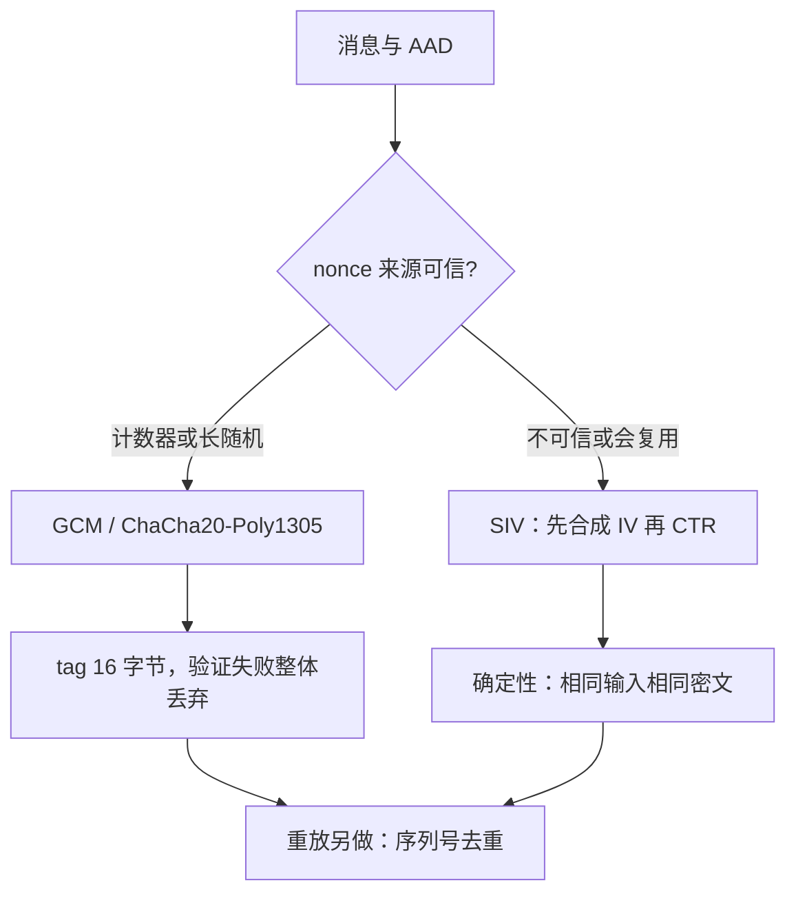

# AEAD 的深入

AEAD 的函数签名只有一行；合同的全部重量都压在 nonce 的来源上——误用发生之后，标签照样验证通过，坏消息也照样递送。

<footer>—— 据 RFC 5116；Rogaway and Shrimpton, 2006；NIST SP 800-38D 整理</footer>

[上一课](/cs/ce-symmetric-modes)把模式选择钉成清单：默认 AEAD，nonce 计数器分配或长随机。本课打开这一行签名本身：明文、AAD、nonce、标签四个参数各管什么，nonce 违约后失败以什么形状出现，以及在 nonce 来源不可信的场合（存储加密、多写者覆盖、乱序交付）该换哪套合同——误用抵抗的 SIV 一族。后课的 KEM 组合与协议陷阱，都默认你能分清「nonce 错了」与「协议错了」这两种失败。

## 问题

RFC 5116 把 AEAD 收成 encrypt(key, nonce, plaintext, aad) → ciphertext, tag。AAD 不加密但进标签：头部、版本号、序列号要被认证却要保持可读。这份合同默认 nonce 唯一，却没有机制强制。GCM 在 nonce 复用后的失败是复合的：CTR 层泄露两条明文的异或；GHASH 层更糟，认证子是认证子密钥 $H$ 的多项式求值，同 nonce 的两条消息即可恢复 $H$，此后攻击者能对任意新消息伪造标签（Procter 2014 的 forbidden attack）。缺口是两问：失败模型决定选型——「nonce 绝对可控」才配用 GCM 一族；不可控时，用把 nonce 也吃进计算的 SIV。

### SIV：合成 IV

SIV（Rogaway and Shrimpton 2006 的确定性 AEAD；AES-GCM-SIV 见 RFC 8452）把方向倒过来：先从密钥、明文与 AAD 算合成 IV，$S = \mathrm{PRF}(k_1, \mathrm{AAD} \| \mathrm{plaintext})$，再用 $k_2$ 与 $S$ 做 CTR 加密。nonce 复用不再灾难：相同输入得到相同密文（确定性加密本来如此），不同输入的碰撞概率被 PRF 压回生日界。代价是不再 online：加密前要缓冲整个明文，流式大消息不友好。

## 方法

选型三问。一问 nonce 来源：由本端单调计数器产生、且重放由序列号拒绝——GCM 或 ChaCha20-Poly1305；由不可信方提供（存储块的地址重映射、多写者覆盖、UDP 乱序重传）——SIV 一族。二问消息上限：GCM 单密钥总账受 SP 800-38D 的 $2^{39}-256$ 比特界；流式协议把大消息切成记录、每记录新 nonce，上限随记录数下降，TLS 的 $2^{14}$ 字节记录上限正是在这套账里。三问失败语义：标签验证失败必须整体丢弃，不能把「解密为什么失败」区分给调用方——那是「协议实现的陷阱」课里预言机的入口。另记一笔：重放拒绝不是 AEAD 的职责，标签验证通过不等于消息是新的，序列号与去重表要外做，TLS 的记录序号正是补在 AEAD 外面的这段账。

## 机制

两族的安全目标不同。GCM 族证明的是 nonce-based AE 安全：同一 nonce 只允许一条消息，优势随消息总量的生日项上涨。SIV 证明的是误用抵抗：攻击者可以诱导 nonce 重复，拿到的只是「明文相等」这一个事实。写成机制：GCM 复用后泄露 $P_1 \oplus P_2$ 与认证子密钥 $H$，随后可主动伪造；SIV 复用后泄露的只有 $P_1 = P_2$。工程含义落在场景上：存储加密的同一扇区反复覆写、内容寻址日志的去重，用 GCM 的失败是主动伪造，用 SIV 的失败只是泄露相等性——两者相差一整个威胁模型。还有一个常被漏掉的合同是密钥承诺（key commitment）：GCM 的密文在多个不同密钥下可能都验证通过，多密钥系统里密文会「认错主人」；标准库默认无此性质，需要它的场合要选带承诺的修补构造，不能假设。

RFC 8452 的 AES-GCM-SIV 在每次调用里额外算一遍合成 IV：nonce 乱来不死人，代价是每消息多一遍全量计算。TLS 1.3 没有采用它——协议层的序号管理已经把 nonce 唯一性钉死，这是「合同分摊」而不是「单层加强」。

## 边界

本课不重推 GHASH 的域运算，那在 [AEAD 与 GCM 内部](/cs/aead-gcm-internals)已完成；重放窗口与前向保密是协议层概念，不算进 AEAD。XTS 不是 AEAD，SIV 与它解决的也不是同一个问题：前者防 nonce 误用并给完整性，后者给扇区定长可调加密、无标签。记录边界泄露长度、密钥轮换的调度属于「协议实现的陷阱」；密钥从哪来属于「随机数」课。

## 小结

- AEAD 四参合同：明文加密，AAD 只认证，nonce 唯一，标签失败整体丢弃。
- GCM 的 nonce 复用复合失败：异或泄露加认证子密钥恢复，随后任意伪造。
- SIV 先合成 IV 再加密，把复用降级为「泄露相等性」；代价是不再 online。
- 重放拒绝与密钥承诺都不在标准 AEAD 里，要外做或选修补构造。
- 出处：RFC 5116；Rogaway and Shrimpton, 2006；RFC 8452；NIST SP 800-38D；Procter 2014。
