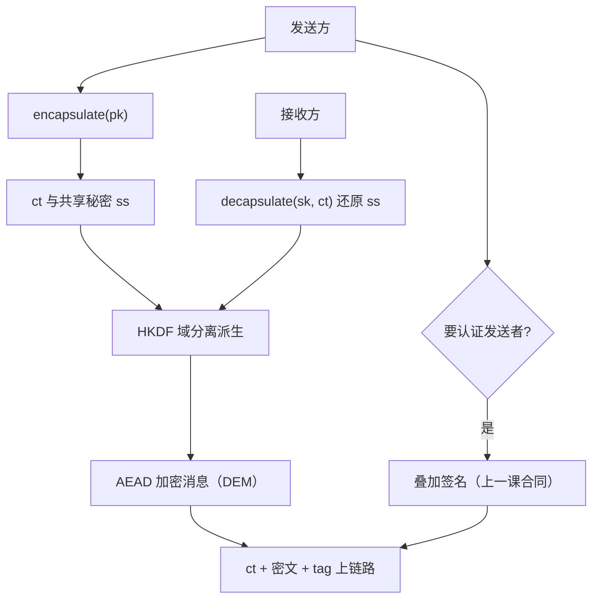
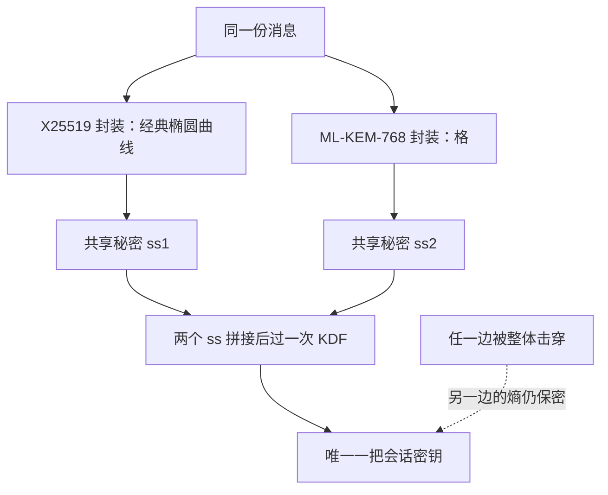

# KEM 与混合加密

公钥加密的正确形状不是「拿对方公钥加密消息」，而是「封装一把会话密钥，再用 AEAD 履行合同」——KEM/DEM 把这句话写成了接口。

<footer>—— 据 Shoup, 2001；RFC 9180；FIPS 203 整理</footer>

[上一课](/cs/ce-signature-practice)把签名纪律钉在 nonce 与验证器上。现在看保密方向：[ECDH 与 X25519](/cs/ecdh-x25519)给了协商原语，[RSA 攻击面](/cs/rsa-attacks)解释了为什么 RSA 直接加密消息的形状退出历史。缺口是**接口**：现代协议（TLS 1.3、HPKE、后量子迁移）都不再「用公钥加密数据」，而是 KEM 封装对称密钥、DEM 做 AEAD。本课钉这个接口的合同、它在格密码上的版本、以及混合迁移的做法。

## 问题

教科书公钥加密把消息直接喂进陷门函数，工程上从来不能这么用：明文要结构化、长度受限、且没有 CCA 安全。KEM 的解法是把「加密任意消息」换成「加密一把定长密钥」：encapsulate(pk) 输出 $(ct, ss)$，decapsulate(sk, ct) 还原 $ss$，$ss$ 经 KDF 进 AEAD——后半叫 DEM，就是[AEAD 的深入](/cs/ce-aead-deep)那套合同。组合「KEM+DEM = 公钥加密」要满足的是 CCA 安全：对手能拿任意密文去问解密预言，仍不能区分挑战密文。缺口是三问：KEM 从哪来（DH 怎么变成 KEM、格加密怎么变成 KEM）、发送方身份谁认证、迁移怎么走。

直觉类比：KEM/DEM 像寄保险箱——先用对方的公钥「封装」出一把一次性小钥匙（KEM，只搬钥匙不搬货），再用这把钥匙锁住真正的货箱（DEM，普通对称加密）；公钥数学慢而贵，只干一次搬钥匙的活。

常见误区：初学者容易以为「拿对方公钥把消息整个加密」就是标准做法，实际上明文长度受限、没有 CCA 安全——RSA 直接加密消息的形状正是因为这些退出历史，现代协议只让公钥原语搬运密钥。

### DH-KEM 与 FO 变换

X25519 本身就是一个 KEM 雏形：发送方临时密钥对 $(a, aG)$，封装密文 $ct = aG$，共享秘密取 $\mathrm{HKDF}(a \cdot B)$，$B$ 是接收方公钥。裸构造不带密钥确认，CCA 证明落在 GDH 一类较强假设上；HPKE（RFC 9180）把两把公钥卷进 HKDF 的套件标识做域分离，给出标准化构造。格侧不同：ML-KEM（FIPS 203，原 Kyber）的底层加密只有 CPA 安全，Fujisaki–Okamoto 变换把解密端改成「重新加密并比对」——解密结果与密文不一致即拒绝，CPA 加密由此升到 CCA 的 KEM。

术语翻译：FO 变换就是用「解密前先重新加密一遍并比对」的手段来做「把 CPA 加密升到 CCA」的事——对手若篡改密文来试探解密预言，比对不一致直接拒绝，试探的嘴被堵上。

## 方法

工程口径四条。其一，消息保密一律 KEM+DEM：KEM 出共享秘密，HKDF 派生，AEAD 加密；绝不把公钥原语的输出直接当密文用。其二，认证归属：KEM 只对「谁能解开」负责，不证明发送者；要认证就叠加签名（上一课的合同）或预共享钥，TLS 1.3 的证书正是叠在临时 DH 之上。其三，前向保密来自临时性：KEM 密钥对每会话即弃；静态公钥解密的服务（给多个接收者发件）没有前向保密，长存私钥泄露会回溯解开历史密文。其四，后量子迁移用混合：X25519 与 ML-KEM-768 各封装一次，两个共享秘密拼接过 KDF——任何一边被破，另一边还撑着；TLS 的 X25519MLKEM768 组合已按此部署。

## 机制

KEM 为什么是「更小的合同」？它把「任意长度、结构化明文」的编码问题从公钥原语里拿掉，塞给对称侧：封装输出永远是定长密钥与定长密文，剩下的一切交给 AEAD 与消息格式。CCA 安全在 DEM 侧由 AEAD 自带的认证给出——篡改密文则标签失败；在 KEM 侧由构造给出——FO 变换把解密预言的每一问都变成自检。两半的合同叠起来，才抵得上「CCA 安全公钥加密」这个旧目标。混合迁移同理是把风险对冲写进协议：拼接两个共享秘密后，安全性取两侧较弱者——除非两边同时被破，防线不塌；它防的是「单一方案被整体击穿」，不是「双倍强度」。

数字实例：X25519 封装出 32 字节的 ss；ML-KEM-768 封装出 32 字节 ss 加 1088 字节密文。两者拼成 64 字节再过 HKDF——不是 128 位变 256 位，而是「经典算法被量子计算机整体击穿时，格那半边还在」。

尺寸账：X25519 公钥 32 字节；ML-KEM-768 公钥 1184 字节、密文 1088 字节。TLS 握手里每个方向多出约 2 KB——这是迁移的物理成本，也是「不到期限不提前全量混合」的工程理由。

## 边界

本课只钉 KEM/DEM 接口与混合口径；证书怎么把公钥绑到名字、握手怎么协商套件，属于 [TLS 握手](/cs/tls-handshake)与 PKI 层。群上签名的纪律在上一课；PIR、MPC 这类「对加密数据直接计算」的路线（见 [PIR](/cs/pir)）与 KEM 不在同一条线上，不要混装。后量子对签名的冲击（ML-DSA、SLH-DSA 与尺寸暴涨）是下一课的主题。

## 小结

- 公钥加密的正确接口是 KEM+DEM：封装会话密钥，AEAD 履行消息合同。
- DH-KEM 把 X25519 的共享点过 HKDF；格侧靠 FO 变换从 CPA 升到 CCA。
- KEM 不认证发送者；认证叠加签名或 PSK，前向保密来自密钥临时性。
- 后量子迁移用混合封装：拼接共享秘密，安全性取较弱侧。
- 出处：Shoup, 2001；RFC 9180；FIPS 203（ML-KEM）；RFC 8446。
