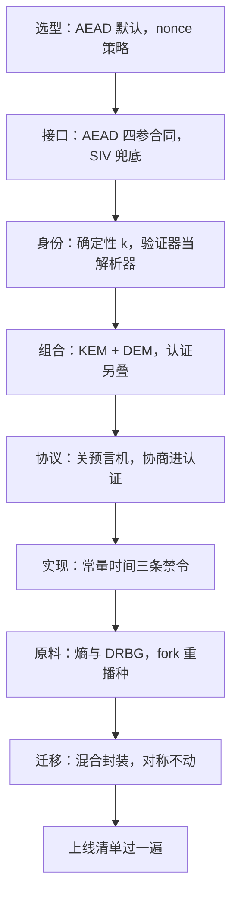
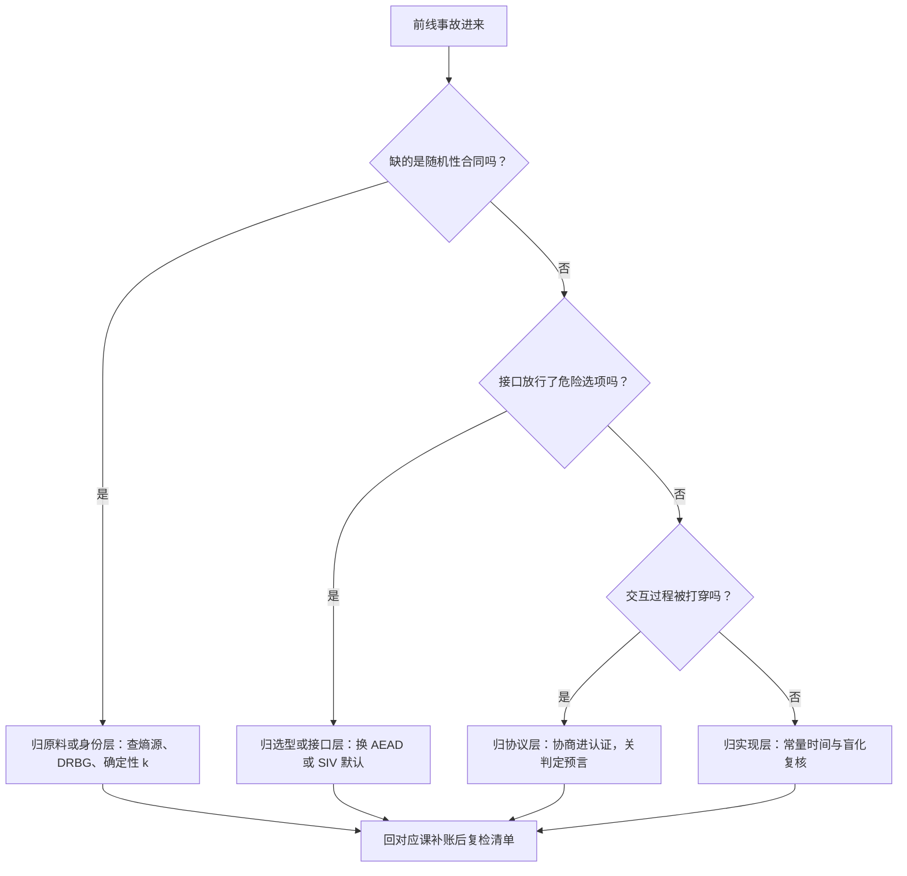

# 密码学工程收束

密码工程这几十年的真实进展，不在发明更多原语，而在把「使用者可能做错的选择」一项一项从接口里拿走。

<footer>—— 据 Ferguson, Schneier and Kohno, *Cryptography Engineering*；Bernstein 的 Curve25519 与 Ed25519 设计口径 整理</footer>

[上一课](/cs/ce-postquantum-overview)把迁移账排完：机密性先行、混合过渡、对称合同不动。前八课各自钉了合同，但工程决策到来时不会按课序敲门——你要先答「这一层是谁的合同」，再翻对应课。本课不引入新合同，只把九课收成一张可执行的地图：按层检索的顺序与上线前的查漏清单。本课程到此收束。

## 问题

收束课的缺口不是知识，而是**检索结构**。整理的轴有三条：合同的层次（选型 → 接口 → 身份 → 组合 → 协议 → 实现 → 原料 → 迁移），每层的死法谱系（同一层内的事故长同一个样），与跨层的通用纪律（域分离、失败不可区分、确定性优先）。三层之中，层次轴决定「去哪查」，死法谱系决定「出了事往哪归类」，通用纪律决定「没有对应课的新场景怎么推理」。

## 方法

按层回收八课。第一层选型（[对称加密模式的实践](/cs/ce-symmetric-modes)）：默认 AEAD，nonce 随模式定策略，遗留 CBC 必配 HMAC。第二层接口（[AEAD 的深入](/cs/ce-aead-deep)）：四参合同，误用后果分级，SIV 兜底 nonce 不可控的场合。第三层身份（[签名方案的实践](/cs/ce-signature-practice)）：$k$ 确定性，验证器当解析器，签钥与协商钥分离。第四层组合（[KEM 与混合加密](/cs/ce-kem-hybrid)）：KEM+DEM 替代「公钥加密消息」，认证另叠签名，混合对冲迁移。第五层协议（[协议实现的陷阱](/cs/ce-protocol-pitfalls)）：判定预言四个来源，协商进认证，不自写协议。第六层实现（[侧信道](/cs/ce-side-channels)）：常量时间三条禁令加盲化，编译产物上复核。第七层原料（[随机数](/cs/ce-randomness)）：熵多源混合，系统 CSPRNG，fork 与快照重播种，nonce 双合同。第八层迁移（[后量子概览](/cs/ce-postquantum-overview)）：机密性先行，混合封装，对称侧不动。

## 机制

「死法谱系」就是把同一层里出过的事故按成因归成的清单——可以类比医生分诊：同样是胸痛，急诊科会先按既往病例里最常见的成因排查心脏，而不是随机乱查。有了谱系，新事故先对号入座，再对症下药。

跨层看，全部事故共用同一条机制：**确定性冒充随机性，或随机性缺乏合同**。$k$ 复用是确定性撞上签名方程；nonce 复用是计数器合同没传到调用方；Debian 的熵是确定性原料被当随机卖；fork 后的重复输出是 DRBG 的合同没覆盖进程生命周期。防御也共用一条机制：**把正确做法变成默认路径**。X25519 的钳位、Ed25519 的确定性派生、SIV 的合成 IV、HPKE 的标准化封装、TLS 1.3 删掉 CBC——每一个都是在接口层没收使用者的犯错机会，而不是在文档里请求小心。这条机制也解释了本课程的课序为什么「实践」在前、「陷阱与前沿」在后：先立正合同，再审合同会被怎么打穿；两层都过一遍，剩下的才是参数与性能的自由度。

为什么「确定性冒充随机性」值得单独记住：签名时把随机数 $k$ 换成确定值会泄露私钥，但 Ed25519 偏偏用确定性派生的 $k$ 却更安全——区别在于前者是攻击者可预测的确定（比如取消息哈希），后者是只有私钥能算出的确定。可见「确定」本身不是罪，缺合同的确定才是。

上线前的最小清单：AEAD 且 nonce 有合同；签名确定性且验证器逐项检查；KEM+DEM 而非自造公钥加密；错误与失败不可区分且常量时间；系统 CSPRNG 且 fork 重播种；协商进认证；密钥有域分离与轮换。七项各对应一课，缺一项就回那一课补账。

## 边界

本课程有意留下的界外账：公钥绑名字的 PKI 与证书生态（[TLS 握手](/cs/tls-handshake)的入口课已给外观）；对加密数据直接计算的 MPC 与 PIR 路线（见 [PIR](/cs/pir)）；格密码与量子算法的数学；硬件安全的功耗层。这四块各自是别的课程的缺口，本课程不再追。常见误区是把「界外」理解成「不重要」：这四块只是不属于本课程的范围，不等于上线产品可以不管。比如你的服务要用证书，PKI 的账照样要算——只是要翻到讲 PKI 的那一课去算，而不是在这张地图里硬找。收束的口径：选型、接口、身份、组合、协议、实现、原料、迁移，八层合同到此全部钉完，前线事故回到对应层诊断即可。

## 小结

- 八层地图：选型、接口、身份、组合、协议、实现、原料、迁移；决策先归层再查课。
- 全部事故同机制：确定性冒充随机性，或随机性缺乏合同。
- 全部防御同机制：把正确做法变成默认路径，在接口层没收犯错机会。
- 界外四块：PKI、MPC/PIR、格数学、硬件功耗层，各是别的课程的缺口。
- 出处：Ferguson, Schneier and Kohno, *Cryptography Engineering*；Bernstein（Curve25519）与 RFC 7748/8032；NIST SP 800-38D 与 FIPS 203/204/205。
