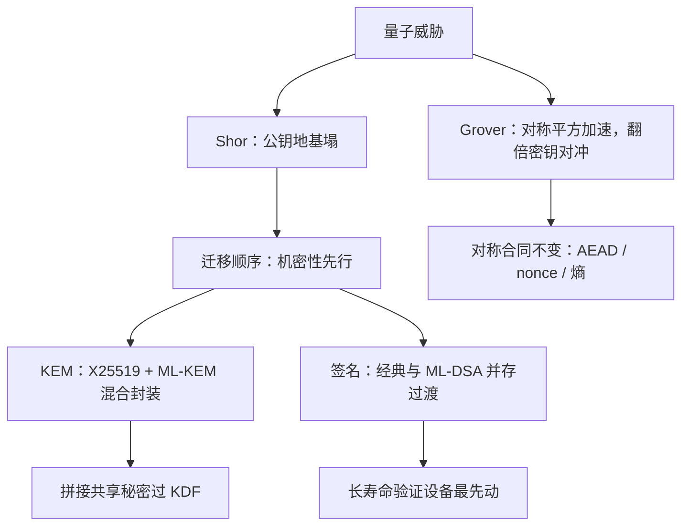
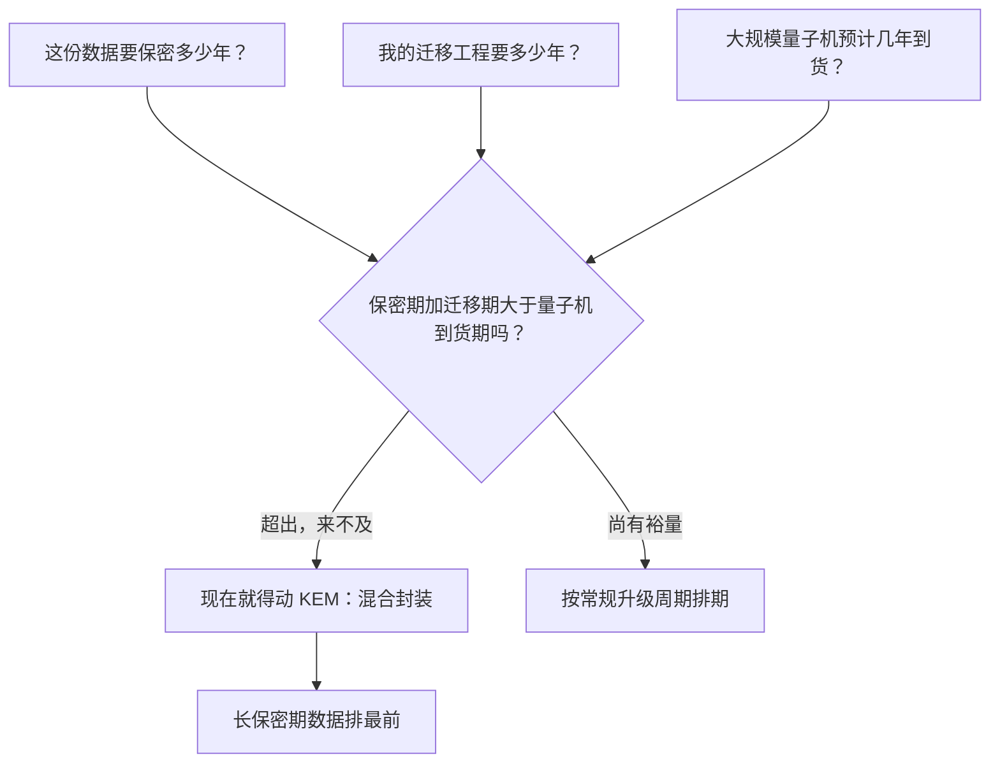

# 后量子概览

量子计算机不改变对称密码的账，它换掉的是公钥那半张表：Shor 把因式分解与离散对数收进多项式时间，整条公钥地基要重铺。

<footer>—— 据 Shor, 1997；Grover, 1996；NIST FIPS 203/204/205 整理</footer>

[上一课](/cs/ce-randomness)把原料层钉在熵与 DRBG 上。现在抬头看前沿：本课程至此的全部公钥合同——X25519 协商、ECDSA/EdDSA 签名、RSA 的遗留形状——都站在「大整数分解与椭圆曲线离散对数不可解」这块地基上，而 Shor 算法在足够规模的量子计算机上把两者都收进多项式时间。缺口是**迁移账**：什么先破、什么不用慌、替手的方案是什么族、协议层怎么混合过渡。本课是概览，收下边界，不进格密码的数学。

## 问题

威胁按算法分账。Shor 1997：周期查找把因式分解与离散对数归约到量子傅里叶变换，RSA、DH、ECDH、ECDSA 全部在打击面上——公钥侧的整张表。Grover 1996：对对称原语给出平方加速，AES-128 的暴力成本从 $2^{128}$ 落到 $2^{64}$ 量级，翻倍密钥（AES-256）即对冲；哈希的原像同理，抗碰撞的生日界只降常数倍。「平方加速」翻译过来就是：暴力搜索的工作量从 $2^n$ 降到约 $2^{n/2}$。代入数字看，AES-128 的 $2^{128}$ 次尝试变成 $2^{64}$ 次——听着仍巨大，但已落入国家级对手可规划的射程；而把密钥翻倍到 AES-256，成本回到 $2^{128}$，裕量又够了。这就是「对称侧不用慌、密钥翻倍即对冲」的来由。这条分账决定了迁移顺序：**机密性先行**——「现在截获、将来解密」（harvest now, decrypt later）只需要对手存密文等机器；签名可以等到量子计算机真的可用再换，因为伪造必须当场完成。Mosca 的不等式把这写成判据：数据保密期加迁移期 \gt 量子机到货期，就必须现在动 KEM。

### 方案族

NIST 2024 年定稿三份标准，覆盖两大族：格上的 ML-KEM（FIPS 203，原 Kyber，接替 ECDH 的位置）与 ML-DSA（FIPS 204，原 Dilithium，接替签名位置）；哈希签名的 SLH-DSA（FIPS 205，原 SPHINCS+，保守但尺寸大）。之外编码族的 Classic McEliece（密钥巨大、更保守）留在备用位。谱系里也有反面教材：同属决赛圈的同源（isogeny）方案 SIKE，2022 年被经典（非量子）攻击在单核约一小时内击穿——「新结构」不等于「更安全」，标准化过程的意义正是让方案被公开拷打几年。

## 方法

迁移口径四条。其一，协商用混合：X25519 与 ML-KEM-768 各封装一次，两个共享秘密拼接过 KDF——上一课 [KEM 与混合加密](/cs/ce-kem-hybrid)的合同原样适用；任一被破另一边还撑着，代价是握手多约 2 KB。其二，签名分阶段：先在支持双签的场合并存（经典与 ML-DSA），证书链与代码签名这类「验证设备寿命长」的场合最先动，固件里的验证器一用十年。其三，按 Mosca 判据排期：长保密期数据（医疗档案、国家档案）的加密迁移第一优先。「现在截获、将来解密」可以类比成：有人今天拍下你寄出的每张明信片，等几十年后某种读信机器问世，再逐张把内容读出来。明信片一旦寄出就收不回，数据一旦被截走就追不回——所以防御必须赶在「寄出」（加密）那一刻之前完成，这正是机密性先行的时间逻辑。其四，对称层不动：AES-256 与 SHA-384 在 Grover 界下余量充足，AEAD 结构、nonce 纪律、本课程前七课的对称合同原样保留——后量子换的是公钥侧，不是重学一遍。

## 机制

「机密性先行」的机制根据是**攻击的时间方向**。解密攻击可以在密文产生多年后执行——对手的唯一成本是存储，因此防御必须赶在加密那一刻完成；伪造签名却必须在被验证的那一刻完成，量子机到货前不存在「先存着」的签名攻击，所以签名迁移可以等标准化与硬件生态成熟再收口。混合封装为什么不是「双倍强度」而是「取较弱侧」：攻击者只需攻破拼接中任意一份就能推进——混合防的是「单一方案被整体击穿」，不防「两侧方案同一天各破一半」。SIKE 之死给出的教训也是机制性的：同源映射的困难性没有多年公开分析支撑，决赛资格不构成安全证据；ML-KEM 与 ML-DSA 站的是被拷打了十几年的格假设（LWE 一族）。

尺寸的账：Ed25519 公钥 32 字节、签名 64 字节；ML-DSA-44 公钥 1312 字节、签名 2420 字节。TLS 握手每个方向多约 2 KB、证书多约 1 KB——迁移的真实代价是带宽与解析，不是算法速度。

## 边界

本课不进格密码数学（LWE、模格的困难性归约）与量子算法推导；PIR、MPC 这类密码学前沿（见 [PIR](/cs/pir)）与本课不在同一条线上。状态化哈希签名（XMSS/LMS）的有状态风险——签名状态一旦重放即灾难——只点名，落进 IoT 与固件场景时按 NIST SP 800-208 口径执行。常见误区：把哈希签名当成「最保守就最安全」的默认选择。XMSS/LMS 的私钥状态必须按严格顺序用、每格只能签一次——设备一旦被刷回旧快照（状态回滚），同一格签两次就可能泄露私钥。管不好状态的场景，宁可换更大但无状态的 SLH-DSA。本课程至此不更换前七课的任何对称侧合同；下一课收束全课程。

## 小结

- Shor 收走全部经典公钥原语；Grover 只给对称平方加速，翻倍密钥即对冲。
- 迁移按攻击时间方向排序：机密性先行（harvest now, decrypt later），签名可后动。
- 方案族：格（ML-KEM/ML-DSA）、哈希（SLH-DSA）；SIKE 之死说明新结构需要公开拷打。
- 混合封装取较弱侧安全性，防单点击穿；对称侧合同原样保留。
- 出处：Shor, 1997；Grover, 1996；NIST FIPS 203/204/205；Mosca, 2018。
