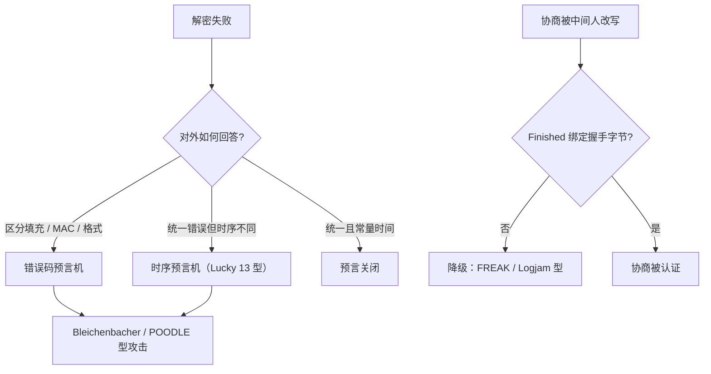

# 协议实现的陷阱

原语各自正确，组合起来才出事：预言机不在算法里，在错误码、时序与「顺手回一句为什么失败」里。

<footer>—— 据 Bleichenbacher, 1998；Vaudenay, 2002；Ferguson, Schneier and Kohno, *Cryptography Engineering* 整理</footer>

[上一课](/cs/ce-kem-hybrid)把 KEM+DEM 的组合合同钉住。本课面对工程里更常见的实况：协议不是原语的加法，历史上大部分破绽发生在组合处——错误消息区分了填充错误与 MAC 错误，时序区分了分支，协商字段放行了降级。主干[填充预言机](/cs/padding-oracle)已给过 CBC 那口井；[TLS 握手](/cs/tls-handshake)给了 Finished 绑定握手字节的机制。缺口是把案例收成一份「组合纪律」清单：任何自写协议过一遍都该被这张表拷问。

## 问题

组合失败的共同形状：协议向攻击者开放一个**判定预言**。Bleichenbacher 1998 打 PKCS#1 v1.5 的 RSA 解密：服务器对「填充错」与「格式对但后续错」返回不同错误，攻击者据此把密文盲化、逐字节逼近，约一百万次查询内解出明文；二十多年后这个预言仍在多家产品里复活（ROBOT）。CBC 侧同型：填充校验先于 MAC 校验、错误码不同即预言机（Vaudenay 2002）。Lucky 13 证明连「错误码统一」都不够：MAC 校验的处理量随填充长度变化，预言从错误码挪进了纳秒级时序。缺口不是背案例，而是识别预言的四类来源：错误码、时序、可见的状态变化、可重放性。

### 降级与协商

协商字段本身是攻击面。客户端与服务器各自报版本与套件，中间人删掉高版本与强套件——FREAK、Logjam 都靠复活出口级弱算法得手。RFC 5746 之后，TLS 用 Finished 把全部握手字节哈希进密钥材料：篡改过协商的中间人，造不出与两端一致的 Finished。把这条机制通用化就是本课的核心纪律：**把协商过程本身绑进认证**，而不是信任每个字段的独立正确性。

## 方法

组合纪律五条。其一，失败一律不可区分：解密失败的对外表现只有一种（连接终止或通用错误），内部区分只进日志，且日志路径不带时序差。其二，认证次序用 Encrypt-then-MAC 形状或直接 AEAD；「MAC-then-encrypt」的正确性靠「MAC 校验时间与内容无关」来补——这是 Lucky 13 用多年补丁换来的教训，不该再付一次。其三，防重放要有显式合同：nonce、计数器或时间戳，且落进认证范围；「消息里有时间戳」本身不防重放，除非时间戳被 MAC 覆盖。其四，常量时间比较标签与 MAC——[长度扩展与 HMAC](/cs/length-extension-hmac)的小结已点名；任何 `==` 比较密钥材料都重新开口预言。其五，不自写协议：组合问题连专业团队都反复失手（renegotiation 2009、Bleichenbacher 两度复活），应用层该做的是选 TLS、Noise 这类经过战役的框架，把自创减到最少。

## 机制

为什么预言机挡不住？因为组合层的安全目标与原语层不同：原语按「挑战不可区分」证明，协议要按「任何判定结果不依赖秘密」重证一遍。错误路径上每一处提前返回，都在游戏之外多了一个可观测输出。TLS 1.3 把这条纪律制度化：记录层统一 AEAD、失败即连接终止、握手转录进 Finished、降级用哨兵值标记（服务器拒绝旧版本连接时写死一个特定随机串供客户端识别）。对照读，[AEAD 的深入](/cs/ce-aead-deep)的「标签失败整体丢弃」正是这条纪律在记录层的落地：合同在原语层写好了，协议层的职责只是不去重新打开它。

Lucky 13 的修补成本常被低估：统一错误码之后，实现还要把 HMAC 校验做成「无论填充对错都执行相同指令数」，并在缓存与循环里抹掉时间差。TLS 1.3 直接删掉 CBC 套件——用「少一个模式」换「少一类预言」。

## 边界

时序如何在纳秒尺度被测量、常量时间代码怎么写、编译器如何重新引入分支，是下一课「侧信道」的主题。本课不重述 CBC 填充预言的代数细节（见[填充预言机](/cs/padding-oracle)），也不展开证书链校验的陷阱（判名规则不在协议组合层）。随机数短缺引发的协议失败（重复的 $k$、可预测的 nonce）按「随机数」课的口径处理。

## 小结

- 组合层破绽的共同形状是判定预言：错误码、时序、状态变化、可重放性。
- 失败对外一律不可区分且常量时间；MAC-then-encrypt 的时序债是 Lucky 13 的教训。
- 协商要被认证：Finished 绑定握手字节；字段独立正确不等于组合正确。
- 防重放要显式合同且进认证范围；自写协议默认有预言，选经过战役的框架。
- 出处：Bleichenbacher, 1998；Vaudenay, 2002；RFC 5746；RFC 8446；Ferguson, Schneier and Kohno。
