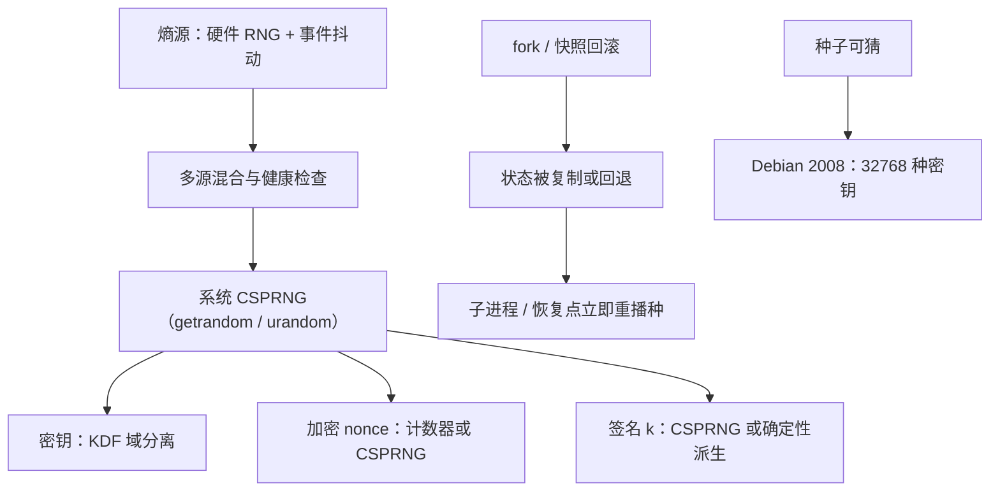

# 随机数

密码学里一切「不可预测」的承诺，最终都落到一个数上：熵不够，前面全部的合同都是在拿确定性的原料签不确定性的单。

<footer>—— 据 RFC 4086；NIST SP 800-90A；Ferguson, Schneier and Kohno, *Cryptography Engineering* 整理</footer>

[上一课](/cs/ce-side-channels)把实现层的泄露口收到常量时间。本课回到更底层的原料：密钥、nonce、盐、$k$，全都要求「攻击者猜不到」，而机器是确定性设备，不会自己产出意外。[CSPRNG](/cs/csprng)已给过抗预测与抗回溯的目标定义；[ECDSA / EdDSA](/cs/ecdsa-eddsa)的 $k$ 复用事件刚演示过弱随机的代价。缺口是**工程链条**：熵从哪来、怎么烧成 DRBG、fork 与虚机会把状态怎么弄坏、nonce 的两个合同为何不同。

## 问题

随机数事故的历史几乎是同一句话的重复：「熵源看似有，实则可猜」。1996 年 Netscape 的 SSL 种子取自时间与进程号，搜索空间被压到分钟级暴力；2008 年 Debian 打包脚本误删两行，OpenSSL 的种子只剩进程号，全网密钥塌缩到 32768 种；2013 年 Android 的 SecureRandom 实现缺陷让比特币签名重复 $k$，钱包当场被洗。三案都不是「算法选错」，而是同一层：确定性机器上，不可预测性必须显式制造。缺口是把制造流程钉成组件：熵源（物理噪声、硬件 RNG、事件计时抖动）→ DRBG（把种子确定性扩张成无限流）→ 使用纪律（按用途分合同）。

### 两个 nonce 合同

同名叫 nonce，合同不同。加密侧（CTR、GCM）的 nonce 要求**唯一但可以公开**：计数器即可，秘密性无关紧要。签名侧（ECDSA 的 $k$、EdDSA 的派生种子）的 nonce 要求**不可预测且一次性**：必须是 CSPRNG 输出或从密钥确定性派生，泄露即私钥。把签名 nonce 当计数器编，等于把私钥按序号公开——两套合同混用是工程里真实发生过的错误。

## 方法

工程口径按链条走。熵源：优先硬件 RNG（RDRAND/RDSEED 一类）但**不单独信任**，与系统事件（中断计时、设备延迟）混合；熵估计交给标准化健康检查（SP 800-90B 口径），不做手工估计。DRBG：用系统级 CSPRNG（Linux 的 getrandom(2)、/dev/urandom），不自建；自建也只选标准化构造（CTR_DRBG/HMAC_DRBG）并按周期重播种。进程安全：fork 复制父进程的 DRBG 状态，子进程必须立即重播种；虚机快照回滚同理，恢复点之后的输出可能整段重复，这是云环境真实的事故源。使用纪律：密钥与 nonce 各自过 KDF 域分离；盐公开、$k$ 保密，按上一段的两套合同分发。

## 机制

DRBG 为什么敢把 256 位种子拉成无限流？因为底层是 PRF 的安全归约：不知道状态则输出不可区分于均匀——这正是[一次一密与完美保密](/cs/one-time-pad-perfect-secrecy)之后「用 PRG 换钥匙长度」的同一笔账。但归约不覆盖两类现实失败：种子本身可猜（熵估计错），状态可回退（fork、快照、克隆）。前者靠 SP 800-90B 的健康检查与多源混合兜底；后者的通用解是「重播种加单调计数」，内核在 fork 与虚机恢复路径上补种的做法即是此理。回溯抵抗为什么重要：会话密钥要在密钥文件被读走之后仍然保密，靠的就是 DRBG 的前向安全——拿到现在推不出过去；重播种的节奏就是在为这条性质付账。

Debian 2008 的量级：被删的两行让种子池只剩进程号一个变量，密钥空间塌到 $2^{15}$，漏洞公开后全网批量重签。同年前后，PS3 的静态 $k$ 从另一条线击穿签名——可预测的熵与重复的 nonce 死法同源：确定性原料冒充随机性。

## 边界

本课不展开熵的物理来源（量子噪声、热噪声采集电路）与形式化熵理论；也不重讲 CSPRNG 的目标定义（见 [CSPRNG](/cs/csprng)）。后量子迁移不改变本课任何结论——ML-KEM 的密钥生成同样吃 CSPRNG，格参数对低熵种子更敏感的讨论是前沿课的缺口。签名侧确定性派生（RFC 6979、Ed25519）把在线随机需求降为零，但不取消密钥生成时对熵的需求——[ECDSA / EdDSA](/cs/ecdsa-eddsa)已钉过这条边界，不重复。

## 小结

- 随机数事故同源：确定性原料冒充随机性；Netscape、Debian、Android 三案同一句诊断。
- 链条三件：多源混合的熵、标准化 DRBG、按用途的使用纪律；手工熵估计一律拒绝。
- fork 与快照回滚复制或回退状态，子进程与恢复点必须立即重播种。
- nonce 两合同：加密侧唯一可公开，签名侧不可预测且一次性。
- 出处：RFC 4086；NIST SP 800-90A/90B；Ferguson, Schneier and Kohno；对照 Debian OpenSSL 2008 事件。
