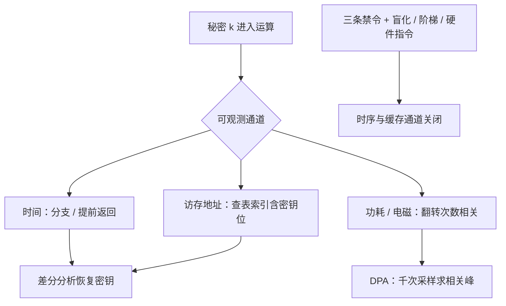

# 侧信道

密钥可以在数学上无懈可击，同时从功耗曲线、缓存命中或一条分支里整字节整字节地漏出去——实现本身就是一条明文通道。

<footer>—— 据 Kocher, 1996；Kocher, Jaffe and Jun, 1999；Bernstein, 2005 整理</footer>

[上一课](/cs/ce-protocol-pitfalls)把组合层的预言机钉在错误码与时序上。时序往下挖一层就是本课：不只协议的分支在漏，一次乘法、一次查表、一个依赖密钥的内存地址，都在把秘密写进可测物理量。Kocher 1996 用纯计时差解出 RSA 的指数位；Kocher, Jaffe and Jun 1999 的差分功耗分析（DPA）在智能卡上批量恢复密钥；Bernstein 2005 证明缓存时序可以隔着网络打 AES。缺口是把「实现不能泄露」变成可检查的工程标准：什么操作在什么模型下算漏，常量时间到底约束哪几类指令。

## 问题

秘密进入计算后，沿三条物理通道外出。其一，时间：分支与提前返回让执行时长依赖密钥位，查表让访存地址依赖密钥位。其二，功耗与电磁：电路翻转次数与处理的数据相关，同一密钥上千次采样的功耗曲线做差分，相关峰直接标出密钥字节。其三，共享资源：同一 CPU 上的另一个进程（或另一台虚机）可通过缓存组的命中状态观察受害者的访存模式，Flush+Reload（Yarom and Falkner 2013）把测量精度做到一条 cache line。数学安全证明对这些通道全部失明：归约里的攻击者拿不到计时器。缺口是定一条可实现的安全线，而不是要求「实现无物理泄露」。

### 常量时间的可检查定义

工程上「常量时间」有可操作的判据，只有三条禁令：秘密不得进入分支条件；秘密不得进入内存地址（数组下标）；与秘密相关的执行时间不得依赖其值（除法、提前退出、可变循环次数都算）。满足三条，执行流与访存序列对秘密独立，时间与缓存两个通道即关闭。功耗通道要靠掩蔽与双轨逻辑，属于硬件层，本课只划界不展开。

## 方法

落地做法按算法族分。模幂（RSA）：固定窗口数、预计算全表、Montgomery 乘法常量时间，另加指数盲化 $d' = d + r\cdot\varphi(n)$——即使有残余时序差，也不与真实指数对齐。标量乘（ECC）：Montgomery 阶梯天然每步对称，X25519 在 RFC 7748 里把「阶梯加常量时间」写进规范本身，这是「合同进接口」的范例。AES：软件实现弃查表改用 bitsliced 或 AES-NI 硬件指令，密钥装进独立电路后缓存通道消失。比较（MAC 标签）：逐字节异或累积、最后统一判断——[协议实现的陷阱](/cs/ce-protocol-pitfalls)里「常量时间比较」的机器级实现。最后一条纪律管编译器：优化器有权把「秘密控制的选择」改回分支、把查表展开，常量时间必须在编译产物上复核，源码级审查不够。

## 机制

侧信道攻击的共同机制是**把秘密变成可分的信号**：一次测量里泄露混在噪声里，多次测量按猜测分组求平均（DPA）或按地址对齐（Flush+Reload），信号从噪声里立起来。防御因此分两层：降低单次泄露（常量时间让信号源头为零），提高对齐成本（盲化让每次测量的目标不同）。Brumley and Boneh 2003 证明这仗隔着网络也能打：OpenSSL 的 RSA 时序差跨广域网仍可统计出指数位。反过来，这条机制也解释了为什么「常量时间」是可实现的标准：它不要求消除物理世界的全部相关性，只要求秘密与可观测序列在指令层面独立——这是编译器选项与检测工具（ctgrind 一类）能机械检查的性质。

查表的账：一张 256 字节的 S 盒占 4 条 64 字节 cache line，查表索引含 8 位密钥；cache 命中约几纳秒、未命中约百纳秒，差两个数量级——Bernstein 2005 的远程 AES 攻击与 Flush+Reload 攻击吃的是同一个信号。

## 边界

功耗与电磁通道、掩蔽与双轨逻辑属于硬件安全，本课只点名不展开；容错攻击（Rowhammer、电压毛刺改写计算）也在界外。本课的「常量时间」针对时序与缓存两个通道，不承诺对抗持有近场测量装备的攻击者。协议层失败（错误码预言机）已由上一课收口；随机数侧的失败——熵不足与时序可预测的非密码 RNG——留给「随机数」课。

## 小结

- 秘密沿时间、功耗、共享缓存三条通道外泄；数学归约对它们失明。
- 常量时间三条禁令：无秘密分支、无秘密下标、无秘密相关的执行时间。
- 防御两层：常量时间消信号源，盲化与阶梯提高对齐成本；X25519 把阶梯写进规范。
- 常量时间要在编译产物上复核；功耗通道由硬件层另解。
- 出处：Kocher, 1996；Kocher, Jaffe and Jun, 1999；Bernstein, 2005；Yarom and Falkner, 2013；RFC 7748。
