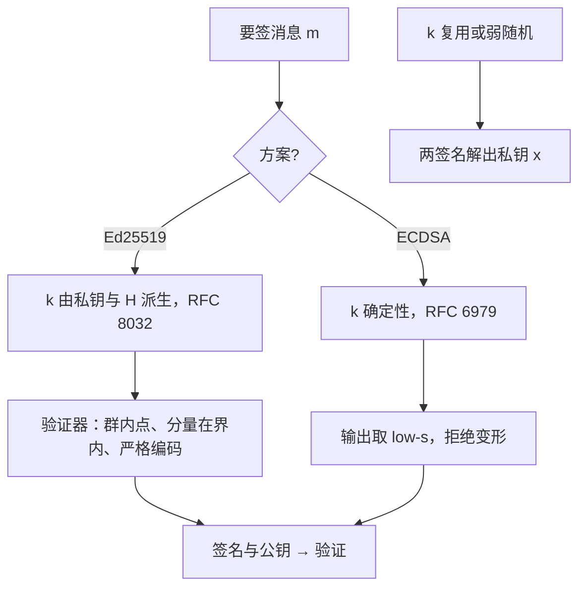
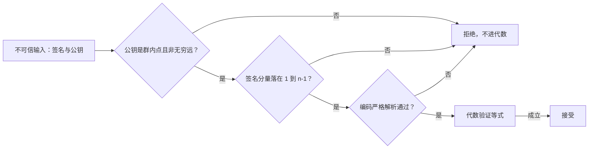

# 签名方案的实践

签名方案的数学几十年没被推翻；被打穿的地方几乎都在随机数与输入校验上——$k$ 重复一次，私钥就从两行式里走出来。

<footer>—— 据 RFC 8032；Bernstein 等, Ed25519；RFC 6979 整理</footer>

[上一课](/cs/ce-aead-deep)把 AEAD 的合同与误用边界钉死，对称侧的保密与完整齐了。接下来是公钥侧的身份：主干[MAC 与签名](/cs/mac-signature)分开了认证与不可否认，[ECDSA / EdDSA](/cs/ecdsa-eddsa)给了两族方案，[RSA 攻击面](/cs/rsa-attacks)解释了 RSA 为什么退居填充正确的形状。缺口是**实践纪律**：签什么（原始消息还是哈希）、nonce 怎么来、验证器要拒绝什么。方案本身选错的情况很少，纪律缺失时攻击不需要碰数学。

## 问题

ECDSA 与 EdDSA 同为椭圆曲线签名，合同却不同。ECDSA 要求每次签名一个新鲜的秘密 $k$：签名方程 $s = k^{-1}(H(m) + r\,x) \bmod n$ 里，同一个 $k$ 签两条消息，两式相减即解出私钥 $x$——2010 年 PS3 的签名密钥正是这样被算出来的。即使 $k$ 只用一次但来自弱 CSPRNG，或带可利用的偏差（格攻击），同样致命。EdDSA 把 $k$ 改成从私钥与消息哈希确定性派生；RFC 6979 给 ECDSA 同样的确定性补丁。缺口因此不是「哪条曲线安全」，而是三件实践事：$k$ 的来源、签名的输入格式、验证器的严格性。常见误区：以为「选了公认安全的曲线就安全了」。PS3 被破时曲线本身毫发无损，坏的是静态的 $k$；Android 钱包案里坏的是弱随机源。方案的安全性是数学、随机数、输入校验三件事的和，任何一件缺席，攻击都轮不到碰数学。

### 验证器要拒绝什么

签名验证是面向不可信输入的解析器。进代数之前必须逐项检查：公钥是群内点且不是无穷远点（退化点上曲线方程的恒等式可能自动成立，验证被白绕）；签名分量的数值落在 $[1, n-1]$；编码严格解析（宽容的 DER 解析曾让签名可变形成交易重放）。Ed25519 已把点压缩、坐标范围、dom 域分离写进 RFC 8032，照文检查即可；自己拼装「先哈希再喂 ECDSA」时，这些检查要自己补齐。「把验证器当解析器」可以类比海关验护照：先验证件的材质与格式，再查人证是否一致，两关都过才谈得上比对记录。跳过格式检查直接进「代数比对」，等于给假护照开后门——群外点攻击利用的正是这个窗口。

## 方法

实践规则四条。其一，$k$ 一律确定性：Ed25519 用 RFC 8032 的派生式，ECDSA 用 RFC 6979——把在线随机数需求从签名里删掉，同时保留可注入额外熵的接口。其二，输入域分离：Ed25519 的 dom2 前缀把纯 Ed25519 与预哈希变体 Ed25519ph 分开，同一密钥混用两式会互签；应用层的消息类型也应进哈希前缀，防止「转账单」被改签成「确认单」。其三，签钥与协商钥分离——[ECDH 与 X25519](/cs/ecdh-x25519)的 DH 密钥不该兼签身份，两处的泄露后果与暴露面不同。其四，输出规范化：ECDSA 取 low-s（把 $s$ 折到 $n/2$ 以下）消灭可变形；验证端拒绝 high-s。RSA 侧只接受 PSS（RFC 8017），PKCS#1 v1.5 签名只在遗留校验里出现。

## 机制

确定性为什么够？被攻击的正是 $k$ 的均匀性：$k = \mathrm{PRF}(k_{\mathrm{seed}}, H(m))$ 的输出只要不可预测即可，不必真随机；Ed25519 干脆把消息哈希卷进派生，同一消息每次签名结果相同——重复投递由应用层序号去管，不是签名的职责。反过来，随机 $k$ 的失败是集合式的：PS3 的静态 $k$、2013 年 Android 钱包弱随机导致的比特币密钥泄露、格攻击吃偏差，三条路汇到同一行代数。验证端同理：群外点让点加变成未定义行为，各库「容错」方向不同，签名等式在退化点上恒等成立，伪造免费。把验证器当解析器而不是当数学求值器，是这一课的机制核心。

为什么 low-s 是「二选一收编」：ECDSA 的等式对 $s$ 与 $n-s$ 同时成立，同一份签名天然有两种合法编码，攻击者可拿另一种编码把已花的交易（或已投的消息）伪装成新的一条重放——2014 年比特币交易变形风波即属此类。约定只收 $s \le n/2$ 的一半，编码就只剩一种，变形空间归零。

两次签名共享 $k$：$s_1 - s_2 = k^{-1}(H(m_1) - H(m_2)) \bmod n$，右端全部可算，先解出 $k$，代回任一式得私钥 $x$。2010 年 PS3 与 2013 年 Android 比特币钱包是同一行代数的两次执行。

## 边界

本课管签名本身的纪律；公钥绑到名字（证书、信任链、吊销）是 [TLS 握手](/cs/tls-handshake)与 PKI 层的事，[MAC 与签名](/cs/mac-signature)已把「签名只证明某把私钥」钉为边界。哈希函数选择与碰撞界按[生日攻击](/cs/birthday-attack)的口径取；长度扩展类问题按[长度扩展与 HMAC](/cs/length-extension-hmac)的结论用标准结构规避。门限签名、聚合签名与后量子签名是「后量子概览」及更前沿课的缺口。

## 小结

- ECDSA 的 $k$ 复用一次即解私钥；实践上一律确定性：Ed25519 派生式或 RFC 6979。
- 验证器是解析器：群内点、分量界、严格编码，逐项通过后才进代数。
- 签钥与 DH 钥分离；域分离（dom2、消息类型前缀）防跨语境互签。
- ECDSA 取 low-s 消可变形；RSA 签名只接受 PSS。
- 出处：RFC 8032；RFC 6979；Bernstein 等, Ed25519；RFC 8017（PSS）。
