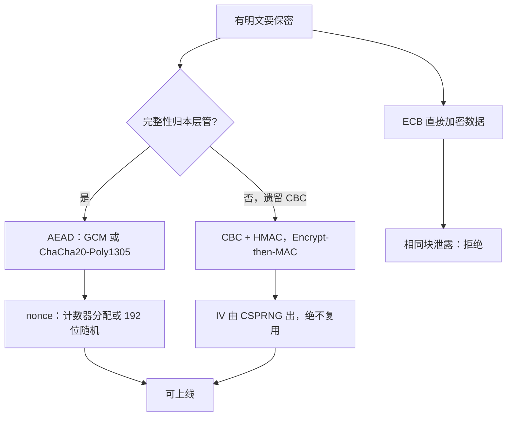
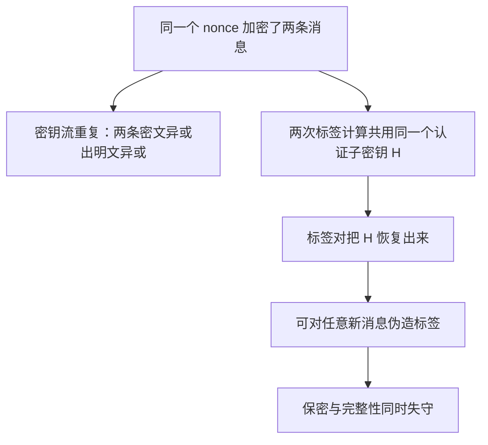

# 对称加密模式的实践

选错模式不会让算法变慢，会让它变假：同一个 AES，ECB 里是一台复读机，GCM 里才是一台加密机。

<footer>—— 据 NIST SP 800-38A、SP 800-38D；Ferguson, Schneier and Kohno, *Cryptography Engineering* 整理</footer>

[上一课](/cs/dt-case-map)给「分布式事务深化」收束：选型第一问是「能不能单片」，分片键设计优于一切协议优化，性能税等于锁持有、分片数与轮次的乘积。密码学的账更不容含糊：主干[分组模式 CBC / GCM](/cs/block-modes)与[ChaCha20](/cs/chacha20)给了各模式的名字与密钥流形状。缺口是**选型**：工程里拿到一段要落盘或上链路的明文，第一问不是「用 AES 还是 ChaCha」，而是「用什么模式、nonce 从哪来、完整性谁负责」。本课是「密码学工程」的第一课，把模式选择钉成可执行的规则；后课的 AEAD、签名与协议陷阱都默认这套规则已经在手。

## 问题

模式决定「一块密文依赖哪些输入」。ECB 只依赖本块明文：相同明文块产出相同密文块，图像加密出剪影，这是复读机不是加密。CBC 引入链式依赖与随机 IV，堵住了模式泄露，却添两笔新账：填充使密文对齐块长，而填充校验一旦把失败原因泄露给攻击者，就成了[填充预言机](/cs/padding-oracle)的入口；IV 若可预测，首块等价于在攻击者选定的明文下工作。CTR 用计数器编址密钥流，密文长度等于明文长度、可随机访问，但 nonce 唯一性成了硬合同：复用即密钥流复用，两条密文的异或把两段明文的异或直接暴露——与[一次一密与完美保密](/cs/one-time-pad-perfect-secrecy)里复用密钥同类的失败。ECB 的失败可以类比成给句子里每个词单独换上同一种固定颜色：内容听不见，但哪些词相同一目了然。著名的「加密企鹅」图就是把企鹅照片逐块 ECB 加密，企鹅轮廓原样可见——这就是「复读机」三字的直观版本。缺口不是再讲一遍这些模式的定义，而是把「谁在什么条件下可用」钉成清单。

## 方法

实践规则按四步走。第一步，任何需要保密的传输或存储，默认选 AEAD：AES-GCM 或 ChaCha20-Poly1305；硬件有 AES 指令选前者，纯软件环境选后者。第二步，nonce 策略随模式定：GCM 的 96 位 nonce 用计数器分配（每密钥一个单调计数器），若只能随机生成，单密钥调用次数必须 \lt $2^{32}$，这是 SP 800-38D 把随机 IV 碰撞概率压在 $2^{-32}$ 以下的界；XChaCha20 把 nonce 拉到 192 位，随机生成即可。$2^{32}$ 这条线的来由可以代一下数：生日界下，从 96 位空间里随机取 $n$ 个数，碰撞概率约为 $n^2 / 2^{96}$。代入 $n = 2^{32}$，得 $2^{64}/2^{96} = 2^{-32}$——「可忽略」的门槛正好卡在这里；调用次数再多一个数量级，概率就升到 $2^{-12}$ 量级，工程上不再可忽略。第三步，遗留系统里的 CBC 只能与 HMAC 组合成 Encrypt-then-MAC，且 IV 由 CSPRNG 出、绝不复用；单独 CBC 一律视为错误。第四步，ECB 只允许出现在「单块、明文无结构」的场合，比如作为构造可调 PRP 的零件，永远不直接服务数据。

## 机制

这些规则的根据是「模式把块密码扩展成语义」的方式。每个模式的安全性证明都按特定前提给出：GCM 的证明要求每 nonce 只用一次，nonce 复用后 GHASH 的认证子密钥 $H$ 会被同 nonce 的标签对恢复，Procter 2014 给出了此后对任意新消息伪造标签的完整路径；CBC 的证明依赖 IV 对攻击者不可预测。反过来说，实践清单的每一条都是在保住证明的前提，而不是风格偏好。长度也要记账：CTR 与 GCM 的密文不膨胀（只多 16 字节标签），CBC 膨胀至多一块且需要填充，落盘格式与去重都因此不同。密钥侧，同一主密钥跨模式使用要过 KDF 并做域分离，否则「CBC 的密钥」与「GCM 的密钥」在证明里是两把，混用等于让两份证明互相作保。

这张图回答的是「nonce 复用在 GCM 内部到底坏了什么」——上面那张图管选型，不管事故现场。它其实断了两次：密钥流重复泄机密、$H$ 被恢复毁完整性，两桩祸共享同一个根因（nonce 撞车）。这也是为什么计数器分配比随机 IV 更稳：计数器在数学上不可能重复。

「AEAD」翻译过来是「带关联数据的认证加密」：加密（保密）、认证（防篡改）、关联数据（不加密但同样不许被改的头部，比如路由地址）三件事一次合同做完。它把「先加密再 MAC 还是先 MAC 再加密」这种最容易做错的组合决策从使用者手里收走——这正是本课默认选它的理由。

SP 800-38D 的两道账：单密钥总加密量不超过 $2^{39}-256$ 比特（约 64 GiB）；随机 96 位 IV 时调用次数不超过 $2^{32}$。任一越界，GHASH 的认证优势就按生日界塌掉——大吞吐服务在同一密钥下写满一年数据，恰好会撞线。

## 边界

本课只管「加密模式怎么选」，nonce 复用之后 AEAD 内部发生什么属于下一课；完整性合同与标签语义在 [AEAD 与 GCM 内部](/cs/aead-gcm-internals)已钉。XTS 这类宽块可调模式服务磁盘扇区（SP 800-38E），只给扇区级保密、不给完整性，不在本课清单里，也不该被当成 AEAD 用。密钥怎么生成、熵从哪来，是「随机数」课的缺口；协议层组合错误（重放、降级、预言机）留给「协议实现的陷阱」。

## 小结

- 模式选择的第一问是完整性归谁：本层管就用 AEAD，遗留 CBC 必配 HMAC。
- GCM 的 nonce 用计数器分配；只能随机时，单密钥调用次数 \lt $2^{32}$。
- ECB 不直接服务数据；CTR nonce 复用与一次一密复用密钥同类失败。
- IV 可预测、nonce 复用、无 MAC 的 CBC，都是证明前提被打破的三种形状。
- 出处：NIST SP 800-38A/38D；RFC 8439；Ferguson, Schneier and Kohno, *Cryptography Engineering*；Procter 2014。
