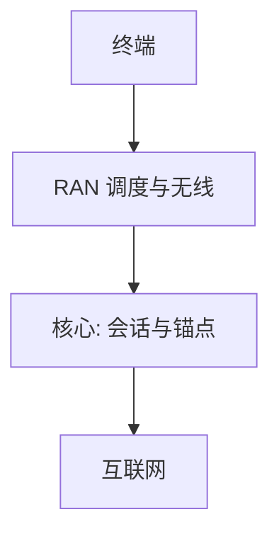

# 蜂窝：RAN 与核心网

空口在基站结束；用户的会话、鉴权与路由在核心网。RAN 与核心的接口让无线跳可以换代而不改「号码与数据」的合同。

<footer>—— 据 3GPP TS 23.501（5G 架构）与 LTE EPC 对照；Kurose and Ross 蜂窝节整理</footer>

[上一课](/cs/bluetooth-ble) 是无牌照短距。手机要移动、要计费、要跨城。缺口是**蜂窝两段**：RAN（UE–gNB/eNB）与核心（EPC 或 5GC）。本课不把网络切片 SLA 写完。

## 问题

Wi‑Fi 的「核心」往往是一台路由器加 DHCP。蜂窝：空口调度、切换、无线承载在 RAN；附着、会话、策略、对互联网的 PDU 会话在核心。用户 IP 通常在核心锚点分配，基站像一跳隧道端——对照后课 GRE/GTP。移动性：换基站不换 IP 锚，才像「一直在线」。这不是 MAC 学习能做的：地址在三层锚，不是二层泛洪。

LTE：eNB + EPC（MME/SGW/PGW）。5G：gNB + AMF/SMF/UPF。本课钉分工，不背网元缩写表。

### 基站不是交换机

用户 IP 在核心锚，换 gNB 不换锚。空口 $C$ 与核心转发是两段预算。鉴权在核心，RAN 只消耗密钥。不要把 5G 写成更快 Wi‑Fi。

## 方法

画：UE ↔ RAN ↔ 核心 ↔ 互联网。对照 802.11：AP 桥到同一广播域；gNB 不把以太网洪泛到全国。鉴权在核心，空口只消耗密钥。容量：小区 $B$ 与干扰决定空口 $C$，核心是交换与策略。

方法止于选定对象与对照；机制才说它如何嵌入已有分层与主干课。

## 机制

自协商变成能力与频段登记。PFC 无对应物；无线用调度与 QoS 承载。TCP 看到的 RTT 含空口调度时延，后课无线 TCP 会收回。主干 NAT 课：运营商常在锚点后做 NAT，与家庭路由同类但规模不同。

切换：RAN 先保住无线，核心更新转发；失败才掉 PDU 会话。GTP 隧道把基站接到锚点，中间仍是 IP 转发，不是 MAC 学习。

计费与政策在核心执行，空口只执行已授权的 QoS 规则。

## 边界

本课不引入 IMS 语音全程。5G 切片与 URLLC 是下一课。后课默认：蜂窝 = RAN + 核心锚点；基站不是以太网交换机。

不要把「5G 等于更快 Wi‑Fi」当架构结论。

上一课留下的缺口在本课收口；「蜂窝：RAN 与核心网」进入后课词汇表后只引用。文献用来钉对象与边界，不把本课写成该主题的独立综述。下一课[5G 切片与 URLLC](/cs/5g-slicing)。

## 小结

- RAN 管空口；核心管会话、移动性锚与出网。
- 用户 IP 在锚点，不靠二层洪泛跨城。
- 空口 $C$ 与核心转发是两段预算。
- 后课只引用本课钉死的对象，不从该领域总问题重开。
- 出处：3GPP TS 23.501；Kurose and Ross。
