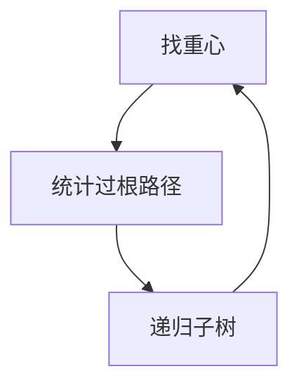

# 点分治

树的重心子树不超过一半；以重心为根分治，路径统计变成「过当前根」与「落在子树」两支，层数 $O(\log n)$。

<footer>—— 据 Jordan 的树重心；分治范式见 CLRS 第 4 章；树上点分治为标准教材技法整理</footer>

上一课[重链剖分](/cs/heavy-light)把路径变成区间。有一类询问不是「路径聚合」，而是**树上距离/路径计数**：有多少对点距离为 $k$、路径权 $\le K$。HLD 的线段树不直接数点对。缺口是点分治：选重心，统计过根的路径，再对每棵子树递归。不重写重链。

## 问题

树（无根）上，重心（centroid）满足：删掉后每棵连通块大小 $\le n/2$。存在，且可在 $O(n)$ 内找（两次 DFS 或一次换根）。以重心为根，任意路径要么过根，要么整段落在某子树。过根的用到根距离/权的集合做双指针或排序；子树递归。层数 $O(\log n)$，每层扫边 $O(n)$，总 $O(n\log n)$ 再乘以层内统计代价。

缺口是这套分治树，不是再求 LCA。

### 重心不是直径中点

直径中点（或中心）与重心不同：一个管偏心距，一个管子树大小。点分治要的是大小平衡，保证递归深度对数。边分治把边当切，层数仍对数，实现更绕，本课点名。

Jordan 19 世纪已讨论树的重心。点分治是分治在树上的实例，主定理的形状：$T(n)= \sum T(n_i)+O(n)$，$n_i\le n/2$。后课 Kruskal 重构树用 MST 结构回答最大边查询，不是重心。

## 方法

找重心；标记已删（虚删）。收集子树到根的信息，容斥：全集统计减去同一子树内的（不过根）。递归未删子树。注意不要把过根路径算重：点对 $(a,b)$ 的 $lca$ 在分治树上是某层重心。

点分治树（centroid tree）深度 $O(\log n)$，可当另一棵树预处理。

## 机制

每次切掉重心，块大小折半，递归树高对数。与[分治](/cs/divide-conquer)同型，平衡保证来自重心定义而非输入有序。容斥：过根 = 所有到根的配对减去同一子树内配对。哈希或排序做配对，复杂度随题。

不要在带环图上找「重心」当点分治：先要块是树。点双连通上的点分治是另一层，不插入。

## 边界

本课不写点分树套数据结构的全部模板变体。动态点分治（带修改）更重。后课默认：树上点对路径统计可用重心分治。下一课用 Kruskal 重构树回答「路径最大边 $\le x$」一类查询。

## 小结

- 重心使子树 $\le n/2$；路径过根或在子树。
- 每层 $O(n)$，深度 $O(\log n)$。
- 管点对统计，不是路径区间修改。
- 出处：重心见经典图论；分治见 CLRS 第 4 章。
